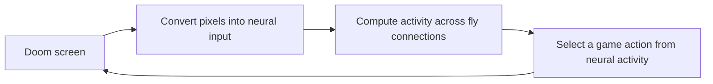

# Fly Doom

A research project to train a model based on the real fruit fly connectome to control Doom.

**Status: bounded automatic synaptic learning and persistent neural replay are implemented.** A separate cycle collects Laya Vision targets and measured movement feedback, trains gains on existing fly connections, runs paired independent evaluations and promotes only an accepted candidate. Live play uses a fixed approved checkpoint. This is a working research pipeline, not a claim that Doom training is complete. See the [automatic learning guide](docs/AUTOMATIC_LEARNING.md), [interface research](docs/LAB_DESIGN_RESEARCH.md), and [validation record](docs/VALIDATION.md).

## Current research desk

```powershell
.\.venv\Scripts\python.exe -m flydoom.laboratory
```

Open **http://127.0.0.1:8770**. Stop an older server on that port first. The desk starts paused with the approved checkpoint, falling back to `runs/synaptic-eligibility-v1` until a learning candidate passes its gate. **Single step** computes one decision and **Run** advances autonomously. **Cell & connections** exposes all selected-cell dynamics and original/current strengths; **Activity & decision** shows the 64 engineered readout cells and six action contributions.

The brain scene now contains **78 named measured regions**, optional 139,255 anchors and real context-neuron skeletons. Filter a region, search exact IDs/types/classes, stream up to 32 skeletons, or inspect a directed graph path. **Fit brain**, **Expand**, projections and layer controls retain the full anatomical view. Every live decision is saved with the whole population's neural state; review it from the timeline or reopen a recording after restarting. The image can show decision input or action outcome.

End the live run, then choose **Start one learning cycle** in **Experience to candidate**. The worker collects experience, optimizes a separate candidate and performs a paired gate and final test. **Load approved checkpoint** applies a successful promotion to a new paused run. Failed candidates preserve the existing policy. For repeated automatic cycles:

```powershell
.\.venv\Scripts\python.exe -m flydoom.learning_cycle --cycles 3
```

The desk now uses the bounded sparse-consensus follow-up: at most 4,096 supported edge changes, fresh trajectories and old-training rehearsal. Run it directly with `.\.venv\Scripts\python.exe -m flydoom.synaptic_consensus`. The repeated-cycle command above retains the earlier dense-search protocol for reproducibility. The [developer guide](docs/AUTOMATIC_LEARNING.md) explains both protocols, budgets, cancellation, rollback, data separation, rewards and interpretation limits. The [public dataset audit](docs/RESEARCH.md#dataset-audit-and-sparse-follow-up-october-10-2026) records downloaded sample checks and action incompatibilities.

**Latest follow-up completed:** 96 fresh training frames, 64 validation frames and 16 rehearsal frames. Both sparse proposals worsened the combined training/rehearsal objective, so zero new weight changes were accepted. Paired gate and final-test outcomes were identical to the parent (2/6 and 3/6 target kills); no promotion occurred. Checkpoint reload and sparse-update audits passed. This is a preserved negative result, not improved gameplay. [Measured results](docs/VALIDATION.md#sparse-consensus-and-rehearsal-follow-up-october-10-2026).

The two unsuccessful shared-gain searches are preserved. The accepted individual-edge pilot changed strengths by at most approximately 0.01%, with train KL 0.142918 → 0.142570 and validation KL 0.174334 → 0.173330 on 16/8 previously seen prefix examples. Its two familiar short game starts are a smoke test, not a new held-out benchmark. Older four- and six-action checkpoints remain available through their original commands below.

Earlier text-Laya experiments remain available in the [learning guide](docs/LEARNING.md). That teacher's failed acceptance gate is preserved; it does not describe the newly integrated Vision checkpoint. See also the [bridge guide](docs/BRIDGE.md), [research plan](docs/RESEARCH.md), and [simulation assumptions](docs/SIMULATION.md).

**First Vision teaching pilot completed:** `runs/fly-student-vision-v1` is a separate student distilled from 147 recorded Vision targets, with 26 retained validation examples. In a six-start native-game comparison without running Vision, it killed 6/6 targets versus the parent's 5/6, using 49 rather than 153 decisions. Two evaluation openings repeat training images; this is a small development result. The biological weights stay frozen, and the original default checkpoint is preserved. [Training procedure, commands and replay instructions](docs/VISION_WORKBENCH.md#offline-teaching-first-vision-student) and [full validation evidence](docs/VALIDATION.md#first-offline-laya-vision-distillation-october-3-2026) distinguish teacher imitation from autonomous gameplay.

Current tools include data preparation, annotation matching, an experimental neural simulator, stimulation diagnostics, recorded activity playback, a random Doom baseline, a bounded neural game controller, human demonstration recording, local Laya adaptation, and training of an additional spiking neuron group.

**Larger locked evaluation completed:** on 20 shared starts, the Vision student achieved 19 target hits versus the parent's 15; the same student with graph transmission disabled achieved zero. Mean returns were 33.70, -60.40 and -300.00. The starts contain only eight distinct opening images, and 13 repeat one training opening. Among the seven unmatched openings, the candidate hit 6 targets versus the parent's 2. This supports a fixed-policy improvement and graph-signal dependence within `basic`, not broad generalization or a topology advantage. [Protocol and replay commands](docs/VISION_WORKBENCH.md#locked-gameplay-validation-and-graph-dependence-control) and [full evidence](docs/VALIDATION.md#locked-20-start-vision-student-validation-october-3-2026) include the remaining recovery failure and uncertainty.

**Recovery teaching and reserved gameplay completed:** three continuation seeds trained from the tested Vision student on 220 new student-trajectory examples, with 110 retained validation examples. Teacher agreement rose from 28.18% to 61.82%, 60.91% and 59.09%. On 20 distinct reserved opening images, the common parent scored 13/20 target-hit episodes; continuations 101/202/303 scored 15/20, 14/20 and 15/20. Mean returns were -135.15 versus -72.30, -78.15 and -74.70. All paired uncertainty intervals include zero, and each continuation lost four parent successes. No default checkpoint was promoted. [Collection and commands](docs/VISION_WORKBENCH.md#diverse-recovery-collection-and-three-teaching-repetitions) and [complete gameplay evidence](docs/VALIDATION.md#reserved-recovery-gameplay-comparison-october-6-2026) distinguish modest measured gains from broad generalization or biological-topology claims.

A later balanced-readout training experiment shortened long WAIT streaks but did not improve gameplay: both old and new students killed two targets in six new starts. The original student remains the default. The [learning guide](docs/LEARNING.md#refine-the-existing-readout-with-balanced-human-actions) explains the refinement command and the retained experimental candidate; [validation results](docs/VALIDATION.md) include paired teacher, timing, random, and disconnected controls.

A subsequent [student-trajectory correction experiment](docs/CORRECTIONS.md) trained on frozen Laya suggestions for the student's own observations. On six reserved development starts, both parent and candidate killed five targets; mean return improved from -21.33 to -11.83, while waiting increased. Three opening images repeat correction-training scenes, so this is a limited score improvement, not a generalization result. The candidate is available as `runs/fly-student-corrected-v2`; the original remains the default.

Project documentation, source comments, docstrings, and application messages are written in English. Upstream research data retains its original contents.

The [action memory and recovery guide](docs/ACTION_MEMORY.md) covers the latest input-memory experiment and a standalone interactive replay comparing the student's recorded choices with Laya advice. Open `runs/recovery-review-v1/index.html` on this prepared machine to inspect the failed and successful recordings side by side with model activity.

In the new six-opening comparison, the action-memory candidate improves from two to three target kills versus correction-v2, with mean return -153.17 versus -200.17. The longest WAIT streak remains 33 decisions and direct Laya achieves five kills. This is a limited development result; the original remains the default. The separate candidate is `runs/fly-student-memory-v1`.

A first human-feedback continuation trained from 35 explicit labels and selected a checkpoint using 17 separate validation labels. The new candidate scored 0/6 target kills versus 2/6 for its memory parent on the six reserved starts; mean returns were -328.33 and -220.50, respectively. The default remains unchanged. The local review `runs/human-feedback-review-v1/index.html` shows all recorded labels and both models' probabilities; [validation results](docs/VALIDATION.md) retain the full comparison.

The [target-side diagnostic](docs/TARGET_DIAGNOSIS.md) compares color image bins, the actual brightness input, and frozen fly outputs on separate episodes. Its local inspector shows each recorded game frame beside the 8 by 8 input grid and diagnostic predictions. This measures available visual information without retraining the game policy.

## Six-action movement pilot

After the separate pilot has completed on this prepared machine:

```powershell
.\.venv\Scripts\python.exe -m flydoom.experiment --movement
```

Use **Run / Pause / Single step** for the learned six-action controller (WAIT, LEFT, RIGHT, ATTACK, FORWARD, BACKWARD). **Manual motor check** buttons apply a single explicit user-selected action while paused; these decisions are marked manual and do not train the model. The student still proposes probabilities. The six-action live mode runs without loading Laya Vision or allocating a GPU teacher. Its benchmark is a separate pilot and cannot be compared directly with the older four-action 20-start benchmark.

The map includes all neuron anchors and 75 real FlyWire-space neuropil region surfaces. **Brain regions** toggles the anatomical surfaces; **Expand view** expands the map (Escape exits). Select a biological neuron and press **Load neuron branches** to fetch its actual v783 skeleton. This loads the selected neuron's geometry, not all 139,255 full cell morphologies. Skeleton downloads require internet on a cache miss and retain at most 16 raw cached skeletons. The research map's region colors describe anatomical geometry, not activity.

Live history is bounded to eight full neural snapshots. **Release idle memory** keeps only the latest snapshot and releases a loaded Vision observer when safe. In the older four-action workbench, the observer loads on demand and unloads after 60 seconds idle. This releases its process memory; the active connectome and trained weights remain available. Recorded runs, datasets and model files are not cache files.

## Earlier four-action benchmark workbench

On this prepared machine, open the completed-training / benchmark / live workbench:

```powershell
.\.venv\Scripts\python.exe -m flydoom.experiment
```

Open **http://127.0.0.1:8770**. Choose a checkpoint under **Trained model**, click **Load paused live model**, then **Single step** or **Run**. **Benchmark results** shows the completed four-model comparison; loading a model does not retrain it or rerun the benchmark. The launcher verifies completed training, checkpoint hashes, the locked benchmark and recomputed scores/intervals. It starts in live mode with the common parent and alpha zero. Vision remains an observer; the student chooses the action. Future reserved test seeds are blocked from live demonstrations when the reservation file is present.

The observatory places Doom and the connectome/readout map side by side. **Recorded runs** and **Live experiment** switch the source of both panels together. The active-cell table shows signed action-logit contributions; select a cell in the map or table to open its weight/input inspector. [Architecture, API contracts and artifact formats](docs/VISION_WORKBENCH.md) are documented for development.

The map opens with an enlarged, higher-contrast brain cloud. **Enlarge brain** fits all 139,255 neuron reference positions to the map area; **Show circuit** restores the student and action layers. The projection selector offers 3D, XY, XZ and YZ views. Drag to rotate, Shift-drag to pan, and use **Reset map view** after zooming. These positions form an anatomical anchor cloud, not complete neuron shapes. Doom stays visible alongside the enlarged cloud on desktop.

Use **Play run**, pause, arrows or the decision strip to inspect a recording. The archive selector prefers a recording with the loaded checkpoint hash. Choosing an archive does not change the live model. Archived highlights use saved descending features and student spikes, while live mode shows full current biological spike counts. A source change never advances the game. Live controls provide **Single step**, **Run**, **Pause**, **End run** and **New run settings**. The earlier separate native-observation panel and long signal dashboard have been replaced by this shared workspace.

For the earlier student-only observer:

```powershell
.\.venv\Scripts\python.exe -m flydoom.live_brain
```

The browser opens at `http://127.0.0.1:8766`, paused for inspection. Click **Step once** for one neural decision or **Run** for autonomous play. The central map shows all 139,255 anatomical neuron anchors beside the 64 trained engineered cells and action outputs, with the Doom observation and a connection inspector alongside. Drag to rotate, Shift-drag to pan, scroll to zoom, and click a node to inspect actual model weights. These points are anatomical references, not complete neuron shapes; the added cells have a schematic layout. See the [live screen guide](docs/LIVE_VIEW.md) for controls, timing, and interpretation.

To include the experimental candidate's 17 action-memory inputs in the same map:

```powershell
.\.venv\Scripts\python.exe -m flydoom.live_brain --checkpoint runs/fly-student-memory-v1 --port 8767
```

The live screen also supports **Teach this decision**: pause, label the pictured decision, and save or revise your correction. Playing and labeling leave the active weights unchanged. A separate `flydoom.feedback_training` command trains a candidate from training/validation collections while replaying earlier demonstrations. Follow the [human correction workflow](docs/LIVE_VIEW.md#teach-a-decision-then-train-a-separate-candidate) before collecting labels or training.

For the standalone Doom window with terminal telemetry:

```powershell
.\.venv\Scripts\python.exe -m flydoom.learning play --checkpoint runs/fly-student-experimental-v2 --max-decisions 75
```

Laya is absent from student inference. The full graph takes approximately 1.3 seconds per decision on this machine; Doom pauses between actions while the neural simulation computes. This is an experimental transfer, not a claim of a successful Doom policy. Terminal output includes neural spike counts and computation time. The checkpoint and evaluation reports live under `runs/` on this machine, not in Git.

To watch the experimental Laya teacher separately:

```powershell
.\.venv\Scripts\python.exe -m flydoom.teacher_play --teacher runs/laya-temporal-teacher-v2 --visible --episodes 6
```

This runs the saved teacher directly, with its own recent actions and images as history. It does not train while playing or load the fly graph. The six-seed pilot and controls are recorded in [VALIDATION.md](docs/VALIDATION.md). The experimental checkpoint lives under `runs/` on this machine, not in Git.

On the prepared machine, run this from the project directory to record your play and begin the learning pipeline:

```powershell
.\.venv\Scripts\python.exe -m flydoom.learning run
```

Before pressing **ENTER**, try **LEFT/RIGHT** or **A/D** and **SPACE**; the `input` indicator lets you check that the window receives your keys. The paused check is excluded from the recording. Play naturally after ENTER. The pipeline collects at least **30 episodes**, extending up to 100 if training/validation movement or firing examples are insufficient. **ESC** keeps completed episodes and stops; losing window focus pauses recording until ENTER. A coverage check runs before expensive neural replay. Laya uses class-balanced imitation, and the additional 64 spiking cells are trained only if the teacher passes its validation gate. See [LEARNING.md](docs/LEARNING.md) for timing and separate commands. A failed gate remains a possible experiment result.

The experimental bridge implements the following loop:



The first working adapter converts screen brightness into drive for positive-sign visual projection cells and reads descending spikes to select actions. Image-to-cell and cell-to-action assignments are explicit engineering conventions, not known biological mappings. The learning pipeline instead trains an additional group from descending voltages and spike rates, with the fly graph frozen and Laya used as a teacher during training.

The local dataset contains **139,255 neurons**, **15,091,983 directed neuron pairs**, and **54,492,922 synaptic contacts**. The prepared sparse connectivity matrix occupies approximately **173 MiB** in memory; this excludes simulation and training memory. Every neuron matches an annotation row, although some annotation fields are missing. See the [validation record](docs/VALIDATION.md).

A **neuron** is a nerve cell that receives and transmits signals. A **synapse** is a communication site between cells. A **connectome** describes which neurons are connected. A **simulation** computes how activity changes over time along those connections. **Training** changes selected model parameters using experience from the game. These are separate steps.

### What each file does

| File or directory | Purpose | What to know now |
|---|---|---|
| `README.md` | The project guide you are reading | Start here |
| `docs/RESEARCH.md` | Sources, design decisions, and experiment plan | Read for scientific and technical context |
| `docs/VALIDATION.md` | What has been run and verified | Progress and evidence record |
| `flydoom/data.py` | Downloads and checks data, builds the graph, and matches annotations | The current data preparation code |
| `flydoom/doom_smoke.py` | Sends random actions to Doom to check the integration | Not a fly model or training procedure |
| `flydoom/bridge.py` | Encodes images and decodes neural spikes | Fixed, artificial mappings; no learned weights |
| `flydoom/brain_doom.py` | Runs the neural model and Doom together | Start here to watch the experimental neural controller |
| `docs/BRIDGE.md` | Explains the adapter, controls, timing, and limitations | Guide to the first game connection |
| `flydoom/learning.py` | Starts recording, preparation, teacher training, and student training | Run `python -m flydoom.learning run` |
| `flydoom/learning_data.py` | Records your buttons and replays images through the graph | Keeps episodes in separate learning splits |
| `flydoom/recording_input.py` | Captures key events, brief taps, and focus changes | Prevents short taps from disappearing between game decisions |
| `flydoom/learning_quality.py` | Checks action coverage and visual diversity | Rejects insufficient data before expensive neural replay |
| `flydoom/laya_teacher.py` | Downloads Laya and adapts its decision head | Frozen text encoder; supervised imitation |
| `flydoom/laya_features.py` | Caches frozen encoder outputs and runs the original decision head | Avoids repeated encoder computation during learning |
| `flydoom/learning_diagnosis.py` | Fits a tiny balanced subset of training examples | Checks learning mechanics without claiming game skill |
| `flydoom/temporal_data.py` | Adds strictly past image/action summaries to recorded observations | Preserves neural features and episode splits |
| `flydoom/teacher_play.py` | Runs a trained Laya teacher and optional controls in Doom | Direct teacher evaluation; no fly graph or student |
| `flydoom/student.py` | Trains and runs the extra 64 spiking cells | Uses Laya during training, without loading it during play |
| `flydoom/correction_data.py` | Records states reached by the student's own actions | Keeps teacher suggestions separate from actual behavior |
| `flydoom/correction_training.py` | Labels those states and trains a separate candidate | Preserves parent weights and checks human validation regression |
| `docs/CORRECTIONS.md` | Explains this additional imitation experiment | Commands, library roles, and visual-overlap limitations |
| `flydoom/action_memory.py` | Encodes three past buttons and timing for the added cells | Causal engineering memory, separate from biological neuron state |
| `flydoom/recovery_review.py` | Builds an interactive review of recorded decisions and advice | Verified policy replay; no training or external service |
| `flydoom/vision_recovery_eval.py` | Locks and evaluates the parent and three recovery continuations on 20 reserved openings | Frozen policies, native recordings, paired uncertainty and trajectory-overlap audit |
| `docs/ACTION_MEMORY.md` | Explains memory inputs, the review screen, and matched experiments | Includes commands for inspecting the separate candidate |
| `flydoom/calibration.py` | Selects a smaller global synaptic gain | Engineering stability checks, not biological validation |
| `docs/LEARNING.md` | Explains the learning experiment and commands | Read before the first recording |
| `flydoom/simulation.py` | Loads the graph and computes changing voltages and spikes | Experimental model with explicit assumptions |
| `flydoom/brain_probe.py` | Runs four stimulation and control experiments | Checks signal transmission before game integration |
| `flydoom/viewer.py`, `flydoom/web/` | Local browser viewer for recorded trials | Play recorded activity, scrub time, and inspect neurons |
| `docs/SIMULATION.md` | Explains equations, sign rules, and measured limitations | Guide to the first neural model |
| `flydoom/__init__.py` | Marks the directory as a Python package | No manual changes needed |
| `tests/test_data.py` | Checks the data code against small examples with known answers | Automated checks that catch mistakes |
| `tests/test_simulation.py` | Checks dynamics, delays, reset, and controls | Numerical model tests |
| `pyproject.toml` | Project metadata and required Python libraries | The project's dependency list |
| `requirements.lock.txt` | Exact installed library versions | Recreates the package versions used here |
| `requirements-training.lock.txt` | Exact training environment versions | Windows, Python 3.13, CUDA 13.0 PyTorch build |
| `models/laya-base/` | Downloaded local Laya checkpoint and checksums | Large model files, excluded from Git |
| `data/raw/` | Original files downloaded from the researchers | No need to open them in a code editor |
| `data/processed/` | Data prepared for our program | Inputs for later computations |
| `runs/` | Results from game runs | Experiment output |
| `.venv/` | The project's Python environment and libraries | Automatically managed |
| `.uv-cache/`, `.pytest_cache/`, `__pycache__/` | Installation and runtime caches | No need to inspect them now |
| `.gitignore` | Defines files excluded from Git tracking | Excludes large data and temporary files |
| `_vizdoom.ini` | Local settings generated by the game engine | Automatically generated |

In a fresh checkout, `data/` and `runs/` appear when their corresponding commands run. File extensions also help: `.py` is Python code, `.md` is documentation, and `.json` stores structured records. `.npy`, `.npz`, and `.feather` store numerical data for efficient program access.

### Tools we installed and why

We used the existing Python 3.13.11 installation on this machine. The existing `uv` tool created `.venv` and installed the project dependencies there.

| Tool or library | Role in this project | Why we use it |
|---|---|---|
| Python | Runs our scripts | Provides a shared environment for data processing and the game interface |
| `uv` | Creates the environment and installs packages | Keeps dependency installation and management straightforward |
| NumPy | Stores and processes arrays of neuron IDs and counts | Supports efficient array operations and exact 64-bit integer IDs |
| SciPy | Builds and stores the sparse connectivity matrix | Stores existing connections without allocating every possible neuron pair |
| PyArrow | Reads the research archive's Feather table | Reads the source format and selects the columns we need |
| ViZDoom | Provides the Doom engine interface | Lets Python read screen frames and send game actions |
| pygame-ce | Displays the demonstration window and reads keyboard input | Lets you provide examples by playing |
| Laya | Scores the four possible actions from text descriptions of coarse images | Provides the local teacher we can specialize |
| PyTorch | Computes gradients and updates selected weights | Trains the Laya head on the GPU and the small spiking group on the CPU |
| Transformers and Hugging Face Hub | Load the text encoder, tokenizer, and downloaded checkpoint | Supply Laya's pretrained components |
| Safetensors | Stores numerical model weights | Saves and reloads the teacher head and student |
| pytest | Runs automated checks | Detects data preparation errors using known examples |

The lock files also contain transitive dependencies such as Gymnasium. Standard-library modules such as `pathlib`, `hashlib`, `json`, `csv`, and `urllib.request` come with Python and did not require separate installation. Training dependencies are optional for the original simulator and viewer; the learning setup is documented separately below.

### Understanding connectivity data

A fictional example for learning:

| Source neuron | Target neuron | Synapse count |
|---|---|---:|
| A | B | 3 |
| B | C | 2 |

The first row means there are three synaptic contacts from A to B. It does not imply a connection from B to A. Three contacts also do not establish an electrical effect exactly three times as strong.

`data.py` converts this list into a matrix suitable for computation. We use `A[target, source]`: the entry in row B and column A is 3. Most neuron pairs are not directly connected, so we avoid storing all the zero entries. This is a **sparse matrix**. It retains every neuron while reducing memory use.

After downloading an archive file, its digital fingerprint, or **checksum**, is compared with the publisher's value. This checks that the file matches the archive; it does not establish biological validity. Preparation writes `manifest.json` to record the sources and neuron, connection, and synapse counts.

### Reading a command

```powershell
.venv/Scripts/python.exe -m flydoom.data prepare
```

- `.venv/Scripts/python.exe`: run the Python interpreter in this project's environment.
- `-m flydoom.data`: run the `data.py` module in the `flydoom` package.
- `prepare`: select the data preparation operation. Use `download` to select downloading or `annotate` to match neuron annotations.

Run commands in a PowerShell terminal opened in the project directory. There is no need to repeat a command that has already completed successfully unless you intend to rerun that step.

## Setup (PowerShell)

The following is the **base environment** setup for a fresh checkout. Syncing its lock file removes optional training packages. For the learning environment, use the [training setup instructions](docs/LEARNING.md#setup-on-a-fresh-machine).

Requires Python 3.11+ and `uv`. Tested on this machine with Python 3.13.

```powershell
$env:UV_CACHE_DIR = Join-Path (Get-Location) '.uv-cache'
uv venv .venv
uv pip sync --python .venv/Scripts/python.exe requirements.lock.txt
.venv/Scripts/python.exe -m pytest -q
.venv/Scripts/python.exe -m flydoom.doom_smoke --episodes 3
```

The random-policy report is written to `runs/doom-smoke.json`. It is explicitly marked `trained: false` and `connectome_loaded: false`. The game runs without a visible window; this command does not start training.

### Watch the game window

To watch the random controller play the basic target-shooting scenario:

```powershell
.venv/Scripts/python.exe -m flydoom.doom_smoke --visible --episodes 5 --log-actions --output runs/my-visible-doom.json
```

This opens a separate ViZDoom window with a 640 x 480 view and HUD. It does not appear inside the brain viewer. The controller randomly chooses `WAIT`, `MOVE_LEFT`, `MOVE_RIGHT`, or `ATTACK`; the terminal prints each decision. The basic scenario allows sideways movement and shooting, not free navigation through a full Doom level. Episodes can end early when the target is hit, so the whole demo may be short. The window closes after the requested episodes finish.

The visible mode advances one game tic at a time, paced around the normal 35-tic-per-second rate. Add `--speed 0.5` to watch at half speed. This changes wall-clock presentation, not the controller's decision frequency in game time. Rendering or OS scheduling can make playback slower than requested. Sound remains disabled. Press Ctrl+C in the terminal to stop; interrupted runs do not write a completed report. You do not need to steer with your keyboard: the random controller sends the actions.

**This command still uses random control.** The separate neural controller below connects the graph to the game. The random report records the presentation settings separately and keeps `trained: false` and `connectome_loaded: false`. Implementation uses the existing ViZDoom interface; see its [game control documentation](https://vizdoom.farama.org/api/python/doom_game/).

### Connect the neural model to Doom

With the prepared graph and annotations already present, run:

```powershell
.venv/Scripts/python.exe -m flydoom.brain_doom --visible
```

After loading the graph, a separate Doom window opens. Every decision prints `L`, `R`, and `A`: mean spike rates per output neuron assigned to left, right, and attack. The largest rate selects the action; silence or a tied maximum selects `WAIT`. There is no random-action fallback. These groups were assigned by us, not identified as biological Doom controls.

The default run stops after **24 decisions or an earlier game ending**, not necessarily a complete episode. It computes 50 ms of neural activity per decision and applies the chosen action for up to 4 game tics. The CPU needs approximately 1.3 seconds per decision on this machine, during which the game holds its current frame. This is expected computation time. The neural and game clocks are separate experimental time scales.

Each run creates a new timestamped `runs/brain-doom-.../` folder with `report.json`, `mapping.json`, and a per-decision `decisions.jsonl` trace. Ctrl+C during play saves partial results. To preserve an explicitly named run, use `--output runs/my-neural-game`; an existing directory is rejected. The existing browser viewer still displays separate probe recordings, not live Doom activity.

**This is an untrained engineering bridge that bypasses the retina.** It is not evidence of natural fly vision or competent play. Nothing new needs installing: NumPy encodes pixels, SciPy carries signals through the sparse graph, and ViZDoom reads frames and applies actions. See [the step-by-step bridge guide and control commands](docs/BRIDGE.md).

## Real connectivity data

The two connectivity archive files require approximately 853 MB of downloads. Processing needs additional disk space and RAM; annotations are downloaded separately by `annotate` if missing.

```powershell
.venv/Scripts/python.exe -m flydoom.data download
.venv/Scripts/python.exe -m flydoom.data prepare
.venv/Scripts/python.exe -m flydoom.data annotate
```

Source: [FlyWire publication archive](https://zenodo.org/records/10676866). The downloader checks published MD5 values. Preparation records source and output SHA-256 values and neuron, edge, and synapse counts in `data/processed/fafb783/manifest.json`.

`annotate` downloads the [authors' v2.1.0 annotations](https://github.com/flyconnectome/flywire_annotations/tree/ebd66db2596fcc39c6950fb54ea3efa00f7fe8a0) if necessary, checks a pinned SHA-256 value, and orders rows by neuron identity. The outputs are `neuron_annotations.tsv` and `annotations_manifest.json`. A `.tsv` file is a text table with tab-separated columns. `top_nt` is the predicted neurotransmitter; missing values remain missing.

The prepared matrix uses `A[target, source]`. Its weights are **unsigned synapse counts**, not physiological strengths. Neuron IDs remain exact integers. The experimental simulator builds a separate signed weight matrix using the explicit assumptions in [the simulation guide](docs/SIMULATION.md).

## First neural simulation

```powershell
.venv/Scripts/python.exe -m flydoom.brain_probe
```

This CPU experiment uses existing NumPy and SciPy dependencies. It stimulates selected cells for a short period and compares connected and disconnected conditions. Results go to `runs/brain-probe/report.json`. No Doom pixels, learned policy, or training are involved. The first run showed downstream voltage responses, but photoreceptor stimulation did not produce descending spikes, and some voltage excursions were excessive. See [the full results and next steps](docs/SIMULATION.md).

## View the brain in your browser

After a completed probe, run:

```powershell
.venv/Scripts/python.exe -m flydoom.viewer
```

Keep the terminal open and visit **http://127.0.0.1:8765**. The default viewer reads the existing `runs/brain-probe` experiment. To view a different completed experiment:

```powershell
.venv/Scripts/python.exe -m flydoom.viewer --run-dir runs/my-first-probe
```

An interrupted probe without `report.json` cannot be displayed. Complete it first. If port 8765 is in use, pass `--port 8766` and open the corresponding address. Press Ctrl+C in the terminal to stop the viewer.

Choose a condition from **Experiment**. Drag the map to rotate, scroll to zoom, and click a point to inspect the cell. The **Show** filter can isolate spiking, directly stimulated, or descending cells. Cyan identifies stimulated spiking cells, orange other spiking cells, and pink spiking descending cells. Gray cells emitted no spikes; they may still have changed voltage.

### Play activity over time

New probes record per-neuron spike counts in successive intervals and voltage snapshots, including the initial resting state. To create your own replay, stop the old viewer with Ctrl+C and run these commands in order:

```powershell
.venv/Scripts/python.exe -m flydoom.brain_probe --output runs/my-replay
.venv/Scripts/python.exe -m flydoom.viewer --run-dir runs/my-replay
```

Wait for the probe to finish all four conditions before starting the viewer. The terminal prints simulation progress. Open http://127.0.0.1:8765 and reload the page. A temporal recording starts playing once on load; use **Pause**, **Play recording**, **Replay**, or the **Simulation time** slider to explore it. Selecting a different experiment starts its recording. Clicking a neuron pauses playback for inspection.

**Color by → Voltage change** shows endpoint voltage relative to rest: blue below rest, orange above rest, gray near rest. Color intensity saturates at ±20 mV for visibility, while actual values remain available in the inspector. This color mapping does not clip simulation voltages. **Spikes per interval** uses the cyan/orange/pink spike colors described above and shows counts since the previous saved sample. The cells remain in place; their activity changes. Default recordings sample every 10 ms, with each saved sample displayed for 400 ms of viewing time (about 40 times slower than simulated time). There is no interpolation. The final frame stays visible until replayed.

The sidebar totals and bars summarize the whole trial; the map and trace cursor follow the selected time. The stimulus indicator reports whether input was applied during the selected interval. These are recorded results, not a live simulation. Older runs with only total counts remain viewable but show disabled playback controls and instructions to create a new recording.

The map uses all 139,255 real neuron anchor positions, converted from the authors' 4 x 4 x 40 nm voxel coordinates to micrometers before display normalization. These are reference points on neurons, not their full shapes, somas, synaptic locations, or connections. Source scan orientation is retained; anatomical left/right is not inferred from screen position. See the [authors' coordinate definitions](https://github.com/flyconnectome/flywire_annotations/blob/ebd66db2596fcc39c6950fb54ea3efa00f7fe8a0/supplemental_files/Supplemental_files_columns.md).

**Playback uses measured per-neuron recordings; it is not live simulation.** Legacy files without temporal data show whole-trial totals only. Group bars summarize annotated cell superclasses, not anatomical brain regions or inferred mental functions. The viewer uses Python's built-in HTTP server and the browser's WebGL support, with no new packages, CDN, or external web service. It listens only on the local machine and verifies data/result hashes before serving results.

### Windows test directory permissions

If pytest reports access denied for its temporary or cache directory, use a fresh temporary location and disable the cache:

```powershell
$testTemp = Join-Path $env:TEMP ("fly-doom-tests-" + [guid]::NewGuid().ToString("N"))
.venv/Scripts/python.exe -m pytest -q -p no:cacheprovider --basetemp "$testTemp"
```

This still runs every test. Use the fresh generated path: pytest manages the directory passed to `--basetemp` as disposable test storage.

Large data files, the environment, and run outputs are excluded from version control. Third-party data and game assets retain their own licenses; this repository does not relicense or bundle them.
