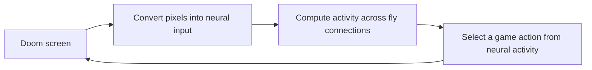

# Fly Doom

A research project to train a model based on the real fruit fly connectome to control Doom.

**Status: the real connectivity graph and neuron annotations are ready.** There is no brain simulator or trained policy yet. See the [research, architecture, and experiment plan](docs/RESEARCH.md).

Current tools include a FAFB v783 archive downloader, checksum verification, a directed sparse graph builder, annotation matching, and a ViZDoom random-policy integration check.

Project documentation, source comments, docstrings, and application messages are written in English. Upstream research data retains its original contents.

## Start here

Our target is the following loop:



This diagram describes the intended system. We have tested sending actions to Doom, downloaded and prepared the real connectivity data, and matched neuron annotations. The brain simulation and learning components have not been implemented yet.

The local dataset contains **139,255 neurons**, **15,091,983 directed neuron pairs**, and **54,492,922 synaptic contacts**. The prepared sparse connectivity matrix occupies approximately **173 MiB** in memory; this excludes simulation and training memory. Every neuron matches an annotation row, although some annotation fields are missing. See the [validation record](docs/VALIDATION.md).

A **neuron** is a nerve cell that receives and transmits signals. A **synapse** is a communication site between cells. A **connectome** describes which neurons are connected. A **simulation** computes how activity changes over time along those connections. **Training** changes selected model parameters using experience from the game. These are separate steps.

### What each file does

| File or directory | Purpose | What to know now |
|---|---|---|
| `README.md` | The project guide you are reading | Start here |
| `docs/RESEARCH.md` | Sources, design decisions, and experiment plan | Read for scientific and technical context |
| `docs/VALIDATION.md` | What has been run and verified | Progress and evidence record |
| `flydoom/data.py` | Downloads and checks data, builds the graph, and matches annotations | The current data preparation code |
| `flydoom/doom_smoke.py` | Sends random actions to Doom to check the integration | Not a fly model or training procedure |
| `flydoom/__init__.py` | Marks the directory as a Python package | No manual changes needed |
| `tests/test_data.py` | Checks the data code against small examples with known answers | Automated checks that catch mistakes |
| `pyproject.toml` | Project metadata and required Python libraries | The project's dependency list |
| `requirements.lock.txt` | Exact installed library versions | Recreates the package versions used here |
| `data/raw/` | Original files downloaded from the researchers | No need to open them in a code editor |
| `data/processed/` | Data prepared for our program | Inputs for later computations |
| `runs/` | Results from game runs | Experiment output |
| `.venv/` | The project's Python environment and libraries | Automatically managed |
| `.uv-cache/`, `.pytest_cache/`, `__pycache__/` | Installation and runtime caches | No need to inspect them now |
| `.gitignore` | Defines files excluded from Git tracking | Excludes large data and temporary files |
| `_vizdoom.ini` | Local settings generated by the game engine | Automatically generated |

In a fresh checkout, `data/` and `runs/` appear when their corresponding commands run. File extensions also help: `.py` is Python code, `.md` is documentation, and `.json` stores structured records. `.npy`, `.npz`, and `.feather` store numerical data for efficient program access.

### Tools we installed and why

We used the existing Python 3.13.11 installation on this machine. The existing `uv` tool created `.venv` and installed the project dependencies there.

| Tool or library | Role in this project | Why we use it |
|---|---|---|
| Python | Runs our scripts | Provides a shared environment for data processing and the game interface |
| `uv` | Creates the environment and installs packages | Keeps dependency installation and management straightforward |
| NumPy | Stores and processes arrays of neuron IDs and counts | Supports efficient array operations and exact 64-bit integer IDs |
| SciPy | Builds and stores the sparse connectivity matrix | Stores existing connections without allocating every possible neuron pair |
| PyArrow | Reads the research archive's Feather table | Reads the source format and selects the columns we need |
| ViZDoom | Provides the Doom engine interface | Lets Python read screen frames and send game actions |
| pytest | Runs automated checks | Detects data preparation errors using known examples |

The lock file also contains dependencies installed by these libraries, such as Gymnasium and pygame-ce. Our current scripts do not directly import those packages. Standard-library modules such as `pathlib`, `hashlib`, `json`, `csv`, and `urllib.request` come with Python and did not require separate installation. PyTorch and a learning algorithm have not been installed or implemented as part of this project yet.

### Understanding connectivity data

A fictional example for learning:

| Source neuron | Target neuron | Synapse count |
|---|---|---:|
| A | B | 3 |
| B | C | 2 |

The first row means there are three synaptic contacts from A to B. It does not imply a connection from B to A. Three contacts also do not establish an electrical effect exactly three times as strong.

`data.py` converts this list into a matrix suitable for computation. We use `A[target, source]`: the entry in row B and column A is 3. Most neuron pairs are not directly connected, so we avoid storing all the zero entries. This is a **sparse matrix**. It retains every neuron while reducing memory use.

After downloading an archive file, its digital fingerprint, or **checksum**, is compared with the publisher's value. This checks that the file matches the archive; it does not establish biological validity. Preparation writes `manifest.json` to record the sources and neuron, connection, and synapse counts.

### Reading a command

```powershell
.venv/Scripts/python.exe -m flydoom.data prepare
```

- `.venv/Scripts/python.exe`: run the Python interpreter in this project's environment.
- `-m flydoom.data`: run the `data.py` module in the `flydoom` package.
- `prepare`: select the data preparation operation. Use `download` to select downloading or `annotate` to match neuron annotations.

Run commands in a PowerShell terminal opened in the project directory. There is no need to repeat a command that has already completed successfully unless you intend to rerun that step.

## Setup (PowerShell)

Requires Python 3.11+ and `uv`. Tested on this machine with Python 3.13.

```powershell
$env:UV_CACHE_DIR = Join-Path (Get-Location) '.uv-cache'
uv venv .venv
uv pip sync --python .venv/Scripts/python.exe requirements.lock.txt
.venv/Scripts/python.exe -m pytest -q
.venv/Scripts/python.exe -m flydoom.doom_smoke --episodes 3
```

The random-policy report is written to `runs/doom-smoke.json`. It is explicitly marked `trained: false` and `connectome_loaded: false`. The game runs without a visible window; this command does not start training.

## Real connectivity data

The two connectivity archive files require approximately 853 MB of downloads. Processing needs additional disk space and RAM; annotations are downloaded separately by `annotate` if missing.

```powershell
.venv/Scripts/python.exe -m flydoom.data download
.venv/Scripts/python.exe -m flydoom.data prepare
.venv/Scripts/python.exe -m flydoom.data annotate
```

Source: [FlyWire publication archive](https://zenodo.org/records/10676866). The downloader checks published MD5 values. Preparation records source and output SHA-256 values and neuron, edge, and synapse counts in `data/processed/fafb783/manifest.json`.

`annotate` downloads the [authors' v2.1.0 annotations](https://github.com/flyconnectome/flywire_annotations/tree/ebd66db2596fcc39c6950fb54ea3efa00f7fe8a0) if necessary, checks a pinned SHA-256 value, and orders rows by neuron identity. The outputs are `neuron_annotations.tsv` and `annotations_manifest.json`. A `.tsv` file is a text table with tab-separated columns. `top_nt` is the predicted neurotransmitter; missing values remain missing.

The output matrix uses `A[target, source]`. Its weights are **unsigned synapse counts**, not physiological strengths or a working brain model. Neuron IDs remain exact integers. Neuron dynamics and the treatment of neurotransmitters in the model are the next stage.

Large data files, the environment, and run outputs are excluded from version control. Third-party data and game assets retain their own licenses; this repository does not relicense or bundle them.
