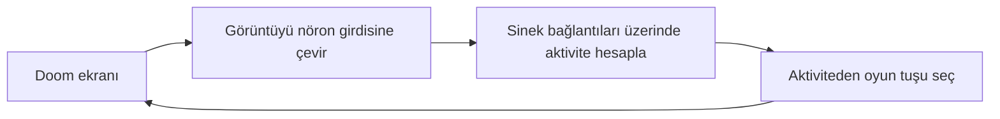

# Fly Doom

Meyve sineğinin gerçek bağlantı haritasına dayalı bir modeli Doom kontrolüne eğitmek için araştırma projesi.

**Aşama: gerçek bağlantı haritası ve nöron açıklamaları hazır.** Henüz beyin simülatörü veya eğitilmiş politika yok. [Kaynaklar, mimari ve deney planı](docs/RESEARCH.tr.md).

Mevcut araçlar: FAFB v783 arşiv indiricisi, checksum doğrulaması, yönlü seyrek graf hazırlayıcısı ve ViZDoom rastgele politika bağlantı testi.

## İlk kez bakıyorsan buradan başla

Hedefimiz şu döngüyü kurmak:



Bu, hedeflediğimiz sistemin şeması. Şu anda Doom'a tuş göndermeyi denedik; gerçek bağlantı verisini indirip hazırladık ve nöron açıklamalarını eşledik. Ortadaki beyin simülasyonu ve öğrenen bölüm henüz yok.

Yerel veride **139.255 nöron**, **15.091.983 yönlü nöron çifti** ve **54.492.922 sinaps** var. Hazırlanan seyrek bağlantı matrisi bellekte yaklaşık **173 MiB** tutuyor; bu sayı simülasyon veya eğitim belleğini kapsamıyor. Bütün nöronlar açıklama tablosuyla eşleşti, fakat bazı açıklama alanları boş. [Doğrulama ayrıntıları](docs/VALIDATION.tr.md).

**Nöron**, sinyal alan ve başka hücrelere ileten sinir hücresidir. **Sinaps**, bu hücreler arasındaki iletişim noktasıdır. **Connectome / bağlantı haritası**, hangi nöronların birbirine bağlandığını gösterir. **Simülasyon**, bu bağlantılar üzerinde aktivitenin zamanla nasıl değiştiğini hesaplar. **Eğitim**, oyun deneyiminden yararlanıp seçilen model parametrelerini değiştirir. Bunlar ayrı adımlardır.

### Hangi dosya ne işe yarıyor?

| Dosya veya klasör | Görevi | Şimdi bilmen gereken |
|---|---|---|
| `README.md` | Projenin giriş rehberi; şu anda okuduğun dosya | Başlangıç noktan |
| `docs/RESEARCH.tr.md` | Kaynaklar, neden bu yöntemi seçtiğimiz ve deney planı | Ayrıntı istediğinde oku |
| `docs/VALIDATION.tr.md` | Neyi çalıştırıp doğruladığımız | İlerleme kaydı |
| `flydoom/data.py` | Veriyi indirir, kontrol eder, bağlantı matrisini hazırlar ve hücre açıklamalarını eşler | Şu an üzerinde çalıştığımız kod |
| `flydoom/doom_smoke.py` | Doom'a rastgele tuşlar göndererek bağlantıyı dener | Sinek modeli veya eğitim değil |
| `flydoom/__init__.py` | Python'a bu klasörün bir paket olduğunu bildirir | Düzenlemen gerekmiyor |
| `tests/test_data.py` | Veri kodunu küçük, sonucu bilinen örneklerle kontrol eder | Hataları yakalayan otomatik denetimler |
| `pyproject.toml` | Projenin adı ve ihtiyaç duyduğu Python kütüphaneleri | Projenin araç listesi |
| `requirements.lock.txt` | Kurulu kütüphanelerin kesin sürümleri | Aynı ortamı yeniden kurmayı sağlar |
| `data/raw/` | Araştırmacılardan indirilen kaynak dosyaları | Kod editöründe açman gerekmiyor |
| `data/processed/` | Kaynak verinin programımız için hazırlanmış hali | Hesaplamada kullanılacak |
| `runs/` | Oyun denemelerinin sonuçları | Sonuçlara buradan bakılır |
| `.venv/` | Projeye özel Python ve kütüphaneler | Otomatik; elle değiştirme |
| `.uv-cache/`, `.pytest_cache/`, `__pycache__/` | Kurulum ve çalıştırma sırasında oluşan önbellekler | Şimdilik ilgilenmene gerek yok |
| `.gitignore` | Hangi dosyaların Git geçmişine eklenmeyeceğini belirtir | Büyük veri ve geçici dosyaları hariç tutar |
| `_vizdoom.ini` | Oyun motorunun oluşturduğu yerel ayarlar | Otomatik oluşur |

Yeni oluşturulmuş bir klasörde `data/` ve `runs/`, ilgili komutlar çalışınca ortaya çıkar. Dosya uzantıları da ipucu verir: `.py` çalıştırılabilir Python kodu, `.md` açıklama metni, `.json` alan-değer biçiminde kayıt dosyasıdır. `.npy`, `.npz` ve `.feather` ise sayısal veriyi programların verimli okuması içindir.

### Bağlantı verisini nasıl düşünmelisin?

Öğretici, uydurma bir örnek:

| Kaynak nöron | Hedef nöron | Sinaps sayısı |
|---|---|---:|
| A | B | 3 |
| B | C | 2 |

İlk satır A'dan B'ye üç sinaptik temas olduğunu söyler. B'den A'ya da bağlantı olduğunu söylemez. Ayrıca üç temas, ölçülmüş elektriksel etkinin kesin olarak üç kat olduğu anlamına gelmez.

`data.py` bu listeyi hesaplamaya uygun bir matrise dönüştürür. `A[hedef, kaynak]` kullanıyoruz: B satırı ve A sütunundaki değer 3 olur. Çoğu nöron çifti doğrudan bağlı olmadığından sıfırları tek tek saklamayız; buna **seyrek matris** denir. Böylece bütün nöronları koruyup bellek kullanımını azaltırız.

İndirme sonrası dosyanın dijital özeti (**checksum**) yayıncının değeriyle karşılaştırılır. Bu, indirdiğimiz dosyanın arşivle aynı olduğunu denetler; biyolojik modelin doğru olduğunu kanıtlamaz. Hazırlama sonunda `manifest.json`, kullanılan kaynakları ve nöron/bağlantı/sinaps sayılarını kaydeder.

### Komutu nasıl okuyacaksın?

```powershell
.venv/Scripts/python.exe -m flydoom.data prepare
```

- `.venv/Scripts/python.exe`: bu projenin Python'unu çalıştır.
- `-m flydoom.data`: `flydoom` klasöründeki `data.py` modülünü çalıştır.
- `prepare`: modülün veri hazırlama işini seç. `download` yazarsak indirme işini seçeriz.

Komutlar, proje klasöründe açık bir PowerShell terminalinde çalıştırılır. Ben burada çalıştırdığımda senin aynı komutu tekrar çalıştırman gerekmiyor.

## Kurulum (PowerShell)

Python 3.11+ ve `uv` gerekir. Bu makinede Python 3.13 ile denenmiştir.

```powershell
$env:UV_CACHE_DIR = Join-Path (Get-Location) '.uv-cache'
uv venv .venv
uv pip sync --python .venv/Scripts/python.exe requirements.lock.txt
.venv/Scripts/python.exe -m pytest -q
.venv/Scripts/python.exe -m flydoom.doom_smoke --episodes 3
```

Rastgele oyun koşusunun raporu `runs/doom-smoke.json` dosyasına yazılır. `trained: false` ve `connectome_loaded: false` olarak işaretlenir. Oyun görünmez pencerede çalışır; bu komut eğitim başlatmaz.

## Gerçek bağlantı verisi

Yaklaşık 853 MB indirme; işleme sırasında ek disk ve RAM gerekir.

```powershell
.venv/Scripts/python.exe -m flydoom.data download
.venv/Scripts/python.exe -m flydoom.data prepare
.venv/Scripts/python.exe -m flydoom.data annotate
```

Kaynak: [FlyWire yayın arşivi](https://zenodo.org/records/10676866). İndirici yayınlanan MD5 değerlerini kontrol eder. Hazırlayıcı kaynak ve çıktı SHA-256 değerlerini, nöron/kenar/sinaps sayılarını `data/processed/fafb783/manifest.json` içine yazar.

`annotate`, [yazarların v2.1.0 açıklamalarını](https://github.com/flyconnectome/flywire_annotations/tree/ebd66db2596fcc39c6950fb54ea3efa00f7fe8a0) gerekirse indirir, sabit SHA-256 değeriyle kontrol eder ve nöron kimliklerine göre sıralar. Çıktı `neuron_annotations.tsv`, eşleme raporu `annotations_manifest.json` olur. `.tsv`, sütunları sekmeyle ayrılmış metin tablosudur. `top_nt` tahmin edilen nörotransmiterdir; boş alanlar tamamlanmış gibi gösterilmez.

Çıktı matrisi `A[hedef, kaynak]` biçimindedir. Ağırlıklar **işaretsiz sinaps sayılarıdır**; fizyolojik ağırlık veya çalışır beyin modeli değildir. Nöron kimlikleri tam sayı olarak korunur. Nöron dinamiği ve nörotransmiterin modele nasıl yansıtılacağı sonraki aşamadır.

Büyük veri, sanal ortam ve koşu dosyaları sürüm kontrolünden hariçtir. Üçüncü taraf veriler ve oyun varlıkları kendi lisanslarına tabidir; bu depo onları yeniden lisanslamaz veya paketlemez.
