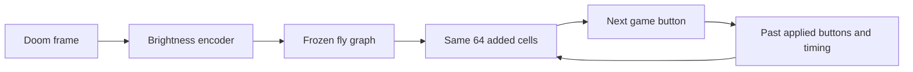

# Action memory and recovery review

This experiment tests whether recent actions and timing help the same 64 added cells recover from prolonged waiting. It adds engineering inputs, not biological memory or extra fly neurons. The fly graph remains fixed, and the added cells still reset their own voltage at every decision.

## Inspect the failed recording

The correction-v2 student on development seed 57002 chooses WAIT 63 times, RIGHT ten times, ATTACK twice, and LEFT zero times. Its longest WAIT streak lasts 22 decisions, starting at decision 42. On the same saved observations, Laya recommends LEFT 50 times and disagrees with 49 WAIT choices. Advice is not guaranteed correct, but this reveals a substantial mismatch. This new recording and its labels are diagnostic only; they are not added to the memory experiment's training set.

Open the interactive review:

```powershell
Start-Process .\runs\recovery-review-v1\index.html
```

Use the slider to inspect decision 41: the target is visibly left of the weapon, the student selects RIGHT, and Laya recommends LEFT. **Play replay** advances the recording; the episode selector switches between failure and success. The image precedes the action; the return follows it. The 64 cells' activity is recomputed from the verified recorded policy and neural inputs, with probabilities checked against the saved run. This page runs locally without a server or external resources.

The student's vision route is an 8-by-8 brightness encoding through the graph. Laya also receives a direct blue-pixel description and three past visual summaries. Action memory tests one information difference between the policies; it does not fix or isolate all visual representation differences.

## What the new inputs contain

`action_memory.py` adds 17 inputs: twelve indicators for the three past buttons, three timing values (completed decisions, decisions since an active button, and decisions since a shot), and two flags distinguishing unavailable timing from zero. Time counts are divided by 75. Before the first decision all memory inputs are zero. Only the actual applied button updates memory, and each episode starts empty. No current label, reward, future observation, or direct image feature enters memory.



The original 2,606 neural channels stay first; the 17 new inputs follow; the original four previous-action indicators stay last. Input width becomes 2,627. New connection weights start at zero, preserving the original policy before training. Original normalization is unchanged; bounded memory inputs use mean zero and scale one.

## Train and play

The experiment uses the same parent, observations, teacher probabilities, loss, random seed, learning rate 0.00001, and 100-epoch budget as correction-v2. It changes the input representation. Both human-accuracy constraints and the parent-at-epoch-zero option remain. The failed teacher gate is preserved. Human test data is not evaluated.

To reproduce into a new directory:

```powershell
.\.venv\Scripts\python.exe -m flydoom.correction_training train --collection runs/student-correction-merged-v1 --labels runs/student-correction-labels-v1 --output runs/my-memory-student --epochs 100 --learning-rate 0.00001 --memory
```

The completed `runs/fly-student-memory-v1` candidate selects epoch 11. Its human accuracy is 66.85% and balanced accuracy 51.43%, the same as correction-v2. Correction-validation KL changes from 0.64391 to 0.63918. On the failed recording's 75 fixed observations, zeroing memory changes probabilities by at most 0.01877 but changes no selected actions. This is diagnostic replay, not autonomous recovery.

To play it with the observer:

```powershell
.\.venv\Scripts\python.exe -m flydoom.live_brain --checkpoint runs/fly-student-memory-v1 --port 8767
```

The **Action memory inputs** panel shows values used for the displayed decision. Click **since active**, for example, to inspect its learned connections. The original model remains the default. Memory checkpoints use a distinct schema and implementation checksum: use `live_brain`, not the older `learning play` command.

The current correction collector accepts standard students only and rejects memory checkpoints before loading the graph. This experiment trains memory inputs from existing standard-student recordings; collecting and continuing training from a memory-policy parent requires a later extension.

`live_brain --seeds 58000 58002 58004 58006 58007 58010` runs explicit noncontiguous starts, overriding `--seed` and `--episodes`. `--disconnected` disables graph transmission for a control. Playback never trains weights.

## Check opening-image overlap

A scan of 48 starts (58000-58047) found 25 distinct opening frames. Before gameplay, six were selected whose opening pixels differ from one another and from all checked human/student training and validation frames. The plan is `runs/memory-evaluation-plan-v1/report.json`. Human test frames were not inspected. This checks exact pixels only: the same map, nearby positions, and later overlap remain possible. The first-eligible selection favors right-side and central positions, so it is not a balanced position benchmark.

The memory model, correction-v2 baseline, disconnected control, and direct Laya/timing/random controls use the same planned seeds and 75-decision limit. Completed results are in [VALIDATION.md](VALIDATION.md). These starts become development data after comparison.

The completed comparison improves from two to three target kills in six episodes; mean return improves from -200.17 to -153.17. The additional success is start 58010, where the memory candidate finishes in 34 decisions. The longest WAIT streak remains 33, and direct Laya kills five targets. This is a small pilot improvement with unresolved failures. To inspect the improved development example, add `--episodes 1 --seed 58010` to the memory playback command.

An additional control zeros only the learned memory-input connections in a separate copy, leaving every other weight unchanged. On the selected development start 58010, that copy fails after 75 decisions. The first action difference appears at decision 9: memory enabled chooses ATTACK; memory connections zeroed chooses RIGHT. This supports an effect of the memory inputs in this one example, not a general recovery guarantee. The control is recorded separately at `runs/memory-ablation-comparison-v1/report.json`.

## Files and existing libraries

| File | Purpose |
|---|---|
| `flydoom/action_memory.py` | Encodes past buttons and expands inputs without changing initial behavior |
| `flydoom/correction_training.py` | Trains optional memory inputs with the existing validation constraints |
| `flydoom/live_brain.py`, `flydoom/live_activity.py` | Run and inspect memory checkpoints and connections |
| `flydoom/recovery_review.py`, `flydoom/web/recovery.html` | Build the interactive recording/advice comparison |
| `tests/test_action_memory.py`, `tests/test_recovery_review.py` | Check causality, parent parity, training, runtime resets, and review summaries |

No new package is installed. NumPy encodes history and loads arrays, PyTorch trains weights, safetensors preserves them, and the browser renders the local interface. ViZDoom and SciPy continue to run the game and graph.
