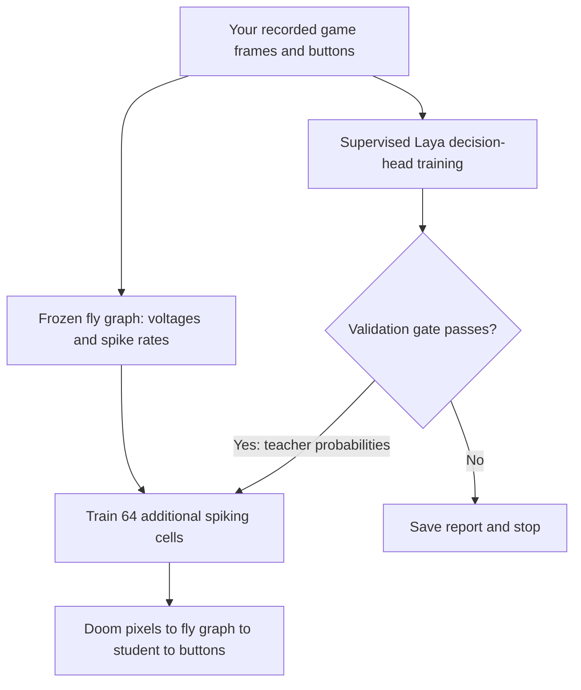

# Learning with a local Laya teacher

The first learning stage trains an additional group of 64 engineered spiking cells. The real fly graph supplies neural features and retains its original connection counts and signs. Its global gain is reduced using an engineering calibration. This is an imitation experiment, with no game-reward reinforcement learning yet.

Human recordings have trained the Laya decision head, and an explicit experimental path now transfers its probabilities to the added spiking group. The teacher still fails its offline acceptance gate; experimental transfer retains that rejection in both training and gameplay reports. The default automatic pipeline still stops at a rejected teacher. Random infrastructure recordings remain ineligible as training labels.

## Start your first experiment

Open PowerShell in the project directory and run:

```powershell
.\.venv\Scripts\python.exe -m flydoom.learning run
```

No environment activation or PowerShell execution-policy change is required. The command uses the project's Python directly.

1. A window displays Doom and keyboard instructions. Before ENTER, try the movement keys and SPACE and watch the `input` indicator. This is an unrecorded keyboard check. Press ENTER to begin each episode; the check's input is cleared before recording.
2. Use LEFT/RIGHT or A/D to align with the target; use SPACE to fire. Fire takes priority if movement and fire are held together. Opposite movement buttons together produce WAIT.
3. Play at least 30 episodes. If training/validation action coverage is insufficient, recording continues up to 100 episodes. Counts and the first unmet requirement are displayed. Keep trying to align and shoot; do not press meaningless buttons to fill quotas. Episodes end when the game finishes or after 75 decisions, approximately 8.6 seconds of game time. The default new episode seeds begin at 30000. Losing focus pauses recording and clears held keys; refocus and press ENTER to resume. Pauses do not become WAIT examples.
4. Before loading the graph, the program checks for at least 10 examples of each active action in training, one training WAIT, at least five of each active action in validation, and at least 30 validation decisions. Test labels do not determine whether collection continues. If coverage is still insufficient at the limit, recording is saved and the pipeline stops with `quality.json`. Otherwise it replays the saved images through all 139,255 simulated neurons. Prior CPU measurements were about 1.3 seconds per decision: 750 decisions take roughly 16 minutes for this stage alone; 30 full-length episodes can take about 49 minutes. Progress is printed every 10 frames.
5. The program adapts Laya's decision head for 15 epochs by default. If it fails the validation gate, it saves the report and stops before student training.
6. If Laya passes, it trains the extra spiking group for 50 epochs and prints a `play` command. Run that command to watch the student control Doom. The game pauses its simulation while the full neural graph computes each decision.

New experiments use timestamped directories under `runs/learning-run-.../`. Existing output directories are not overwritten by a new run. ESC or closing the recording window keeps completed episodes and discards the active episode. To append to a stopped recording and then continue the pipeline, run:

```powershell
.\.venv\Scripts\python.exe -m flydoom.learning resume --run-dir runs/learning-run-20260929-025831-927335
```

Replace the directory with your experiment's path. Resume verifies saved checksums, keeps episode seeds and split assignments, and restarts the unfinished episode. Existing episode files are never replaced. It supports pipelines stopped during recording or for insufficient action coverage, before neural preparation has started. The original recording limits are inherited; `--max-episodes` can increase the limit up to 100. For a run using custom model/calibration paths, pass those same paths again. The keyboard check and ENTER are still required. Reaching a total episode count does not by itself satisfy the coverage requirements.

Ctrl+C stops later stages; partial artifacts remain for inspection. Resuming partial preparation or training is not implemented. Use the separate commands below to continue from a completed stage with a new output directory.

Even 30 episodes can be a small pilot. Very short successful episodes or repetitive behavior may leave too few validation examples. The coverage thresholds are a prerequisite, not a guarantee of useful training. A failed teacher gate can indicate a poor observation representation, insufficient behavioral diversity, or an unsuitable teacher. Do not bypass it to claim success.

Keyboard events are pumped about 120 times per second, and each displayed observation collects one action over approximately four game tics. A press and release between decisions is retained for the next action. Held keys continue to apply; fire still takes precedence and opposite movement keys cancel. This quantization can merge multiple taps within one decision, and only one button is sent. Each episode saves `key_press_counts` and `latched_taps` alongside the actual buttons applied to Doom, so future input problems can be audited. The earlier recording contains no key-event log, so we cannot establish which of its WAIT rows were missed taps.

## What happens to the data



The revised teacher sees an **8 by 8 brightness grid with values from 0 to 255**, a text description of blue pixels in the middle image band, and the previous action. The old grid had only ten brightness levels. A fixed pixel heuristic selects pixels whose blue channel exceeds red by more than 25, green by more than 15, and is greater than 60; only vertical positions from 20% through 75% of the image are considered. A sufficiently large patch is described by its horizontal centroid and area fraction. This is a scenario-specific color cue, not a trained enemy detector: other blue objects can confuse it. The model receives no game-provided target coordinates, object labels, rewards, or demonstrated next action in its input. Laya processes the resulting text, not the RGB image directly.

The fly input remains the original brightness encoder. Thus the teacher has a richer pixel-derived observation than the student's neural features, which can limit distillation even if the teacher passes. Neither a more detailed observation nor a teacher pass proves that the fly graph can supply all necessary information.

The four choices are WAIT, MOVE_LEFT, MOVE_RIGHT, and ATTACK. Each five-episode block assigns three episodes to training, one to validation, and one to test. Seeds are distinct and episodes are never split across these sets. Validation selects checkpoints; test labels do not select checkpoints, extend collection, or approve the teacher. Reusing the same test results repeatedly to change the experiment requires a fresh test set for a later final evaluation. The revised run defaults use new seeds; specify a new `--seed` for later independent evaluations.

Laya's pretrained text encoder stays frozen. Only its head, scorer, and question-type embedding are updated using cross-entropy on human actions. Each optimizer update now contains **16 examples: four per action**, chosen from training data only. These are processed in small GPU microbatches, and their gradients are accumulated before clipping once and updating the weights. The earlier method scaled each example's loss but clipped each two-example update separately; large gradients from rare actions could therefore be heavily reduced. Balanced optimizer batches preserve the relative class contributions within each update. Minority examples are reused as needed, and majority examples are resampled across epochs. Validation/test retain their natural distributions. An epoch contains enough balanced updates to meet or slightly exceed the training row count; it is not a visit to every original row exactly once.

The frozen encoder's outputs are cached in memory, so training the head does not repeatedly recompute the same text encoding. A comparison against the original Laya forward pass checks the cached path before training. The cache changes compute cost, not the intended logits. The default learning rate is now 0.0001. The selected teacher checkpoint minimizes validation loss averaged equally across represented action classes (`balanced_nll`), including the unmodified base as epoch zero. Reports retain ordinary accuracy and loss, and include prediction counts, a confusion matrix, and gradient norms. Student selection still uses its ordinary validation loss.

This uses the installed Laya model, tokenizer, and sequence builder, with a project-specific supervised loop. It does **not** implement upstream RLCD, fine-tune the full encoder, or optimize Doom reward. Reusing rare examples can amplify poor labels, so careful demonstrations still matter.

The pilot teacher gate requires all of:

- At least 30 validation decisions, with at least five examples of each movement and firing action.
- Accuracy at least five percentage points above both a training-majority policy and a repeat-previous-action policy on validation data.
- Balanced accuracy of at least 0.5 over represented classes.
- Accuracy at least five percentage points above a control that shuffles all visual fields together, including color descriptions, while preserving previous-action hints.

This gate screens for some trivial shortcuts; it is not a statistical significance test or proof of game skill. Teacher probabilities use temperature 1 and are not calibrated confidence estimates.

The student receives 2,610 numbers: voltages and spike rates from 1,303 descending cells, followed by four previous-action indicators. Its 64 added cells use dimensionless LIF-like dynamics for eight internal steps per decision. Their state resets each decision; the fly network's state persists until the next episode. A surrogate gradient supplies an approximate derivative for the binary spike operation so PyTorch can update weights.

Student learning combines teacher probability imitation with a smaller human-action loss. Its normalization statistics come from training examples only. The checkpoint contains the new group's input, recurrent, and output weights plus normalization statistics. It does not contain updated original fly edges. During `play`, no Laya model is loaded and no model download is required.

## Files you will see

| Path within an experiment | Meaning |
|---|---|
| `pipeline.json` | Current or last recorded pipeline stage and final play command |
| `quality.json` | Action coverage and old/new observation diversity, checked before neural replay |
| `demonstrations/` | RGB frames, human buttons, previous buttons, rewards, seeds, and split assignments |
| `prepared/` | Neural features, coarse image descriptions, and checked provenance |
| `teacher/report.json` | Losses, validation/test metrics, shortcut controls, and teacher acceptance |
| `teacher/head.safetensors` | Selected Laya decision-head weights |
| `student/report.json` | Learning metrics and test results with neural features zeroed |
| `student/student.safetensors` | Extra spiking group's learned weights |

Checksums detect altered model and data artifacts. They establish file consistency, not scientific validity. The default engineering calibration is `runs/calibration-training-v1/report.json`. Model files live in `models/laya-base/`; generated data and model weights are excluded from Git.

## Separate commands

Use these when you want to inspect each stage or keep a completed recording. Pick new output names for another attempt.

```powershell
.\.venv\Scripts\python.exe -m flydoom.learning record --output runs/my-demonstrations --episodes 30 --max-episodes 100 --seed 30000
.\.venv\Scripts\python.exe -m flydoom.learning inspect --recording runs/my-demonstrations
.\.venv\Scripts\python.exe -m flydoom.learning prepare --recording runs/my-demonstrations --output runs/my-prepared
.\.venv\Scripts\python.exe -m flydoom.learning teacher --dataset runs/my-prepared --output runs/my-teacher
.\.venv\Scripts\python.exe -m flydoom.learning student --dataset runs/my-prepared --teacher runs/my-teacher --output runs/my-student
.\.venv\Scripts\python.exe -m flydoom.learning play --checkpoint runs/my-student
```

The student command refuses an unaccepted teacher by default. `--experimental-teacher` explicitly enables an exploratory transfer from a completed, verified checkpoint while retaining its failed gate and rejection reasons. It does not certify the teacher or the student. `--skip-test` leaves test metrics out of development experiments. Its default visible demonstration ends after 24 decisions. For a longer bounded evaluation with held-out seeds, use matching connected and disconnected runs:

```powershell
.\.venv\Scripts\python.exe -m flydoom.learning play --checkpoint runs/my-student --episodes 10 --seed 20000 --max-decisions 75 --headless --output runs/my-eval-connected
.\.venv\Scripts\python.exe -m flydoom.learning play --checkpoint runs/my-student --episodes 10 --seed 20000 --max-decisions 75 --headless --disconnected --output runs/my-eval-disconnected
```

These commands log returns, evaluation-only kill counts, action counts, and whether each trial ended in the game or reached the decision limit. Decision traces also include neural spike counts, the output-feature norm, and neural computation time. Kill count is never an input to the policy. They do not yet provide a full benchmark against random graphs and other learned baselines. Offline imitation accuracy can fail to transfer to closed-loop play, where the student's actions change future observations.

## Diagnose learning without another recording

The balanced memorization probe selects four distinct observations per action from the training split. It checks cached versus original logits, audits gradient clipping, and attempts to fit those 16 examples with dropout disabled. It does not use validation/test examples, save a gameplay checkpoint, or prove generalization:

```powershell
.\.venv\Scripts\python.exe -m flydoom.learning_diagnosis --dataset runs/learning-run-20260929-025831-927335/prepared --output runs/my-memorization-probe
```

To retry full teacher training on already prepared data, use `learning teacher --dataset <existing prepared directory> --output <new teacher directory>`. No further keyboard recording or full-graph replay is required. Keep earlier reports so the comparison is auditable. Repeatedly inspecting the same test split during development makes it an exploratory result; reserve fresh episodes for a final evaluation.

The completed probe is `runs/laya-balanced-diagnosis-v1/report.json`: 16/16 selected training examples were classified correctly after 70 updates, with no encoder gradients and zero measured logit discrepancy between cached and original forward paths on that probe. Full retraining is saved separately in `runs/laya-balanced-teacher-v2/`, using the original prepared 69-episode recording. Its validation balanced accuracy is 63.9%, compared with the previous constant-WAIT model's 25%; overall accuracy is 59.7%, below the required 69.1%. Image-shuffled accuracy is 44.8%. Thus visual action learning improved, while the teacher gate still rejects distillation.

A validation-only diagnostic multiplied the new teacher's probabilities by training action frequencies raised to powers 0, 0.5, or 1 to examine the prior shift from balanced sampling. No variant passed all existing gates: the full correction improved ordinary accuracy but suppressed firing and reduced balanced accuracy. This diagnostic did not modify the saved teacher or the production inference rule. The next investigation should focus on temporal context and action timing using existing recorded frame/action sequences, with separate episode splits and the acceptance gate retained.

## Temporal observation experiment

The temporal adapter adds the previous three visual summaries and applied actions to each teacher observation, plus the number of completed decisions and time since the last active action and shot. All counts use game decisions, not wall-clock time. The action being predicted is appended to the history only after its observation is constructed. History resets at every episode boundary. The previous visuals describe blue regions and left/center/right brightness; the current image retains its full 8 by 8 grid.

```powershell
.\.venv\Scripts\python.exe -m flydoom.temporal_data --dataset runs/learning-run-20260929-025831-927335/prepared --output runs/my-temporal-data
.\.venv\Scripts\python.exe -m flydoom.learning teacher --dataset runs/my-temporal-data --output runs/my-temporal-teacher --epochs 15 --skip-test
```

This writes a new dataset, retaining neural-feature file bytes, labels, seeds, and split assignments. It does not rerun the fly simulation. The new manifest records the parent dataset and adapter hashes. Existing recordings are sufficient; another keyboard session is not required for this experiment.

Temporal training adds a timing-only baseline: a training-derived lookup from completed-decision count and previous action to the most frequent training action. Unseen combinations fall back to the training majority. Validation labels are used only to score this baseline. The teacher must exceed the strongest baseline, including this timing lookup, by five percentage points; the original balanced-accuracy and image-shuffle gates still apply. Visual shuffling moves the current image and past visual summaries together while retaining the recipient's action history and timing. Teacher tokenization rejects observations exceeding 512 tokens rather than silently truncating history.

`--skip-test` leaves the test split unevaluated during development. Passing offline imitation checks would still require testing autonomous behavior: at deployment, the policy's own actions, rather than human actions, determine subsequent history. The present temporal adapter enriches the teacher only; the student's existing input remains frozen-network features and its previous action. Distillation must be evaluated separately, since the richer teacher observation may not be recoverable from those student features.

To continue training from a completed teacher on the same dataset, add `--initial-teacher <teacher directory>` and choose a new output directory. The model/data checksums and base checkpoint must match. This retains the selected head weights but resets AdamW state; it is a warm start, not an exact optimizer resume. The initial weights remain eligible as epoch zero if further updates make validation worse.

The completed temporal experiments use `runs/temporal-prepared-v1/`, `runs/laya-temporal-teacher-v1/` (15 epochs), and `runs/laya-temporal-teacher-v2/` (15 additional warm-start epochs). The selected second checkpoint achieves 71.8% ordinary and 74.7% balanced validation accuracy. Its ordinary accuracy matches the timing-only baseline, so the strengthened distillation gate still rejects it. Neither temporal training run evaluated the test split. The earlier prior-adjustment probe is recorded separately and did not change the deployed probabilities.

## Watch and compare autonomous teacher play

The teacher can be evaluated experimentally even if it fails the offline imitation gate. This does not change the gate or automatically enable student distillation. A separate explicit student experiment is described below. Direct teacher play separates predicting a human's next button from achieving a target kill and game reward:

```powershell
.\.venv\Scripts\python.exe -m flydoom.teacher_play --teacher runs/laya-temporal-teacher-v2 --visible --episodes 6
```

No keyboard demonstrations are supplied during play. History is rebuilt from the model's own actions and resets each episode. The teacher receives only the current image-derived observation and its history. Kill count is read only after play for evaluation and is never supplied to the policy. The command saves episode returns, action counts, termination reasons, and a decision trace in a new timestamped output directory.

For paired controls on six fresh seeds:

```powershell
.\.venv\Scripts\python.exe -m flydoom.teacher_play --teacher runs/laya-temporal-teacher-v2 --dataset runs/temporal-prepared-v1 --policies laya timing random --episodes 6 --seed 50000 --output runs/my-teacher-comparison
```

Providing the matching dataset checks that evaluation seeds do not overlap demonstration seeds and builds the timing policy from training labels only. The default 75-decision cap matches the bounded basic scenario. An older single-frame teacher can be compared using its own matching prepared dataset; it receives exactly its original current-frame observation, excluding history and timing fields. The evaluator does not support the earliest ten-level brightness format.

In the six-seed pilot, the continued temporal teacher killed six targets with mean return 29.0; the timing control killed five with mean return -29.2; random killed six with mean return 20.8. The older single-frame teacher killed none, with mean return -305.0. These are small-sample observations on the basic scenario, not evidence of general superiority. Direct Laya play does not run the 139,255-cell fly network and is not evidence that the added 64 cells have learned Doom.

The matched 15-epoch temporal teacher killed only one of the six targets, with mean return -254.8. Its continued version therefore must not be compared to the old single-frame teacher as if history were the only changed factor: the additional optimization also matters. The episode results are in `runs/temporal-teacher-game-eval-v1/`, `runs/single-frame-teacher-game-eval-v1/`, and `runs/temporal-teacher-matched-budget-game-eval-v1/`. These gameplay seeds were not used for training, but after inspecting them they should be treated as development evaluation seeds; use a new set for a final comparison.

## Experimental transfer to the fly-network readout

The requested first transfer is saved in `runs/fly-student-experimental-v2/`. It uses the existing 511 training decisions in `runs/temporal-prepared-v1/` and probabilities from `runs/laya-temporal-teacher-v2/`; no new keyboard session or dependency installation was needed. Original graph weights are frozen. Only the added group's input, recurrent, and output weights are trained. Laya's offline rejection remains recorded, and the ordinary automatic pipeline retains its gate.

```powershell
.\.venv\Scripts\python.exe -m flydoom.learning play --checkpoint runs/fly-student-experimental-v2 --max-decisions 75
```

The route during play is **pixels → calibrated frozen fly graph → 1,303 descending-cell voltages and rates → 64 trained engineered cells → buttons**. Four previous-action indicators also enter the added group. It receives no direct image summary, target label, reward, or Laya decision during play. Terminal spike counts include the whole graph; input cells can still spike under the disconnected control even though descending features are zero. The graph computes about 50 ms of neural activity per decision, taking roughly 1.3 seconds of wall time. Doom advances four tics only after the decision finishes.

Training ran for 100 epochs and selected epoch 12 by validation loss. Ordinary validation accuracy is 71.27%, balanced accuracy is 52.76%. Zeroing the neural features gives 64.09% ordinary accuracy and 25% balanced accuracy: every action becomes WAIT. This shows that the readout uses neural features on these observations; it does not prove that the biological topology is necessary or that the student is a competent autonomous player. The test split was left unevaluated.

Native Doom evaluation on three fresh seeds (51000–51002) produced two target kills, with returns **[-315, 39, 31]**. Cutting synaptic transmission on the same seeds produced zero kills and 225 WAIT decisions, with returns **[-300, -300, -300]** and exactly zero descending-feature norms. Every episode terminated in the game rather than at the external decision limit; the failed episodes timed out. These are small development trials, not a broad success rate or a comparison against random topology. The failed connected episode also shows that the transferred student is not consistently effective. Reports and traces are in `runs/fly-student-connected-eval-v1/` and `runs/fly-student-disconnected-eval-v1/`.

To watch those same three development starts:

```powershell
.\.venv\Scripts\python.exe -m flydoom.learning play --checkpoint runs/fly-student-experimental-v2 --episodes 3 --seed 51000 --max-decisions 75
```

To reproduce training into a new directory:

```powershell
.\.venv\Scripts\python.exe -m flydoom.learning student --dataset runs/temporal-prepared-v1 --teacher runs/laya-temporal-teacher-v2 --output runs/my-fly-student --epochs 100 --experimental-teacher --skip-test
```

The first attempt, `runs/fly-student-experimental-v1/`, stopped on a Windows report-file replacement error and is not a playable checkpoint. Report writing now retries brief permission failures while retaining atomic replacement and the last complete report. The second attempt completed; neither attempt modifies the teacher's acceptance result.

## Setup on a fresh machine

This machine already has the dependencies, model, graph, and calibration. Do not repeat the download here. On another machine, first prepare the base environment and graph following the README, then install the optional learning packages:

```powershell
uv pip install --python .venv/Scripts/python.exe --cache-dir .uv-cache --torch-backend=auto --constraint requirements.lock.txt "laya==0.3.21"
$env:HF_HOME = Join-Path (Get-Location) '.hf-cache'
.\.venv\Scripts\python.exe -m flydoom.laya_teacher download --output models/laya-base
.\.venv\Scripts\python.exe -m flydoom.calibration --output runs/calibration-training-v1
.\.venv\Scripts\python.exe -m flydoom.learning doctor --output runs/learning-setup-check
```

The downloader resolves and records a Hugging Face revision, then hashes the downloaded files. This installation uses English Laya revision `55cf4c4ebb4ebe31b2550e8bdf3bd21b99753851`. A future fresh download may resolve a newer revision, which must be validated independently. The installed version snapshot is `requirements-training.lock.txt`; it targets this Windows/Python 3.13/CUDA 13.0 environment rather than every platform. For this same platform, it can be restored with `uv pip sync --python .venv/Scripts/python.exe --cache-dir .uv-cache requirements-training.lock.txt`.

`doctor` uses synthetic inputs to verify local inference and gradient updates. It never saves its synthetic updates as a gameplay checkpoint. Local model loading was verified with `HF_HUB_OFFLINE=1`. No paid decision API is used.

## What has and has not been established

The smaller gain passed bounded no-input, patterned-input, sustained-input, recovery, and disconnected-output engineering checks. It avoids the previous extreme inhibitory voltage excursion on those trials. It is not a physiological fit, and different input trajectories may still fail. Preparation and play stop if recorded post-step voltages fall below the engineering bound of -90 mV.

The added-group training code, frozen-teacher-encoder behavior, weight saving/reloading, and data rejection paths have automated tests. Actual Laya inference and a gradient update were tested on the RTX 3060 Laptop GPU, with approximately 2,025 MiB peak PyTorch allocation in that small check. Full training memory and throughput depend on the run.

The first human dataset had 205 decisions. The revised recording contains 872 decisions across 69 episodes: 511 training, 181 validation, and 180 test. It passes the action-coverage prerequisite. Temporal teacher training, small autonomous gameplay comparisons, and an explicit experimental student transfer have completed using this recording, without another keyboard session. No teacher has passed the offline distillation gate. The experimental student learns only the added group; the small results above do not establish a general advantage. Natural fly vision, biological calibration, game-reward learning, selective original-edge training, and live brain activity visualization synchronized with Doom remain later work. The existing browser viewer replays separate recorded neural experiments.

Upstream references: [Laya repository](https://github.com/NandhaKishorM/laya), [Laya sequence/model code](https://github.com/NandhaKishorM/laya/blob/main/laya/common.py), [upstream fine-tuning example](https://github.com/NandhaKishorM/laya/blob/main/docs/finetune_browser_agent.md). Upstream benchmark claims are not measurements of this Doom pipeline.
