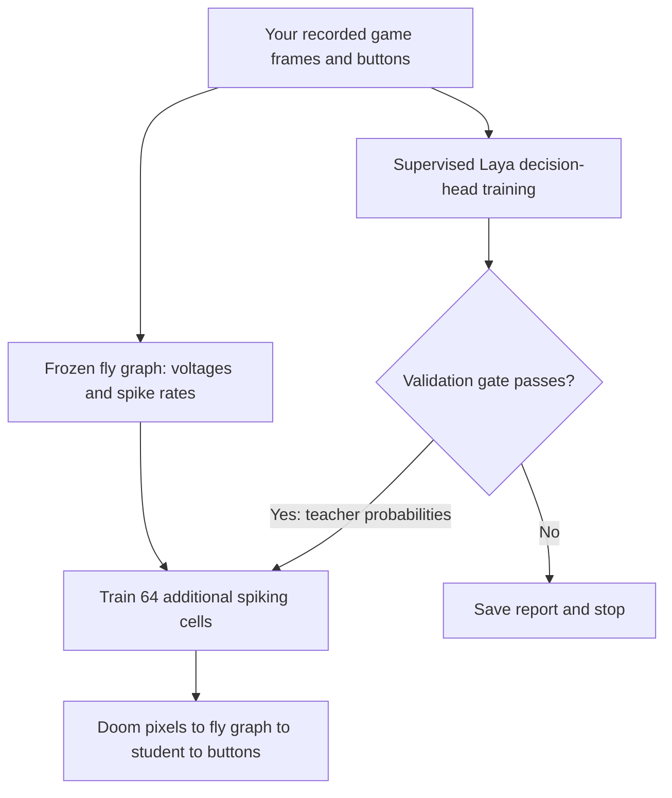

# Learning with a local Laya teacher

The first learning stage trains an additional group of 64 engineered spiking cells. The real fly graph supplies neural features and retains its original connection counts and signs. Its global gain is reduced using an engineering calibration. This is an imitation experiment, with no game-reward reinforcement learning yet.

The local setup is ready. There is **no trained Doom policy yet**: the existing game recordings are infrastructure tests with random buttons and are rejected as training labels. Your demonstrations provide the first real labels.

## Start your first experiment

Open PowerShell in the project directory and run:

```powershell
.\.venv\Scripts\python.exe -m flydoom.learning run
```

No environment activation or PowerShell execution-policy change is required. The command uses the project's Python directly.

1. A window displays Doom and keyboard instructions. Press ENTER to begin each episode.
2. Use LEFT/RIGHT or A/D to align with the target; use SPACE to fire. Fire takes priority if movement and fire are held together. Opposite movement buttons together produce WAIT.
3. Play 10 episodes. Episodes end when the game finishes or after 75 decisions, approximately 8.6 seconds of game time. Pauses before ENTER are excluded from the examples. Try to play well; the recorder does not assume your actions are optimal.
4. The program replays the saved images through all 139,255 simulated neurons. This is slower than the recording: prior CPU measurements were about 1.3 seconds per decision. A full 750-decision recording can therefore take roughly 16 minutes for this stage alone. Progress is printed every 10 frames.
5. The program adapts Laya's decision head for five epochs. If it fails the validation gate, it saves the report and stops before student training.
6. If Laya passes, it trains the extra spiking group for 50 epochs and prints a `play` command. Run that command to watch the student control Doom. The game pauses its simulation while the full neural graph computes each decision.

New experiments use timestamped directories under `runs/learning-run-.../`. Existing output directories are never overwritten. ESC or closing the recording window keeps completed episodes and discards the active episode. Ctrl+C stops later stages; partial artifacts remain for inspection. The pipeline is sequential, not automatically resumable. Use the separate commands below to continue from a completed stage with a new output directory.

Ten episodes are a small pilot. Very short successful episodes or repetitive behavior may leave too few validation examples. A failed gate can indicate insufficient data, a poor observation representation, or an unsuitable teacher. Do not bypass the gate to claim success; inspect its class counts and controls first.

## What happens to the data



The teacher sees an **8 by 8 brightness grid represented as English text and numbers**, plus the previous action. It does not directly process the RGB image. Target coordinates, object labels, rewards, and the demonstrated next action are excluded from its input. This coarse representation can discard useful visual information; Laya's usefulness here remains an empirical question.

The four choices are WAIT, MOVE_LEFT, MOVE_RIGHT, and ATTACK. Each five-episode block assigns three episodes to training, one to validation, and one to test. Seeds are distinct and episodes are never split across these sets. Validation selects checkpoints; test labels do not select checkpoints or approve the teacher. Reusing the same test results repeatedly to change the experiment would require a fresh test set for a later final evaluation.

Laya's pretrained text encoder stays frozen. Only its head, scorer, and question-type embedding are updated using cross-entropy on human actions. This uses the installed Laya model, tokenizer, and sequence builder, with a project-specific supervised loop. It does **not** implement upstream RLCD, fine-tune the full encoder, or optimize Doom reward.

The pilot teacher gate requires all of:

- At least 30 validation decisions, with at least five examples of each movement and firing action.
- Accuracy at least five percentage points above both a training-majority policy and a repeat-previous-action policy on validation data.
- Balanced accuracy of at least 0.5 over represented classes.
- Accuracy at least five percentage points above a control that shuffles images while preserving previous-action hints.

This gate screens for some trivial shortcuts; it is not a statistical significance test or proof of game skill. Teacher probabilities use temperature 1 and are not calibrated confidence estimates.

The student receives 2,610 numbers: voltages and spike rates from 1,303 descending cells, followed by four previous-action indicators. Its 64 added cells use dimensionless LIF-like dynamics for eight internal steps per decision. Their state resets each decision; the fly network's state persists until the next episode. A surrogate gradient supplies an approximate derivative for the binary spike operation so PyTorch can update weights.

Student learning combines teacher probability imitation with a smaller human-action loss. Its normalization statistics come from training examples only. The checkpoint contains the new group's input, recurrent, and output weights plus normalization statistics. It does not contain updated original fly edges. During `play`, no Laya model is loaded and no model download is required.

## Files you will see

| Path within an experiment | Meaning |
|---|---|
| `pipeline.json` | Current or last recorded pipeline stage and final play command |
| `demonstrations/` | RGB frames, human buttons, previous buttons, rewards, seeds, and split assignments |
| `prepared/` | Neural features, coarse image descriptions, and checked provenance |
| `teacher/report.json` | Losses, validation/test metrics, shortcut controls, and teacher acceptance |
| `teacher/head.safetensors` | Selected Laya decision-head weights |
| `student/report.json` | Learning metrics and test results with neural features zeroed |
| `student/student.safetensors` | Extra spiking group's learned weights |

Checksums detect altered model and data artifacts. They establish file consistency, not scientific validity. The default engineering calibration is `runs/calibration-training-v1/report.json`. Model files live in `models/laya-base/`; generated data and model weights are excluded from Git.

## Separate commands

Use these when you want to inspect each stage or keep a completed recording. Pick new output names for another attempt.

```powershell
.\.venv\Scripts\python.exe -m flydoom.learning record --output runs/my-demonstrations --episodes 10
.\.venv\Scripts\python.exe -m flydoom.learning prepare --recording runs/my-demonstrations --output runs/my-prepared
.\.venv\Scripts\python.exe -m flydoom.learning teacher --dataset runs/my-prepared --output runs/my-teacher
.\.venv\Scripts\python.exe -m flydoom.learning student --dataset runs/my-prepared --teacher runs/my-teacher --output runs/my-student
.\.venv\Scripts\python.exe -m flydoom.learning play --checkpoint runs/my-student
```

The student command refuses an unaccepted teacher. Its default visible demonstration ends after 24 decisions. For a longer bounded evaluation with held-out seeds, use matching connected and disconnected runs:

```powershell
.\.venv\Scripts\python.exe -m flydoom.learning play --checkpoint runs/my-student --episodes 10 --seed 20000 --max-decisions 75 --headless --output runs/my-eval-connected
.\.venv\Scripts\python.exe -m flydoom.learning play --checkpoint runs/my-student --episodes 10 --seed 20000 --max-decisions 75 --headless --disconnected --output runs/my-eval-disconnected
```

These commands log returns and whether each trial ended in the game or reached the decision limit. They do not yet provide a full benchmark against random graphs and other learned baselines. Offline imitation accuracy can fail to transfer to closed-loop play, where the student's actions change future observations.

## Setup on a fresh machine

This machine already has the dependencies, model, graph, and calibration. Do not repeat the download here. On another machine, first prepare the base environment and graph following the README, then install the optional learning packages:

```powershell
uv pip install --python .venv/Scripts/python.exe --cache-dir .uv-cache --torch-backend=auto --constraint requirements.lock.txt "laya==0.3.21"
$env:HF_HOME = Join-Path (Get-Location) '.hf-cache'
.\.venv\Scripts\python.exe -m flydoom.laya_teacher download --output models/laya-base
.\.venv\Scripts\python.exe -m flydoom.calibration --output runs/calibration-training-v1
.\.venv\Scripts\python.exe -m flydoom.learning doctor --output runs/learning-setup-check
```

The downloader resolves and records a Hugging Face revision, then hashes the downloaded files. This installation uses English Laya revision `55cf4c4ebb4ebe31b2550e8bdf3bd21b99753851`. A future fresh download may resolve a newer revision, which must be validated independently. The installed version snapshot is `requirements-training.lock.txt`; it targets this Windows/Python 3.13/CUDA 13.0 environment rather than every platform. For this same platform, it can be restored with `uv pip sync --python .venv/Scripts/python.exe --cache-dir .uv-cache requirements-training.lock.txt`.

`doctor` uses synthetic inputs to verify local inference and gradient updates. It never saves its synthetic updates as a gameplay checkpoint. Local model loading was verified with `HF_HUB_OFFLINE=1`. No paid decision API is used.

## What has and has not been established

The smaller gain passed bounded no-input, patterned-input, sustained-input, recovery, and disconnected-output engineering checks. It avoids the previous extreme inhibitory voltage excursion on those trials. It is not a physiological fit, and different input trajectories may still fail. Preparation and play stop if recorded post-step voltages fall below the engineering bound of -90 mV.

The added-group training code, frozen-teacher-encoder behavior, weight saving/reloading, and data rejection paths have automated tests. Actual Laya inference and a gradient update were tested on the RTX 3060 Laptop GPU, with approximately 2,025 MiB peak PyTorch allocation in that small check. Full training memory and throughput depend on the run.

No human demonstration dataset, accepted Doom teacher, trained gameplay student, or measured gameplay advantage has been produced yet. Natural fly vision, biological calibration, game-reward learning, selective original-edge training, and live brain activity visualization synchronized with Doom remain later work. The existing browser viewer replays separate recorded neural experiments.

Upstream references: [Laya repository](https://github.com/NandhaKishorM/laya), [Laya sequence/model code](https://github.com/NandhaKishorM/laya/blob/main/laya/common.py), [upstream fine-tuning example](https://github.com/NandhaKishorM/laya/blob/main/docs/finetune_browser_agent.md). Upstream benchmark claims are not measurements of this Doom pipeline.
