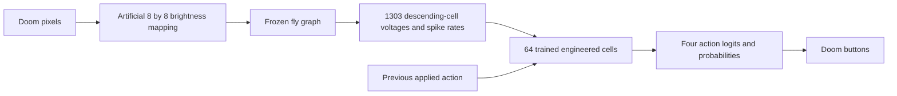

# Live neural observatory

The optional [action-memory candidate](ACTION_MEMORY.md) adds an **Action memory inputs** panel. It shows actual past-button/timing values and their learned connections to the same 64 cells. Start it with `python -m flydoom.live_brain --checkpoint runs/fly-student-memory-v1 --port 8767`. The original checkpoint remains the default. A separate [recovery replay](ACTION_MEMORY.md#inspect-the-failed-recording) compares recorded student choices with Laya advice without running another game.

This screen follows the existing trained student while it plays Doom. It loads the verified fly graph and the saved 64-cell readout, without loading a Laya model or changing any weights. All page assets are local; no additional packages or downloads are needed on this prepared machine.

```powershell
.\.venv\Scripts\python.exe -m flydoom.live_brain
```

The browser opens at **http://127.0.0.1:8766**. The run starts paused, with three bounded episodes on development seeds 51000–51002. Keep the terminal running. To choose another completed student, pass `--checkpoint <directory>`. `--episodes`, `--seed`, `--max-decisions`, and `--port` change the run settings. `--no-browser` prints the address without opening a tab. A maximum of 75 decisions per episode and 20 episodes is enforced.

## Walk through one decision

1. Click **Step once**. The model processes the image through the full fly network, reads its descending outputs, and advances Doom by up to four game tics. It then pauses again. The computation can take several seconds on this machine.
2. The Doom image is the exact observation used for that decision. The displayed return includes the action's subsequent game tics. Image, neural counts, and action probabilities share a decision number; the image is intentionally from before the selected action.
3. Select a row in **Most active fly neurons** or **Descending output neurons**. The inspector shows the exact root ID, annotations, endpoint voltage, spikes in the current 50 ms window, and directed connections.
4. Click a neighboring node to follow a connection. Drag the diagram to pan, scroll to zoom, or click **Reset view**. The exact-ID search can inspect any of the 139,255 fly neurons, including those outside the top-ten lists.
5. Click one of the **64 added cells**. Its brightness reflects spikes over the actual eight internal readout steps. The inspector shows its learned inputs, selected recurrent inputs, and links to the four action outputs.
6. Click **WAIT**, **MOVE LEFT**, **MOVE RIGHT**, or **ATTACK** to inspect the learned action weights. The expanded table includes current arithmetic contributions to the action logit, as well as the action bias in the inspector.
7. Click **Run** to continue or **Pause** to inspect. Controls apply between decisions; an in-progress neural computation finishes first. **End run** ends the bounded experiment and leaves the final observation available for inspection. Ctrl+C in the terminal closes the server. Start the command again for a fresh run.

## Reading the connections and activity

The diagram uses a **schematic layout**, not anatomical coordinates or neuron shapes. Every drawn edge comes from the saved model or the calibrated fly graph. Only a bounded selection is drawn: the strongest incoming/outgoing fly weights, or selected learned input/recurrent/output weights. Exact totals are shown for fly neurons; the expanded table gives endpoints, channels, units, and signed values. Multiple features from the same descending neuron can share endpoints, so use the table to distinguish voltage and spike-rate channels.

Arrows point from source to target. Green means a positive model weight, pink means a negative weight, and gray means zero. Fly weight signs depend on the project's transmitter assumptions; the scalar weight uses the engineering calibration. Learned weights act on normalized features and have different units, so their magnitudes cannot be compared directly with fly synaptic weights.

Fly spike counts cover 50 ms of simulated neural time. The voltage is the endpoint voltage, after any spike reset; it is not the maximum voltage reached during the interval. Cells can therefore have several spikes yet finish at the reset voltage. The recent history retains up to 24 observations within the current episode. The neuron inspector uses the same observation sequence as the displayed image, even if the next computation has already started.

The added cells use eight dimensionless internal steps and reset between decisions. Their 0–8 spike counts are captured from the **actual forward pass** by read-only PyTorch hooks. They are engineered units, not additional measured fly neurons. The observer does not simulate a separate approximate readout or feed its visualizations back into the model.

The model route remains:



Activity and weight magnitude are not measures of importance, understanding, or causal responsibility. Action contributions are arithmetic terms in the readout; they do not establish why a particular biological circuit was necessary. Input encoding is artificial, original fly weights are fixed, and the teacher's offline rejection remains recorded.

## Saved files and validation

Each invocation creates a new `runs/live-brain-<timestamp>/` directory. `decisions.jsonl` saves actions, probabilities, returns, graph spike counts, computation times, and all 64 added-cell spike counts. `report.json` saves episode outcomes and model/observer hashes. The browser's full-neuron snapshots and images are bounded in-memory observations; they are not saved as a replay archive. The older `flydoom.viewer` remains available for recorded brain-probe experiments.

The native-engine observation check used seed 51001 and finished after 16 decisions with one target kill and return 39. Its actions, returns, and probabilities exactly matched the earlier student evaluation (maximum absolute probability difference 0). The student implementation and weights remained unchanged. This checks observer equivalence on one trajectory; it is not a new learning result.

The test suite has **86 passing tests**, including exact-ID handling, target/source edge orientation, read-only hooks, arithmetic action contributions, pause/step behavior, image/action timing, checkpoint rejection, and local HTTP route/control checks. Headless Edge also exercised actual graph clicks, zoom, pan, reset, cell/action selection, and the 390-pixel mobile layout without horizontal overflow. Details are in [VALIDATION.md](VALIDATION.md).
