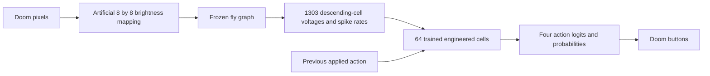

# Live brain and trained-network map

For the current Laya Vision integration and redesigned research interface, use `python -m flydoom.research` and the [Vision workbench developer guide](VISION_WORKBENCH.md). This page documents the retained student-only observer and its earlier human-labeling workflow.

The default view places all **139,255 fly neuron reference points** beside the **64 trained engineered cells**, their action outputs, and any action-memory inputs. The interface uses a large central map, an adjustable Doom observation panel, and a cell inspector. It runs locally with WebGL and Canvas; no new package is required.

The game panel now starts at 480 pixels wide on larger desktops, subject to available space. Use **Game panel width** to adjust it; the preference is saved in this browser. **Focus game** temporarily gives the game the workspace while keeping Run, Pause, and Step once available. Click **Back to brain map** or press Escape to restore the map and current selection. On narrow screens, the full-width game appears above the map. These controls resize the same observation image without changing the model input or advancing the game.

For the current memory candidate, start a paused session with:

```powershell
.\.venv\Scripts\python.exe -m flydoom.live_brain --checkpoint runs/fly-student-memory-v1 --port 8767
```

Open **http://127.0.0.1:8767** while that terminal stays running. Drag the brain to rotate, Shift-drag to pan, and scroll to zoom. Click a fly point, added cell, memory input, or action to inspect its actual directed connections. **Reset view** restores the camera. The filter isolates spiking neurons, visual inputs, or descending outputs; the two layer checkboxes toggle learned overview links and selected-cell links. **Selected connections** opens the separate schematic neighborhood, where ordinary dragging pans.

The map uses real `pos_x`, `pos_y`, and `pos_z` annotation anchors converted from 4 × 4 × 40 nm voxels to micrometers, with the source axes retained. These are reference points, not complete neuron shapes, soma locations, or measured synapse positions. Engineered cells and memory inputs have an explicitly schematic placement beside the fly brain. Orange highlights simulated spiking in the displayed decision. The point cloud and readout activity follow the same observation sequence as the Doom image.

All points are available, but 15 million edges are not drawn together. The overview draws the two strongest neural-feature inputs per trained cell, the strongest destination for each memory input, and four strongest inputs per action. Selecting a node reveals bounded local connections from the real calibrated graph or saved learned weights. Overlapping voltage and spike-rate links are distinguished in the connection table. Scroll the table horizontally for full channel and unit labels.

Design references: [FlyWire Codex](https://codex.flywire.ai/) for navigating neurons and their connections, and [neuPrint](https://neuprint.janelia.org/) for connectivity inspection. The restrained map-and-inspector layout adapts those research-tool concepts; this is not an embedded or connected instance of either service. The [Cytoscape WebGL performance discussion](https://blog.js.cytoscape.org/2025/01/13/webgl-preview/) also informed the choice to retain a GPU point layer and a bounded connection overlay rather than render every edge.

The optional [action-memory candidate](ACTION_MEMORY.md) adds an **Action memory inputs** panel. It shows actual past-button/timing values and their learned connections to the same 64 cells. Start it with `python -m flydoom.live_brain --checkpoint runs/fly-student-memory-v1 --port 8767`. The original checkpoint remains the default. A separate [recovery replay](ACTION_MEMORY.md#inspect-the-failed-recording) compares recorded student choices with Laya advice without running another game.

This screen follows the existing trained student while it plays Doom. It loads the verified fly graph and the saved 64-cell readout, without loading a Laya model or changing any weights. All page assets are local; no additional packages or downloads are needed on this prepared machine.

```powershell
.\.venv\Scripts\python.exe -m flydoom.live_brain
```

The browser opens at **http://127.0.0.1:8766**. The run starts paused, with three bounded episodes on development seeds 51000–51002. Keep the terminal running. To choose another completed student, pass `--checkpoint <directory>`. `--episodes`, `--seed`, `--max-decisions`, and `--port` change the run settings. `--no-browser` prints the address without opening a tab. A maximum of 75 decisions per episode and 20 episodes is enforced.

## Walk through one decision

1. Click **Step once**. The model processes the image through the full fly network, reads its descending outputs, and advances Doom by up to four game tics. It then pauses again. The computation can take several seconds on this machine.
2. The Doom image is the exact observation used for that decision. The displayed return includes the action's subsequent game tics. Image, neural counts, and action probabilities share a decision number; the image is intentionally from before the selected action.
3. Select a row in **Most active fly neurons** or **Descending output neurons**. The inspector shows the exact root ID, annotations, endpoint voltage, spikes in the current 50 ms window, and directed connections.
4. Click a neighboring node to follow a connection. Drag the brain map to rotate, Shift-drag to pan, scroll to zoom, or click **Reset view**. In **Selected connections**, drag to pan. The exact-ID search can inspect any of the 139,255 fly neurons, including those outside the top-ten lists.
5. Click one of the **64 added cells**. Its brightness reflects spikes over the actual eight internal readout steps. The inspector shows its learned inputs, selected recurrent inputs, and links to the four action outputs.
6. Click **WAIT**, **MOVE LEFT**, **MOVE RIGHT**, or **ATTACK** to inspect the learned action weights. The expanded table includes current arithmetic contributions to the action logit, as well as the action bias in the inspector.
7. Click **Run** to continue or **Pause** to inspect. Controls apply between decisions; an in-progress neural computation finishes first. **End run** ends the bounded experiment and leaves the final observation available for inspection. Ctrl+C in the terminal closes the server. Start the command again for a fresh run.

## Teach a decision, then train a separate candidate

Playing alone does not update weights. **Teach this decision** records your desired action for the pictured observation, after the student's actual move has already happened. It does not undo that move, alter the actual action history, or immediately train the model. Use Step once, inspect the image, choose **Correct action**, and click **Save correction**. You can also confirm a correct decision. Skip uncertain examples. **Remove label** withdraws a label; changing a label updates the same example rather than adding a duplicate. The counter counts active labels only. The initial preview cannot be labeled until the first neural decision has run.

Only a paused, finished, or stopped observation can be labeled. A busy simulation or a stale decision number is rejected. The saved features are copied from the exact student forward pass, including the actual past-action memory. Each immutable NPZ contains those inputs, the original probabilities, and the displayed PNG. `feedback/manifest.json` records the desired label, applied action, seed, decision, split, model provenance, checksums, and revision history. The recording is local and does not query Laya. Labels are operator judgments, not independently verified optimal actions.

The current prepared session uses `runs/human-feedback-train-v3` and distinct-opening starts 60011, 60013, and 60014. Validation uses `runs/human-feedback-validation-v3` on 60015 and 60017. The plan is saved in `runs/human-feedback-plan-v2/report.json`.

Use **teaching mode** (`--teach`) to pause after every decision, including episode boundaries. **Next decision** skips forward without a label; **Save & next decision** saves the selected correction and advances one decision. On the final observation it becomes **Save correction**. Repeated clicks during computation cannot queue past the next review point. Teaching mode also overrides `--autoplay`, so a collection cannot accidentally start running unattended. For subsequent collections, choose a new output directory each time:

```powershell
.\.venv\Scripts\python.exe -m flydoom.live_brain --checkpoint runs/fly-student-memory-v1 --seeds 60011 60013 60014 --teach --feedback-split train --port 8792 --output runs/my-feedback-train
```

Collect validation labels in separate episodes, using the same checkpoint. These labels select the candidate; they are not used in gradient updates:

```powershell
.\.venv\Scripts\python.exe -m flydoom.live_brain --checkpoint runs/fly-student-memory-v1 --seeds 60015 60017 --teach --feedback-split validation --port 8793 --output runs/my-feedback-validation
```

After collecting labels in both sessions, train into a new directory. Substitute the actual collection paths; the current prepared paths are `runs/human-feedback-train-v3/feedback` and `runs/human-feedback-validation-v3/feedback`:

```powershell
.\.venv\Scripts\python.exe -m flydoom.feedback_training --collections runs/my-feedback-train/feedback runs/my-feedback-validation/feedback --checkpoint runs/fly-student-memory-v1 --output runs/my-feedback-student
```

This uses the existing PyTorch optimizer to update the 64-cell readout with human correction cross-entropy. Replay of earlier demonstrations and a penalty for departing from the parent policy help limit forgetting. Normalization and the biological graph remain fixed. Checkpoint selection minimizes feedback-validation balanced NLL, subject to both ordinary and balanced earlier-human validation accuracy staying within five percentage points of the parent. Epoch zero remains eligible: training can legitimately retain the old weights. The original checkpoint and default stay unchanged. LoRA, RAG, and reward-based reinforcement learning are not used here.

The reader rejects mixed checkpoint provenance, altered observations, duplicate seed/decision pairs, and train/validation seed overlap. The trainer also rejects feedback seeds from the earlier test split or the opposite earlier demonstration split, and removes exact training-input matches from validation before selection. Distinct seeds and unequal inputs do not establish independent scenes or robust generalization. Tiny, selected feedback sets can still overfit.

Evaluate the resulting candidate and its parent in separate output directories on the same unused starts, the reserved 60020, 60022, 60023, 60025, 60030, and 60034 starts in the current plan. Keep these gameplay outcomes out of training and candidate selection:

```powershell
.\.venv\Scripts\python.exe -m flydoom.live_brain --checkpoint runs/my-feedback-student --seeds 60020 60022 60023 60025 60030 60034 --autoplay --no-browser --exit-on-complete --port 8796 --output runs/my-feedback-evaluation
.\.venv\Scripts\python.exe -m flydoom.live_brain --checkpoint runs/fly-student-memory-v1 --seeds 60020 60022 60023 60025 60030 60034 --autoplay --no-browser --exit-on-complete --port 8796 --output runs/my-feedback-parent-evaluation
```

Compare target kills, returns, and waiting before choosing which checkpoint to play. No automatic promotion is implemented. All commands should be run from the project directory; labels persist when the browser or server closes. The training command needs at least one active example in each split and remaining non-duplicate validation inputs, but passing this technical minimum is not evidence of sufficient training data.

## Completed human-feedback pilot

The first real continuation is saved as `runs/fly-student-human-feedback-v1`. Its 35 training and 17 validation examples are frozen under `runs/human-feedback-frozen-v1`. Review the original frames, your labels, and both checkpoint probabilities by opening `runs/human-feedback-review-v1/index.html`. This review is a local file and remains usable after the game servers close. The full paired gameplay results are in [VALIDATION.md](VALIDATION.md); no default switch was made. Further collection should use more varied movement and firing states, rather than assuming more epochs on this small set will improve play.

## Reading the connections and activity

The **Brain + trained network** map uses anatomical fly anchors and schematic engineered nodes. The separate **Selected connections** view uses a schematic layout throughout. Every drawn edge comes from the saved model or the calibrated fly graph. Only a bounded selection is drawn: the strongest incoming/outgoing fly weights, or selected learned input/recurrent/output weights. Exact totals are shown for fly neurons; the expanded table gives endpoints, channels, units, and signed values. Multiple features from the same descending neuron can share endpoints, so use the table to distinguish voltage and spike-rate channels.

Arrows point from source to target. On the integrated map, green solid lines mean positive weights and brown dashed lines mean negative weights. The separate neighborhood retains green/pink/gray for positive/negative/zero weights. Fly weight signs depend on the project's transmitter assumptions; the scalar weight uses the engineering calibration. Learned weights act on normalized features and have different units, so their magnitudes cannot be compared directly with fly synaptic weights.

Fly spike counts cover 50 ms of simulated neural time. The voltage is the endpoint voltage, after any spike reset; it is not the maximum voltage reached during the interval. Cells can therefore have several spikes yet finish at the reset voltage. The recent history retains up to 24 observations within the current episode. The neuron inspector uses the same observation sequence as the displayed image, even if the next computation has already started.

The added cells use eight dimensionless internal steps and reset between decisions. Their 0–8 spike counts are captured from the **actual forward pass** by read-only PyTorch hooks. They are engineered units, not additional measured fly neurons. The observer does not simulate a separate approximate readout or feed its visualizations back into the model.

The model route remains:



Activity and weight magnitude are not measures of importance, understanding, or causal responsibility. Action contributions are arithmetic terms in the readout; they do not establish why a particular biological circuit was necessary. Input encoding is artificial, original fly weights are fixed, and the teacher's offline rejection remains recorded.

## Saved files and validation

Each invocation creates a new `runs/live-brain-<timestamp>/` directory. `decisions.jsonl` saves actions, probabilities, returns, graph spike counts, computation times, and all 64 added-cell spike counts. `report.json` saves episode outcomes and model/observer hashes. The browser's full-neuron snapshots and images are bounded in-memory observations; they are not saved as a replay archive. The older `flydoom.viewer` remains available for recorded brain-probe experiments.

The native-engine observation check used seed 51001 and finished after 16 decisions with one target kill and return 39. Its actions, returns, and probabilities exactly matched the earlier student evaluation (maximum absolute probability difference 0). The student implementation and weights remained unchanged. This checks observer equivalence on one trajectory; it is not a new learning result.

The test suite has **113 passing tests**, including exact-ID handling, coordinate units, map weight provenance, snapshot consistency, target/source edge orientation, read-only hooks, arithmetic action contributions, pause/step behavior, image/action timing, checkpoint rejection, and local HTTP route/control checks. Headless Edge exercised map selection, rotation, zoom, pan, reset, filtering, layer switches, single-step controls, and the 390-pixel mobile layout without horizontal overflow. The integrated-map observer also matched the first three decisions of the earlier memory-candidate trajectory on seed 58010 exactly, including probabilities, returns, neural counts, and memory inputs. Details are in [VALIDATION.md](VALIDATION.md).
