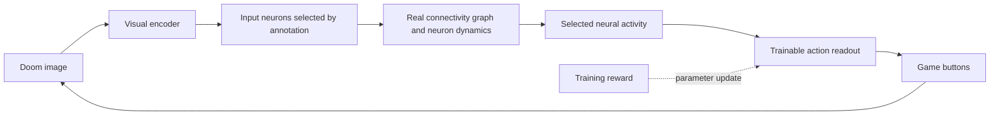

# Fly Doom research

Research date: September 26, 2026. This document distinguishes source findings from project decisions.

## Feasibility

The goal is to teach Doom control to a neural network constrained by the real fruit fly connectome. Connectivity alone does not determine neuronal electrical states, all receptors, synaptic strengths, or learning rules. The result will therefore be a computational model grounded in biological data; we will not claim it is a complete copy of a living brain.

The FlyWire adult female brain study includes 139,255 neurons and approximately 50 million chemical synapses. Directed neuron-pair counts and synapse counts are different: one pair can have many synaptic contacts. [Dorkenwald et al., Nature 2024](https://www.nature.com/articles/s41586-024-07558-y).

Shiu et al. built a brain-wide leaky integrate-and-fire (LIF) model using connectivity and neurotransmitter information, and studied feeding and grooming circuits. This provides a strong starting point for a dynamic model, but does not demonstrate Doom learning. [Paper](https://www.nature.com/articles/s41586-024-07763-9), [authors' code](https://github.com/philshiu/Drosophila_brain_model).

The 2026 FlyGM preprint trains a connectome-derived graph controller for simulated fly locomotion using reinforcement learning. It provides an example of a trainable controller constrained by connectivity. Its reported results concern a different environment and do not guarantee our Doom performance or biological validity. [FlyGM, arXiv v3](https://arxiv.org/abs/2602.17997v3).

## Dataset selection and access

We selected the **FAFB v783 publication archive** for the initial version: it offers a starting point close to the Shiu model and fixed source file versions. This does not mean it is the newest nervous system reconstruction. At the research date, Codex also lists datasets including BANC v888 and MCNS v1.0. We will not arbitrarily mix IDs and annotations across versions. Current Codex exports can differ from publication archives, and downloads can require an account or API token. [Codex FAQ](https://codex.flywire.ai/faq).

Selected inputs from [Zenodo 10676866](https://zenodo.org/records/10676866):

| File | Approximate size | Purpose |
|---|---:|---|
| `proofread_root_ids_783.npy` | 1.1 MB | Neuron IDs, including isolated neurons |
| `proofread_connections_783.feather` | 852 MB | Synapse counts per neuron pair and region |

The archive connection table includes `pre_pt_root_id`, `post_pt_root_id`, `syn_count`, regions, and neurotransmitter probabilities. The 9.5 GB individual-synapse file is not required for the initial graph. The current preparation code extracts directed connectivity counts without assigning neurotransmitter signs. Source MD5 values check download integrity; SHA-256 values are recorded in the local manifest. The source archive's existing quality filters still apply.

Preparation applies no additional synapse threshold, retains any self-connections, and sums regional rows for each directed pair. Matrix rows are targets and columns are sources. Regional and neurotransmitter information will be processed separately from the raw file when dynamics are added. Annotations and visual input and output populations must be matched to the same dataset version before simulation.

## Lessons from related Doom projects

[nftechie/doomfly](https://github.com/nftechie/doomfly) publishes a Doom experiment running on a real connectome. Its README reports that the current experiment failed visual, conditioning, and survival validation gates. Changing weights alone is not evidence of learning. We reviewed this report but did not independently run the upstream code.

[shreyash-sharma/doomFly](https://github.com/shreyash-sharma/doomFly/blob/main/docs/how-it-works.md) freezes connectivity and trains a small readout. It documents additional neural inputs derived from game state, including enemy direction. This differs from learning to play through pixels alone. Our primary experiment will not give the policy enemy coordinates or object labels.

## Proposed architecture



This diagram is the original training design. The experimental LIF kernel now runs inside a bounded pixel-to-game bridge, and a trainable engineered readout has been implemented, including offline Laya Vision distillation. The reward-driven parameter update shown here remains unimplemented; current teaching uses recorded target probabilities. See [the bridge assumptions and controls](BRIDGE.md) and [the Vision training procedure](VISION_WORKBENCH.md#offline-teaching-first-vision-student).

1. Start with a fixed graph and a small trainable readout. Inputs come only from images, and the output policy has no direct access to those images. This is a learned controller on top of a fixed connectivity model.
2. Then train the magnitudes of existing edges. The graph mask remains fixed, with no new connections. Record signs, weight bounds, and deviations from biological initialization. Choose between PPO/BPTT and local plasticity after initial performance measurements.
3. Use an LIF reference for the biological modeling path. A sparse rate model is a possible engineering comparison. If used, it will not be presented as LIF or as an exact reproduction of the paper.

The visual encoder is a central research challenge. Randomly assigning screen coordinates to neurons does not reconstruct natural fly vision. Visual-field mapping, annotation matching, and signal transmission to outputs will first be tested with small stimulation experiments. Inferring an effect's sign from neurotransmitter class is also a model assumption that depends on receptor context; unknown classes will not silently become excitatory.

## Game and experiment design

[ViZDoom](https://github.com/Farama-Foundation/ViZDoom) provides pixel observations, scenario control, and a Python interface. Windows is supported; maintainers recommend considering Linux/WSL for long experiments. The package can run using Freedoom assets. Initial setup is tested on Windows with the window hidden and sound disabled.

Curriculum: `basic` target shooting, then visual orientation and navigation, survival, and more complex maps. Success on `basic` does not mean completing a Doom level. Rewards are training signals; privileged state such as health or position must not leak into the policy. Neural state will reset at episode boundaries; persistent memory will be enabled only as a separate experiment.

Controls include a random policy, an untrained readout, a standard network with the same training budget, a retrained degree-preserving rewired graph, and a graph silenced during evaluation. Silencing demonstrates circuit dependence only; retrained comparisons are needed to establish an advantage from biological topology.

Use at least three independent training seeds and at least 20 evaluation seeds unseen during tuning. Keep training, validation, and test seeds separate. Measure success, return, accuracy, survival, and level completion as appropriate to the scenario. Report distributions and uncertainty; the best single video will not serve as the metric. Stronger learning claims require examining evaluation uncertainty alongside differences from controls.

## Resource budget and milestones

Local GPU: NVIDIA RTX 3060 Laptop with 6,144 MiB VRAM. System RAM information could not be read in the initial session. A dense 139,255-by-139,255 float32 matrix would occupy approximately 77.6 GB (72.2 GiB), making sparse storage necessary. That estimate covers weights only. A sparse graph fitting in memory does not guarantee that gradients across time and optimizer states will also fit.

- M0: literature review, data preparation tools, and ViZDoom integration check.
- M1: real source downloads, checksum verification, graph report, and matched annotations.
- M2: finite and stable model activity, stimulation responses, visual input-to-output transmission, step speed, and memory measurements.
- M3: training with a fixed graph and control experiments.
- M4: training existing synapses and comparing under the same evaluation protocol.
- M5: recordings, video, and more difficult Doom tasks.

September 26 follow-up: M1 is complete. The real graph was prepared and the publication-matched `flywire_annotations` v2.1.0 rows were aligned with all 139,255 neuron IDs. Measurements and limitations are in the [validation record](VALIDATION.md).

September 27 follow-up: an experimental LIF kernel and four bounded whole-graph stimulation conditions now run. M2 remains incomplete: photoreceptor stimulation affects downstream voltage but does not elicit descending spikes, and large voltage excursions require calibration. The positive control bypasses the retina. See [model assumptions, timing, and negative results](SIMULATION.md).

Long training runs will not begin before passing M2. If a subcircuit is needed instead of the whole brain, its scope will be recorded explicitly and will not be described as whole-brain simulation. Training time estimates will follow the first benchmark.

September 27 integration follow-up: a bounded engineering bridge now feeds coarse screen brightness directly into positive visual projection cells and maps descending spike rates to game buttons. This deliberately bypasses the unresolved retinal pathway, uses artificial assignments, and does not constitute passage of M2 or evidence of learning. Disconnected and zero-input controls are included; physiological calibration remains outstanding.

## Scope review after Vision teaching and recovery evaluation (October 6, 2026)

The engineering prototype now meets the immediate goal: real connectivity drives an added trainable student, Laya Vision supplies offline teaching targets, the trained student plays the basic shooting scenario without executing Vision, and recordings plus decision/weight inspection are available. The larger research roadmap remains incomplete.

| Milestone | Current status | Remaining work |
|---|---|---|
| M0–M1 | Completed for the selected dataset and initial setup | Revisit sources only when changing the scope or dataset |
| M2 | Calibrated engineering bridge runs; biological validation remains incomplete | Resolve the retinal pathway and physiological assumptions; the brightness-bin bridge is an artificial bypass |
| M3 | Fixed-graph training, Vision distillation, three recovery continuation seeds and their locked 20-opening gameplay comparison completed | Retrained matched network/topology controls, independent initializations and candidate-state recovery teaching. Continuations share one warm-start parent; paired intervals include zero, and older parent-training independence is unresolved |
| M4 | Not started | Train magnitudes of existing biological edges under explicit sign/mask/bound constraints if pursuing this later research stage |
| M5 | Interactive game recordings and numerical inspection available | Orientation, navigation, survival and harder maps; current success is limited to `basic` |

The first candidate scored 6/6 target kills against the parent's 5/6 on a small development comparison. Two evaluation openings repeat training images. The subsequent locked evaluation measured 19/20 candidate hits, 15/20 parent hits and 0/20 for the disconnected candidate, but 13 starts repeat a single training opening. The seven remaining openings give 6/7 versus 2/7 hits as a descriptive subgroup. See the [full protocol, uncertainty and scene-overlap audit](VALIDATION.md#locked-20-start-vision-student-validation-october-3-2026). These findings support fixed-policy circuit dependence and better performance in this scenario, not a biological-topology advantage or broad generalization.

The recovery teaching stage used 12 distinct training openings and 6 validation openings, with 20 further distinct openings reserved before teaching. All three continuations completed those 20 starts against their common parent: 15/20, 14/20 and 15/20 hits versus 13/20, with better measured mean returns. Every paired uncertainty interval includes zero. Each candidate recovered some failures and lost four parent successes; frequent LEFT/RIGHT changes remain a problem. All actual openings matched the locked scan, and complete RGB/input trajectory overlap was audited. No gameplay-based seed selection or checkpoint promotion occurred. See [the protocol, regressions and independent artifact checks](VALIDATION.md#reserved-recovery-gameplay-comparison-october-6-2026).

The next M3 work is retrained matched network/topology controls and independent initialization studies. Before further recovery tuning, reserve a fresh test set, collect observations reached by the new candidates, and evaluate rehearsal of earlier useful behavior. The previous parent-controlled collection does not fully cover the candidates' new closed-loop states. Both inspected evaluation sets are now development evidence. M4 is a separate extension rather than a prerequisite for the fixed-graph prototype. Automatic online learning is not implemented; current training remains offline.

## Live handoff and data expansion (October 9, 2026)

`flydoom.experiment` now connects completed training and benchmark identity to explicit live model selection. The browser presents the common parent and all three continuations without promoting a gameplay winner. It reloads the selected model's inspector and starts a fresh paused game; all weights remain fixed during play. The map starts with the entire anchor cloud enlarged and higher contrast. Full neuron morphology still requires additional anatomical data and is not supplied by this rendering change.

The next recovery reservation is `runs/vision-recovery-reservation-v2/plan.json`: 24 training starts, 8 validation starts and 20 future evaluation starts. An outcome-free scan examined 151 openings, excluding 529 known RGB identities from the discovered local records and retained teaching data. Evaluation openings were allocated first. No policy actions, Vision targets or rewards were collected in this reservation. Exact opening separation does not establish semantic independence or audit every historical trajectory PNG. The next collection/training protocol must still fix policy rotation, rehearsal proportions, training budget and validation selection before execution. The live application protects these future evaluation seeds from demonstrations.

External data review:

| Source | Observed format | Fit to this project |
|---|---|---|
| [Hugging Face DoomFrameDataset](https://huggingface.co/datasets/brahmandam/DoomFrameDataset) | Policy-generated RGB/action rollouts with episode/step metadata; approximately 2.4 million samples and 68 GB. Preview includes turning and combined actions. | A candidate for later visual/action studies, but not a drop-in four-action teacher dataset. Its card describes policy rollouts, not expert human demonstrations. |
| [GitHub Doom gameplay dataset](https://github.com/thavlik/doom-gameplay-dataset) | Preprocessed gameplay videos and frame/video indices | Useful for studying visual representations; the documented format does not provide our causal fly features or aligned four-action teacher targets. |
| [ViZDoom](https://github.com/Farama-Foundation/ViZDoom) | Controllable game environment | Preferred immediate expansion: generate ordered observations with our exact scenario, action timing, fly dynamics and causal memory, then ask the pinned Vision teacher for labels. |

No external training dataset was downloaded or merged in this step. External ingestion needs explicit episode boundaries, action semantics, source revision/licensing, teacher quality checks and train/validation/test separation. The stateful fly inputs must be regenerated from chronological observations under the project's simulator, rather than inferred from isolated screenshots. Anatomical morphology is a separate data need; [FlyWire's annotation repository](https://github.com/flyconnectome/flywire_annotations) links downloadable skeletons for its dataset.

## Anatomical surfaces and six-action pilot (October 9, 2026)

The map now adds 75 real FlyWire neuropil surfaces to the 139,255 reference positions and can download the selected neuron's actual v783 skeleton. Camera fitting includes the surfaces and selected branches. These additions supply anatomical shape without claiming that all full cell morphologies or synapses are rendered simultaneously. Surface color is not an activity measurement.

The separate six-action student adds forward and backward motor outputs, extends causal history, and transfers matching parent weights and normalization. A bounded offline Vision teaching pilot collected 165 training and 96 validation examples; validation teacher agreement increased from 10.42% to 47.92%. Biological connections and the Vision teacher remain fixed. The live mode executes the trained student without a Vision worker, and explicit manual motor checks demonstrate both directions in the engine without updating weights.

Backward is an available motor action, but the teacher supplied no backward top-choice labels in either split. This pilot therefore does not establish learned retreat. The next movement work needs a scenario and verified teaching examples in which retreat is useful, rehearsal of earlier behavior, and a new held-out evaluation protocol. The current basic shooting scenario, one training seed and small paired benchmark do not validate navigation. M2, matched topology controls under M3, and biological synaptic training under M4 remain unresolved. See the [validation record](VALIDATION.md) for the measured six-action comparison and its uncertainty.

## M4 started: constrained biological-edge learning (October 9, 2026)

M4 is now started at the engineering-pilot level. Two shared-gain searches made no accepted change; their reports are retained. A third experiment used direct local eligibility traces and a frozen decoder gradient to propose independent gains on selected existing synapses. Actual whole-graph replay, including hard spikes, accepted 13,867 changed CSR entries. Topology, signs, unselected edges and the decoder are unchanged. Training KL fell from 0.1429181 to 0.1425697; validation KL fell from 0.1743336 to 0.1733302. The source scenes were already seen by the decoder, and the two short development games show no gameplay gain.

This is an executable link from Laya teaching targets through the fixed decoder into biological-edge magnitude optimization. It is not full recurrent backpropagation or evidence that the brain's entire connectivity has been independently trained. The local derivative ignores indirect feedback and changes in spike timing; only exact forward rollout determines acceptance. M4 completion still requires longer trajectories, multiple seeds, stability analysis, separately reserved evaluation scenes and matched controls. M2 physiological validation remains unresolved. The new [research desk design and methods notebook](LAB_DESIGN_RESEARCH.md) documents source comparisons, exact scope, failed searches and next experiments.

### Automatic synaptic learning prototype (October 9, 2026)

The eight engineering follow-ups now have an implemented path: longer chronological training, reserved paired benchmarks, measured forward/backward curriculum feedback, an encoder ablation, full recurrent perturbation measurements, persistent population-state replay, named anatomy/path exploration, and an automatic candidate/promotion loop. See [Automatic learning](AUTOMATIC_LEARNING.md).

The first complete cycle trained real graph strengths but failed its promotion gate: training KL decreased, validation KL increased, and one task's native return regressed. The approved checkpoint is therefore unchanged. This completes the mechanism's integration, not the research objective of a reliably better Doom policy. Useful retreat, broader task generalization, statistically credible gains, biologically justified visual mapping and exact recurrent gradient training remain open research questions. Those limits are separated from implemented controls and preserved negative results in the [validation record](VALIDATION.md).

## Dataset audit and sparse follow-up (October 10, 2026)

The rejected October 9 cycle changed 292,748 gains relative to its parent using 48 training frames. Its largest training improvement came from one basic episode (mean KL delta -0.002906), while one distance episode regressed. Validation regression came from one basic episode (+0.005560); the other episode was unchanged. These saved-prediction diagnostics motivate a smaller, cross-episode update, but do not identify a proven causal failure mechanism. Reproduce the diagnosis with `python -m flydoom.cycle_diagnosis runs/learning/cycle-20261009-193333-715606`.

The new `flydoom.synaptic_consensus` experiment uses six fresh training trajectories, four validation trajectories, eight old training prefixes for rehearsal, and separate six-start gate/test sets. Per-episode local eligibility gradients must agree in sign in at least 75% of supporting episodes and be nonzero in at least three. Only the strongest 4,096 eligible edges may change. Training-only selection uses a 75% fresh / 25% rehearsal equal-episode objective and limits any training episode's KL regression to 0.005. Validation and native gameplay still independently veto promotion. This remains a small engineering experiment, not converged training or full recurrent backpropagation.

### Public data findings

| Source | Published contents | Integration assessment |
|---|---|---|
| [GameWAM ViZDoom](https://huggingface.co/datasets/Yunncheng/gamewam-vizdoom) | 50,000 policy-generated trajectories, 79,702,755 frames, four combat scenarios; 640x480 at 35 FPS; Apache-2.0; approximately 1.88 TB. | Strongest structured candidate for a future broader action policy. Nine action dimensions include rotation, speed and simultaneous buttons. Only a training split is supplied; reserve whole episodes for evaluation. |
| [DoomFrameDataset](https://huggingface.co/datasets/brahmandam/DoomFrameDataset) | About 2.4 million policy-generated image/action samples; roughly 68 GB; episode and step metadata. | Downloaded action map contains 18 categories. Only LEFT, RIGHT, FORWARD and ATTACK have exact local single-button equivalents; no WAIT/BACKWARD categories. No license was declared in the inspected card. |
| [p-doom Doom dataset](https://huggingface.co/datasets/p-doom/doom-dataset) | Ten million frames and actions; 60x80 images, ArrayRecord, train/validation/test, CC0-1.0. | Useful world-model/visual research source. Downloaded metadata says `env: coinrun` and `num_actions: 18`, despite the Doom card: resolve this inconsistency and action definitions before importing. |
| [GameNGen reproduction sample](https://huggingface.co/datasets/arnaudstiegler/vizdoom-50-episodes-skipframe-4) | 250,938 records, approximately 4.61 GB, episode IDs, JPEG frame bytes, action IDs and step IDs. | Inspected card lacks a license and action semantics; numerical IDs cannot safely be treated as our six actions. |
| [Doom gameplay videos](https://github.com/thavlik/doom-gameplay-dataset) | Approximately 170 hours of video; explicitly no ground-truth labels. | Visual representation research, not direct action imitation. Video availability alone does not provide aligned action targets. |
| [SauerkrautLM Doom MultiVec](https://huggingface.co/datasets/VAGOsolutions/SauerkrautLM-Doom-MultiVec-31k) | 31,645 human demonstration frames, Apache-2.0; ASCII views, depth bins and four soft action scores. | Frame skip matches four tics, but inputs are not RGB and turns are not strafes. Auxiliary depth would change our observation contract. Card review only; not downloaded. |
| [Doom actions Gemini](https://huggingface.co/datasets/chrisxx/doom-actions-gemini) | 172 short human deathmatch clips with 14-dimensional recorded actions and Gemini-assisted event annotations; MIT. | Potential separate perception evaluation source. Cropped clips lack episode prefixes and include weapons/rotation. Annotation claims require their own quality audit. Card review only; not downloaded. |

Four Hugging Face repository revisions and 11 small source files are retained in `runs/data-research-20261010/`. The source files total 250,004 bytes, excluding the repository API metadata. No full video archive was downloaded. `download-manifest.json` records pinned revision URLs, byte counts and SHA256 values. The two GameWAM Parquet samples are episode 0 from `battle1` and `defend_the_center`; this deterministic convenience sample is not a representative estimate of the full dataset.

The offline audit found 112/2,100 matching single-button rows in battle1 and 96/982 in defend-the-center: **208/3,082 in total**. Both episodes start with unsupported actions, so neither has a compatible causal prefix. Source timestamps match 35 Hz, while our policy holds each action for four tics. Removing incompatible rows would break recurrent history; matching action names alone cannot fix timing or dynamics. Sample videos were not downloaded, and **zero external rows were admitted to training**.

Reproduce the checks with `python -m flydoom.external_data_audit runs/data-research-20261010`. Immediate training expansion therefore uses native ViZDoom trajectories with the existing six-button timing and pinned Laya targets. Later external ingestion should either add a separately versioned multidimensional action head and matching timing, or use complete videos as visual pretraining/relabeling data; it must regenerate neural state chronologically and keep held-out episodes isolated.

## Model-neuron integration priority review (October 10, 2026)

The user now prioritizes biological integration over additional gameplay tuning. This section records a source/code review and a proposed protocol, not an implemented replacement or a new training result. No checkpoint, runtime implementation, dependency, or cache was changed for this review.

### What the current integration actually does

- `bridge.py` averages RGB into 64 brightness bins and cyclically assigns them to positive visual-projection neurons sorted by root ID. It bypasses photoreceptors and early visual processing. Neither root-ID order nor soma position establishes retinal receptive fields.
- `simulation.py` applies one LIF parameter set throughout the graph. Neurotransmitter signs are approximate presynaptic rules, without target receptor dynamics. Dopamine has no separate modulatory learning channel.
- `calibration.output_features` reads individual voltage/rate features from all 1,303 descending neurons. The current six-action `MovementReadout` combines these with action history; it does not use the legacy three cyclic output groups as its final action decoder. There is no direct RGB or Laya embedding input to this decoder.
- Laya Vision supplies offline action targets. The synaptic experiments adjust selected existing edges into descending cells, not all internal visual or memory circuits. Their local derivative omits indirect recurrent feedback and spike-time changes; complete forward replay evaluates proposals.
- Neural time advances 50 ms per observation, while an action can advance four game tics. A new physiological protocol must explicitly reconcile stimulus sampling and simulated time before comparing response latencies.

The local annotation audit found 139,255 cells, including 8,452 R1-6, 1,343 R7 and 1,324 R8 cells. No retinal-column or optical-direction field is present in this TSV. Alias-aware lookup finds two DNa02 cells in `hemibrain_type`, two DNg13 cells in `cell_type`, and four MDN cells whose `cell_type` is DNp50. Exact lookup in only one name column would miss relevant populations. These are anatomical identities, not measurements of their functional fidelity in our simulator.

### Primary evidence and usable resources

| Resource | Finding and project implication |
|---|---|
| [FlyVis, Nature 2024](https://www.nature.com/articles/s41586-024-07939-3), [official implementation](https://github.com/TuragaLab/flyvis) | A visual model uses connectivity constraints, graded neuronal dynamics and task optimization to predict responses compared with 26 experimental studies. Transfer its method: constrain cell-type dynamics and synaptic gains, then evaluate neural responses. Its averaged retinotopic network is not our exact whole-brain FAFB graph or a root-ID-compatible checkpoint. |
| [Eye structure and motion vision, Nature 2025](https://pmc.ncbi.nlm.nih.gov/articles/PMC12488493/), [author code/data](https://github.com/reiserlab/eyemap_T4) | Eye geometry shapes motion tuning. The repository contains `eyemap.RData`, medulla coordinates, optical directions and physiological response data. `proc_eyemap.R` maps Mi1 column indices to lens indices; these indices must not be treated as FlyWire root IDs. Matching coverage, coordinate systems and left/right conventions remain unverified locally. |
| [Visual-system parts list data](https://github.com/murthylab/visual-system-parts-list/tree/main/data), [FlyWire annotations](https://github.com/flyconnectome/flywire_annotations) | v783-compatible cell types, side information and synapse resources support anatomical reconciliation. Pin source releases and retain conflicting aliases instead of silently replacing current annotations. These tables alone do not supply a calibrated screen-to-retina mapping. |
| [Beiran and Litwin-Kumar, Nature Neuroscience 2025](https://www.nature.com/articles/s41593-025-02080-4) | The accessible abstract reports that connectivity alone can leave recurrent dynamics underdetermined; partial activity observations can constrain solutions. This motivates adding physiological targets. The study does not validate our model or provide a universal required number of recorded cells. |
| [Shiu et al., Nature 2024](https://www.nature.com/articles/s41586-024-07763-9) | Whole-brain LIF modeling supports specific sensorimotor predictions, while explicitly simplifying nonspiking cells, receptors and internal state. Use its experimental conditions as possible bounded controls, not as validation of our visual bypass or Doom behavior. |
| [Steering control, Cell 2024](https://doi.org/10.1016/j.cell.2024.08.033), [backward walking, Nature Communications 2020](https://www.nature.com/articles/s41467-020-19936-x) | Identified descending neurons offer functional hypotheses for steering and backward locomotion. Our MOVE_LEFT/RIGHT buttons strafe; they do not rotate. Any biological-to-game motor adapter must explicitly distinguish those axes. ATTACK remains an engineered output without a proposed biological shooting neuron. |
| [Dopamine-gated memory model, 2021](https://pmc.ncbi.nlm.nih.gov/articles/PMC8354444/) | Compartment-specific KC-to-MBON plasticity uses the relative timing of Kenyon-cell and dopamine activity. This is a later candidate for learning rules; assigning one global game reward to every dopamine neuron would be an additional engineering assumption. |
| [FlyGM, February 2026 preprint](https://arxiv.org/abs/2602.17997) | A useful engineering comparator for connectomic locomotion and topology controls. Its fixed graph operator and trainable latent features are not evidence of learning measured biological synaptic strengths or reproducing cellular physiology. Do not replace the current simulator on the strength of a preprint performance claim. |

### Proposed implementation order and acceptance evidence

1. **Establish visual identity and geometry.** Export a versioned mapping with root ID, cell type/alias, side, retinal column, optical direction, coordinate units, evidence source and uncertainty. Report unmatched cells explicitly. Audit the eye-map data against current morphology and connectivity before assigning pixels. A restricted validated visual field is acceptable; fabricated whole-eye coverage is not. A single Doom camera must have explicit field-of-view and outside-screen handling.
2. **Validate visual dynamics in isolation.** Evaluate a graded visual subcircuit using flashes, bright/dark moving edges, multiple directions, speeds and contrasts. Measure baseline, response polarity, latency and T4/T5 direction selectivity. Reserve stimulus conditions and cell populations before fitting. Match recording modalities with an observation model; raw calcium fluorescence is not membrane voltage. Resolve the failed retinal transmission pathway rather than merely increasing excitation until motor cells fire.
3. **Reconnect through the existing graph.** Adapt verified visual dynamics to the appropriate existing cells and boundary connections; do not append a duplicate optic lobe. Start with bounded cell-type time constants and positive gains shared by source/target type, keeping structural zeros fixed and sign assumptions documented. Expand to individual-edge residuals only if held-out evidence supports it. Recalibrate the graded/spiking interface and introduce a new checkpoint schema: existing calibration/source hashes intentionally prohibit silent reuse after dynamics change.
4. **Train with task and physiological constraints.** Keep Laya as an offline task teacher. Combine action imitation, measured visual-response agreement and penalties for excessive parameter drift or unstable activity. Fit coefficients on development data; keep physiological test observations separate. Teacher agreement alone cannot establish biological fidelity. A differentiable visual subcircuit is a tractable starting point before attempting recurrent gradients across the full graph.
5. **Ground and test the motor interface.** Compare the present decoder with a constrained population readout over identified descending circuits. Inspect signed population contributions and matched cell-silencing/stimulation effects from identical saved neural states. Record changes in action probabilities and downstream activity. Add rotation only in a separately versioned action protocol with new teacher targets; do not relabel existing strafe actions as turns.
6. **Measure whether the biological organization matters.** Retrain real-topology and degree/sign-constrained rewired controls under matched input/output capacity, compute budgets and several initializations. State which weight/strength statistics are preserved. Add direct-image, memory-only and input/time-shuffle baselines. Separate frozen-policy interventions from retrained controls: a disconnected model failing demonstrates dependence, not the superiority of the biological topology. Evaluate both held-out physiological responses and gameplay with uncertainty.
7. **Investigate local reward-modulated learning after those gates.** Audit KC/MBON/DAN identities and compartments, introduce an explicit modulatory channel, and test timing-dependent learning and retention on a small circuit before expanding. Keep the game-reward interpretation separate from claims about fly dopamine physiology.

The first deliverable should be an audited eye-to-cell map and a visual-stimulus response report. An integration dashboard can then show the actual chain from sampled visual location through identified cells to output changes, including measured intervention effects. No biological integration success percentage is currently justified; the earlier short-game kill percentage measures a different outcome.

## First eye-mapping and visual-path experiment (October 10, 2026)

Implemented the first bounded experiment in the revised plan. This advances anatomical correspondence and establishes a baseline response report; it does not complete retinal mapping, graded dynamics, joint physiological/task training, matched-topology controls or reward-modulated learning.

`eye_sources.py` downloads seven author-repository files at commit `99d2a43123db636cedb55af9ff31a59657e7d17e`, checking Git blob identities and recording SHA256. The data contains 778 eye columns. `rdata==1.1.0` imports the R objects without an R runtime. The audit follows both one-based indexing arrays from optical column to Mi1 annotation and checks the resulting medulla coordinates; it never converts CATMAID skeleton numbers into FlyWire IDs by renaming them.

The first comparison against 793 anatomically right Mi1 cells failed: source coordinates lie in the other hemisphere under local FlyWire annotation conventions. That result remains in `runs/eye-mapping-v1/report.json`. The revised audit searches all 1,580 bilateral Mi1 skeletons after applying the public FAFB14-to-FAFB14.1 coordinate transform to 32 deterministic sample points per source cell. Optical-axis labels and anatomical side are recorded separately. Its 694 supported candidates all have local anatomical side `left`.

Acceptance requires at least 80% nearest-vertex votes for one cell, a 60-percentage-point margin over the runner-up, a winning-match 90th-percentile distance of at most 1 micrometer, and no duplicate assignment. **694/778 candidates pass these geometric criteria; 84 remain unresolved. Zero are segmentation-verified.** This fraction measures provisional mapping coverage, not model or biological success. Skeleton point density and sampling can affect the matching score. The next identity check should use independent samples and materialization-783 segmentation overlap. Mi1 correspondence does not identify each upstream photoreceptor's receptive field.

`runs/eye-mapping-v2/` records the candidate table, transform response, skeleton manifest and source hashes. The first audit's asset folder is retained as a shared cache, so offline reruns do not download the skeletons again. Author files occupy approximately 14.37 MB and 1,580 skeletons approximately 33.59 MB. No caches were removed.

`visual_probe.py` then runs eight 200 ms conditions on the unchanged calibrated **base** LIF graph, with no trained synaptic gains: no input; uniform photoreceptor pulse; uniform Mi1 pulse; disconnected Mi1 pulse; and four translating Mi1 bands along positive/negative author optical x/z axes. Pulses run from 40 to 160 ms at 20 mV-equivalent input. The moving bands are defined in direction-cosine space, not a calibrated angular-speed movie. Each condition resets neural state. Spatial stimulation uses only the 694 supported Mi1 candidates and explicitly bypasses upstream visual processing.

All eight bounded runs completed. The retinal pulse drove photoreceptor spikes and downstream voltage changes, but no descending spikes. Direct Mi1 stimulation produced 6,940 Mi1 spikes during the uniform pulse and 1,388 in each moving-band condition. T4a mean voltage changed by up to approximately 0.358 mV during the uniform Mi1 pulse and returned zero response when transmission was disconnected. Descending spike counts were zero in every condition. The trained decoder also reads voltage, so zero descending spikes alone does not prove the absence of all decision-relevant information. These results establish limited transmission under this protocol, not correct direction selectivity or physiological dynamics.

The offline interactive report is `runs/visual-integration-v1/index.html`: click a column for exact IDs and geometric evidence; select a stimulus, population and signal for measured traces. `visual_audit.py` independently verifies saved counts against population annotations, exact root order, input identities, artifact/source hashes and silent no-input/disconnected controls. Full Python verification passed **262 tests**; report JavaScript syntax passed. Browser rendering was not visually inspected in this step.

Next gate: verify candidate identity and the upstream receptor/column path, establish camera/eye conventions, then build and calibrate graded visual-cell dynamics against held-out physiological observations. A larger Laya teaching run is not an adequate substitute for those checks. The current Doom policy remains available and unchanged while that separately versioned model is developed.

## Retinal path and graded dynamics follow-up (October 10, 2026)

The follow-up adds disjoint-point morphology checking, connectivity-based receptor hypotheses, a graded visual kernel, and a recorded comparison with an LIF subcircuit. Existing model and source files used by the previous experiment remain unchanged. No task training, model promotion or cache deletion occurred.

### Anatomical evidence

`retinal_mapping.py` excludes every coordinate used in the first 32-point morphology sample, removes duplicate source coordinates, and selects 32 new points per source neuron deterministically. After the same public coordinate transform, it searches the same 1,580 target skeletons under the original thresholds. Of 694 previously supported candidates, **672** pass again. All 694 retain the same top candidate; 22 fail the repeated confidence/distance/uniqueness criteria. This is replication over points in the same reconstructions, not independent animals or segmentation verification. No previously rejected candidate is promoted.

Tracing the measured unsigned graph backward finds **651** sufficiently dominant and uniquely assigned L1-to-Mi1 paths. Each selected link needs at least five contacts and at least 80% of that Mi1 cell's L1 input. Receptor-to-L1 assignment independently requires at least five contacts and 80% of each R1-6 cell's output to **all** L1 cells, including unmatched columns and both hemispheres. The resulting provisional map contains **1,208 receptors across 360 columns**. R7/R8 are not assigned or filled by symmetry.

Convergent R1-6 inputs can originate in different ommatidia while sampling a common visual direction; a column must not be identified with one original ommatidial bundle. See the primary [neural-superposition study](https://pmc.ncbi.nlm.nih.gov/articles/PMC4646663/). Our dominance rule is an engineering anatomical hypothesis. The receptor-count distribution per mapped column is `{1: 68, 2: 74, 3: 76, 4: 50, 5: 30, 6: 32, 7: 18, 8: 12}`. In particular, 30 columns have more than six candidate inputs and require review; sparse and excess assignments are not evidence of complete, canonical cartridges. Materialization-783 segmentation overlap, reconstruction quality and optical calibration remain unresolved.

Evidence is retained in `runs/retinal-mapping-v1/`: the predeclared plan, new transform, per-column held-out results, L1 paths, receptor assignments and checksums. The extra transform contains approximately 3.64 MB; cached source data and all skeletons were reused.

### Graded visual prototype

The modeling approach is informed by [FlyVis](https://pmc.ncbi.nlm.nih.gov/articles/PMC11525180/): leaky continuous state with rectified graded synaptic release, rather than requiring every early visual cell to emit spikes. This implementation is independent and does not import FlyVis weights or reproduce its fitted physiology.

`graded_vision.py` implements dimensionless state deviations around a converged tonic fixed point:

```text
baseline = bias + W @ relu(baseline)
tau * d(delta)/dt = -delta + W @ (relu(baseline + delta) - relu(baseline)) + drive
```

The experiment retains **20,566 left-side cells and 303,829 directed structural entries** across 22 selected visual types, with original contact ratios and provisional presynaptic sign rules. Each target type receives one initial positive gain that bounds every absolute incoming row sum by 0.6. Structural zeros remain zero. This contraction bound and the dimensionless bias of 1 are numerical choices, not physiological estimates. Time constants are represented by a cell-type parameter table, initially **20 ms for every type**; cell-specific or type-specific physiological fitting has not occurred. Unknown transmitter outputs remain zero. The tonic fixed-point residual is approximately 1.79e-7.

The induced subcircuit omits **46.25% of incoming contacts** to its selected neurons. There are no descending outputs, central-brain integration, CT1 compartments or Laya training in this experiment. These omissions prevent interpreting the prototype as a replacement whole-brain simulation.

`retinal_experiment.py` uses the provisional receptor map for nine 200 ms runs: no input, bright pulse, dark pulse, disconnected transmission, bright pulse with L1 evoked release blocked, and four source-axis sweeps. Input is applied only to the mapped R1-6 cells during 40-160 ms. Graded drive amplitude is 0.5 dimensionless units; LIF drive is 20 mV-equivalent. Both models use the same induced structural graph and a 0.5 ms step, but different coupling scales, units and baseline assumptions. Their amplitudes are therefore not a controlled quantitative comparison of biological fidelity. The L1 intervention suppresses changes in graded release while preserving tonic transmission; it does not clamp L1 activity or reproduce optogenetics.

### Measured outcome and remaining gates

All nine conditions completed within the specified bounds. Receptor stimulation now reaches Mi1 and T4/T5 through continuous dynamics. During the bright pulse, the peak absolute population-mean Mi1 change is **0.00497351** dimensionless units. Blocking L1 evoked release reduces that peak to **0.00105130**, a **78.862% reduction**. This is a causal effect within this untrained model and protocol, not a biological validation percentage or Doom success rate. In the corresponding LIF variant, Mi1/T4/T5 have zero recorded voltage change and zero spikes. No-input and disconnected controls show no evoked downstream response.

`retinal_audit.py` independently reconstructs the 1,208 receptor paths from original counts, recreates all 303,829 signed/scaled weight entries, verifies source/artifact identities and exact IDs, and recomputes metrics and controls from saved per-neuron recordings. An initial audit exposed float32 reduction-order differences between online and saved population means; accumulation now uses float64 in both paths, and the rerun audit passes without loosening tolerances. Full Python verification passed **268 tests**; report JavaScript syntax passed. The offline report was rendered and visually inspected in headless Edge using an isolated profile. Its initial layout, plots, IDs and comparison table rendered correctly; this is not a claim of exhaustive browser interaction testing.

Open `runs/graded-retina-v1/index.html` to select a column, condition and recorded time. It shows a representative receptor-L1-Mi1 path, measured contact counts, initial graded weights, three recorded cell traces and population comparisons. Model state units are explicitly separated from LIF millivolts and spikes.

The next gates are segmentation/retinal assignment review, calibrated optical stimulus conventions, and fitting/evaluating graded parameters against separate physiological observations, including polarity, timing and direction-selectivity tests. Those gates must precede interpreting a hybrid whole-brain/Laya training run as biologically improved. The current approved live Doom checkpoint remains unchanged.

## Qualitative polarity fitting (October 10, 2026)

This follow-up introduces actual optimization of existing visual-subcircuit weights, but does **not** complete measured physiological calibration. It is a deliberately limited, exploratory fit to cell-type polarity priors. Earlier mapping, simulation and experiment sources are retained unchanged so their artifact audits remain valid.

### Source review and access limitation

The cached eye-map H2 data contains direction-selectivity summaries for a population outside the current 22-type circuit. It cannot provide Mi1/L1 membrane time constants. FlyVis flash datasets generate stimuli; they must not be treated as experimental recordings. The primary [Gou et al. paper](https://doi.org/10.1016/j.cub.2024.10.053) and its [Dryad deposit](https://doi.org/10.5061/dryad.t1g1jwtbs) provide a promising next source: Mi1 Arclight voltage-sensitive fluorescence, calcium and transmitter-sensor recordings under varying stimulus sparsity. Those modalities and stimulus histories require explicit observation/stimulus models. Arclight fluorescence is still not calibrated membrane voltage.

Dryad metadata identifies file version 401319, archive size 180,331,689 bytes and SHA256 `83a2bc0c5e1ce64787a30183f486d219c377014014b5bac5448f6b17502bc35f`. Metadata version 402168 was readable, but the download API returned HTTP 401 and the public web download returned HTTP 403. No measurements from this archive were downloaded or used. The author-linked DANDI 001205 mirror exposes about 139 GB of NWB imaging data; metadata was inspected without bulk downloading. The versioned downloader remains available for a later retry, preserving cached downloads and verifying the published archive digest.

The usable target source for this run is the [FlyVis author literature synthesis](https://github.com/TuragaLab/flyvis/blob/92b3845cc426dd309a1a0e1b3890156c42e14021/flyvis/utils/groundtruth_utils.py), pinned to that commit and verified against Git blob `999012cea4bcf67a997d3ecd72bb5f11c7bb0b30`. Its MIT license is retained beside the source. `physiology_sources.py` extracts the polarity dictionary through Python AST literal parsing without executing downloaded code. Labels are qualitative ON/OFF priors, not measured traces, voltages, calcium amplitudes, latencies or numerical training targets from individual animals.

### Fitting protocol

Inspection of the preceding prototype found Mi4 was the only mismatch among 21 labeled non-input visual types. Accordingly, this **exploratory** model varies 17 positive source-type-to-Mi4 gains over existing nonzero entries. The selection was informed by the earlier result; this is not a blinded confirmatory experiment. Multipliers are constrained to 0.05–1.5. Relative contact strengths within a type pair, presynaptic signs and all structural zeros stay fixed. No new connections are inserted.

The objective uses 13 upstream labels: L1–L5, Mi1/Mi4/Mi9 and Tm1/Tm2/Tm3/Tm4/Tm9. The eight T4/T5 subtype labels are excluded from the optimization. They share the same graph and reference source, so this split is weaker than independent experimental validation. The pre-fit plan is saved before optimization. Responses are computed by solving the graded network's driven and tonic fixed points under +0.5 input to the mapped receptors. A dimensionless sign-margin penalty plus a small log-gain drift penalty is optimized with SciPy L-BFGS-B. The margin and normalization are engineering choices. Time constants cannot be identified from equilibrium responses and remain 20 ms for every type.

The fit converged in five optimizer iterations. Training sign matches changed **12/13 → 13/13**; withheld subtype matches remained **8/8 → 8/8**, demonstrating no improvement on that already-satisfied check. The objective decreased from approximately 0.1201923 to 0.0000012556. It is not a biological accuracy score. **13,324 existing edge weights changed**, controlled by 17 shared parameters. For example, L2→Mi4 gained a multiplier of about 0.7355 and Mi1→Mi4 about 1.2611. Mi4 mean steady response changed from -0.000155797 to +0.000038956 dimensionless units.

### Separate transient checks and limits

Both initial and fitted models were run for 200 ms under bright/dark pulses of amplitudes 0.25 and 0.5, no input and disconnected transmission: twelve simulations total. Pulses run from 40–160 ms at dt=0.5 ms. These transient traces did not enter the steady-state objective. Mi4's mean 110–160 ms bright response changes sign at both amplitudes; dark responses reverse correspondingly. No-input and disconnected downstream traces remain silent. This supports the intended local effect in the simulated model; it does not establish correct measured latency, adaptation, direction selectivity or biological superiority. Bright/dark responses remain approximately sign-inverted, leaving stimulus-history-dependent nonlinear behavior unresolved.

`polarity_audit.py` verifies source and output hashes, rebuilds every saved weight from the original graph and pair multipliers, checks exact IDs, preserved signs/structure, recomputes steady responses/losses, and checks stored transient metrics/controls. It does not independently replay all transients or validate the targets against raw animal recordings. `runs/polarity-training-v1/index.html` exposes before/after traces, label splits, all fitted multipliers and explicit evidence boundaries.

The candidate remains an isolated visual checkpoint. Full-brain boundary coupling, Laya task loss, motor readout, measured physiological calibration and promotion to live Doom are still pending. No cache was deleted and no additional Python dependency was installed for this step.

Verification: **272 Python tests passed**. The new artifact audit and both preceding visual/retinal audits passed. Report JavaScript syntax passed; its initial desktop layout and populated graph/tables were visually inspected in headless Edge. Dropdown interactions were not exhaustively browser-tested. Synthetic optimizer tests verify sign correction and structural constraints; they are not experimental data used by the reported training run.

## Measured temporal calibration (October 10, 2026)

The access limitation is now addressed for the timing task through a different primary dataset: [Pang et al., ClandininLab/L1L2-recurrent-feedback](https://github.com/ClandininLab/L1L2-recurrent-feedback), pinned at `7fa5829e37d566e02beaaa87efd6a0f1de4e48c0`. The original Gou/Dryad archive still returns HTTP 403; it is not represented as downloaded. `timing_sources.py` verifies eight required author data/protocol files against pinned Git blob identities and records SHA256. Their combined size is 184,978 bytes. Additional author notebooks and drug-condition files inspected during research are retained but excluded from fitting. No upstream code is executed or relicensed.

### What the measurements represent

The four control files `L1_highLum.mat`, `L1_lowLum.mat`, `L2_highLum.mat` and `L2_lowLum.mat` each contain two population-mean impulse responses, dark then light, with 63 samples at 8.333 ms intervals. The readout is ASAP2f voltage-sensitive fluorescence. Depolarization decreases fluorescence, so the adapter uses negative delta-F/F and subtracts each trace's t=0 value. It does not reinterpret fluorescence as millivolts or use calcium-indicator data.

The [primary methods preprint](https://doi.org/10.1101/2024.04.19.590352) describes 20 ms flashes. The author MATLAB export and binning scripts preserve a time axis relative to stimulus onset and a causal trailing-bin average. The selection scripts specify a one-bin width and 120 Hz output sampling; this resampled grid is not a claim that the raw imaging rate was 120 Hz. The author demonstration notebook approximates the flash at array indices 2:5, introducing an effective shifted 25 ms pulse. Our protocol instead uses the physical 20 ms pulse at t=0 and an explicit observation model; the discrepancy is recorded rather than silently combining the two conventions.

The observation model applies a first-order indicator filter followed by an 8.333 ms trailing average. A 3 ms indicator time constant is the primary **assumption**, with 0 and 8 ms sensitivity scenarios; these are not independent calibrations of ASAP2f in this preparation. An unknown positive fluorescence/state gain is fitted once per cell type using only training records and shared between dark/light responses. Test traces are never shifted or rescaled to improve agreement. Indicator kinetics, upstream dynamics, sampling and model mismatch therefore remain confounded with inferred model time constants.

### Training and reserved evaluation

`timing_training.py` freezes the previously fitted polarity checkpoint's actual 303,829 structural entries and learns three shared time constants: R1-6, L1 and L2. All other selected cell types retain 20 ms. The retinal input remains the provisional mapped R1-6 cells. Its amplitude is 0.1 dimensionless units, small enough that a contraction bound guarantees the existing graded model stays in its linear release regime for both pulse signs. This permits an efficient simulator without changing the model equations; the checkpoint audit compares it to the actual graded kernel independently.

The fit uses all 63 points of each of four high-luminance traces. The four low-luminance traces are loaded for evaluation only after selecting parameters on training loss. They are a **luminance-condition holdout**, not independently identified animals: the control mean files do not include animal identities or individual recordings. The sensitivity scenarios and two primary initializations are declared before fitting. Parameters are bounded to 2–100 ms and optimized in log space by SciPy least-squares. No Laya targets or game rewards enter this objective.

The selected conditional estimates are:

| Model population | Original tau | Fitted tau | Range across declared sensor scenarios/starts |
| --- | ---: | ---: | ---: |
| R1-6 | 20 ms | 5.4469 ms | 3.3990–6.8800 ms |
| L1 | 20 ms | 4.9641 ms | 2.9342–6.4152 ms |
| L2 | 20 ms | 5.6977 ms | 3.6686–7.1370 ms |

These ranges are sensitivity ranges, not confidence intervals. The two primary initializations converge to nearly identical losses without hitting parameter bounds, but that does not identify unique intrinsic membrane constants. The selected estimates are parameters of this incomplete measured-connectivity model conditional on the observation assumptions.

Normalized full-trace RMSE, using training RMS for both splits, changes from **0.94019 to 0.58772 on training** and **0.65868 to 0.53508 on reserved low luminance**. Lower is better; this is not a biological accuracy percentage. The baseline is fairly amplitude-calibrated on training data as well, so the comparison measures improvement beyond amplitude-only calibration. Candidate and baseline make the same stimulus prediction for both luminance conditions; this prototype has no luminance-adaptation mechanism.

The first-polarity response peak moves from **41.667 ms to 25 ms**, matching all four high-luminance mean traces. Reserved low-luminance peaks are 33.333 ms for L1-dark, 25 ms for L1-light, and 33.333 ms for both L2 contrasts. Thus the fitted model retains one-bin timing errors in three reserved traces. L1-dark full-trace normalized error slightly worsens (0.42241 to 0.42746), despite the aggregate improvement. The observed late phase and contrast asymmetry are not adequately captured by a model whose small-signal bright/dark responses are sign inversions.

### Checkpoint, audit and promotion decision

The predeclared full-trace held-out threshold was normalized RMSE <=0.50, with first-peak error <=8.333 ms. **The waveform-error threshold fails (0.53508), so this candidate is not promoted.** Independently, intrinsic time constants remain unidentified and whole-brain/Laya coupling has not been completed. Retinal geometry and missing lamina/feedback connections remain unresolved. Correcting a delay alone does not demonstrate complete physiological behavior.

`runs/timing-training-v1/checkpoint.npz` stores exact root IDs and one fitted/frozen time constant per cell. `parameters.json` binds it to the unchanged parent weight SHA256. `timing_audit.load_network` loads this research checkpoint into the actual `GradedVision` class without selecting it for live Doom. `timing_audit.py` checks source/data identities, reconstructs measured targets, replays baseline and candidate predictions, verifies metrics and exact cell order, and compares the efficient fit simulator against the saved graded network. The maximum kernel discrepancy is about 4.77e-8. Halving the integration step changes predictions by at most 0.00236 training-RMS units; the declared numerical check passes. Disconnected downstream responses remain zero.

**278 Python tests passed**, including source time-axis/sign validation, causal observation averaging, synthetic recovery of an identifiable time constant, and a delayed-peak regression test. Synthetic traces are only test fixtures, not the data used for the reported fit. Artifact replay passed. The offline measured-versus-predicted report was rendered and visually inspected in headless Edge, and JavaScript syntax passed. Dropdown interactions have not been exhaustively browser-tested.

The next physiological improvement should address the measured second response phase and luminance dependence, audit the missing recurrent/lamina inputs, and constrain sensor/input kinetics with independent evidence before inferring intrinsic time constants. Additional time-constant optimization alone cannot make this linear regime reproduce the observed contrast asymmetry. Existing checkpoints, source files and caches were retained. No new Python package was installed; SciPy already supplies MAT loading and bounded optimization.


## Anatomical feedback and synchronized observation (October 10, 2026)

Primary evidence: [Pang et al., recurrent temporal sharpening](https://pmc.ncbi.nlm.nih.gov/articles/PMC11769683/) and [Henning et al., inhibitory columnar feedback](https://pmc.ncbi.nlm.nih.gov/articles/PMC13211874/). The latter reports GABAergic C2/C3 feedback upstream of T4/T5 and C2-mediated suppression/temporal sharpening of Mi1. Neither establishes that the present point-neuron equations or fitted constants are biologically identified.

An audit of the actual FAFB783 matrix found omitted C2/C3 inputs. The anatomical-left graph contains C2 -> L1 11,373 contacts, C2 -> L2 11,591, C3 -> L1 1,178 and C3 -> L2 32,384. `retinal_feedback.py` adds these cell types and their measured incident edges: 1,422 additional cells and 44,571 structural edges, bringing the circuit to 21,988 cells. Parent weights and original cell time constants remain exact. New weights use provisional transmitter signs, a per-target-type scale preserving contact ratios, and a joint absolute row-sum budget of 0.9. Two bounded gains separately scale the C2 and C3 groups (incoming to each new type plus its outgoing connections to original cells; cross-edges assigned by postsynaptic new type).

The prewritten plan fits C2/C3 time constants (2?500 ms) and group gains (0?1) to high-luminance L1/L2 means using two starts. The simulator retains rectified graded release and the previous sensor observation model. Previously seen low-luminance data are a **development comparison**, not a fresh holdout. No thresholds were relaxed. The selected constants are 2.00022 and 2.00016 ms, with gains 0.007915 and 0.962780. These constants hit the lower bound and are not credible intrinsic membrane-time estimates. The observed late-phase/contrast-asymmetry mismatch remains unresolved.

The candidate training NRMSE is 0.587288. At the same 0.833333 ms integration step, a no-feedback circuit with its own train-only observation-gain fit gives 0.587400. On the previously seen low-luminance comparison, matched-step NRMSE changes 0.534439 -> 0.531412. This modest change does not reach the existing 0.50 waveform reference. Do not attribute the entire difference from the older 0.535077 result to feedback, since that older experiment used a different step. Halving the candidate step produces a maximum normalized difference of 0.01024. Disconnected downstream responses remain zero. The audit rebuilds the checkpoint from the measured graph and replays measured traces. There is no independent confirmation, whole-brain integration, or motor-policy promotion.

`visual_observer.py` loads the verified candidate beside the existing live controller. Its state persists across decisions and resets for each run. The exact input frame is sampled bilinearly through 1,208 provisional R1?6 directions. The mean direction faces an assumed 90-degree pinhole camera, with world Z defining up; 846 receptors fall in view for the current 4:3 input. Unseen receptors get neutral gray, not clipped border pixels. Mean RGB is mapped to a bounded dimensionless drive around gray; this is not calibrated luminance, fly phototransduction, or a verified match to Doom FOV. Each frame is held for actual action tics / 35 Hz, including shortened terminal actions. Intermediate game frames are not sampled. The simulation time step is adjusted to cover each interval exactly.

The English research UI displays the input-image sampling overlay, eight population traces, one largest-absolute-response cell per type and the top five signed incoming weight ? release products. Products use presynaptic release immediately before the final integration step; their total is separately reported, including omitted table entries. The full cell states, previous states, receptor contrasts, exact uint64 root IDs and input image are saved to `visual/`. Their path and checksum, observer source hash and mapping identity accompany each archived decision. Replay reads the original record instead of rerunning it. This circuit is explicitly **shadow observation**: no graded visual signal reaches the action decoder, and Laya supplies no online inference. The existing frozen LIF motor policy remains in control.

The live test exercises 13 decisions until the episode ends, pause, single-step synchronization, exact identity retention, terminal action duration and disk replay of an older decision. `runs/retinal-feedback-v1/live-smoke.json` records latency. Whole-brain policy + observer + archival processing takes seconds per decision; the visual observer alone also exceeds the 114 ms game interval on this CPU. This is interactive synchronized observation, not wall-clock real-time play. A desktop and 390 px browser check found no page overflow in the new panel; cell selection renders actual C2 contributions. Unit and regression tests cover the camera, offscreen neutral drive, bilinear interpolation, persistent state, causal signed products, timing and existing training behavior.

Remaining sequence: resolve contrast/luminance response asymmetry with identifiable physiology and independent stimulus/animal evidence; define and validate a graded-to-whole-brain interface on real shared cell IDs; retrain the downstream decoder with Laya targets under that changed encoder; perform paired connected/disconnected and gameplay tests; profile and optimize the whole-brain computation against the 114 ms action budget. Merely passing a qualitative polarity test or enabling a viewer is insufficient to claim this integration is complete. No caches or prior checkpoints were deleted, and no packages were installed for this extension.


## Retinal closed-loop control and reward (October 10, 2026)

`retinal_policy.py`, `retinal_train.py`, `retinal_play.py` and `retinal_control_audit.py` implement a separate closed-loop experiment, recorded in `runs/retinal-control-v1`. The engineering contract is pixels ? provisionally mapped R1?6 ? the retained 21,988-cell graded circuit ? selected real T4/T5 states ? learned six-action decoder ? actual Doom reward ? decoder update. The previous whole-brain LIF pilot and its descending-cell decoder are not used. A bridge to real descending neurons remains future work, not an implied feature of this direct readout.

Input uses the preceding provisional pinhole camera and gray-centered drive. State persists between frames and resets at episode boundaries. Each image drives a fixed 114.2857 ms neural response window before action selection; this is an algorithmic integration window, not a calibrated fly reaction delay or continuous synchronization to a terminal action's shorter game interval. Eight T4/T5 subtypes each contribute their 32 highest-training-variance cells, 256 total. Training-only mean and scale normalize their dimensionless graded states through tanh. A bias-augmented linear softmax decoder receives no raw pixels, game positions, rewards, action memory or teacher probabilities during decisions. Exact uint64 IDs connect features to cells.

The cached, checksum-verified six-action Laya teacher supplies 165 training and 96 validation image targets. Validation duplicate images are excluded after encoding their complete causal trajectories. Bounded Adam optimization selects epoch 31 by validation KL including epoch zero: training KL 0.304512 ? 0.110282; validation KL 0.326272 ? 0.144393. Validation teacher agreement is 54.17%, which is not a game success rate. No new model download, online Laya override or teacher fine-tuning occurred.

A prewritten plan reserves 16 reward-training, four validation and four test seeds, with distinct opening-image hashes excluding cached teacher frames. Existing plan seeds are excluded. The first run stopped before reward training because the engine's initial episode consumed RNG state differently from opening reservation. The corrected rollout explicitly resets the seed immediately before `new_episode`, and checks the opening hash. Resume preserved the same reserved split and re-encoded source images; no reward/test tuning occurred during this repair.

Reward learning samples the actual decoder distribution. A score-function eligibility matrix evolves as E = 0.97 ? 0.9 ? E + (one_hot(action) ? p) ? feature?. The engine reward is divided by 100 and clipped to [-1, 1]; reward ? E is norm-limited to one and applied at learning rate 0.002. This is a bounded reward-modulated policy-learning rule, not a physiological dopamine mechanism or proof of an exact unbiased recurrent gradient. The API verifies that probabilities match the current weights. Eligibility resets between episodes. The [ViZDoom API](https://vizdoom.farama.org/api/python/doom_game/) defines engine reward and action stepping; the existing six-action wrapper provides real reward deltas and termination details without passing diagnostic positions into policy features.

Sixteen reward-training episodes produced 519 updates and a candidate decoder weight displacement of 0.102816 in L2 norm. Frozen validation mean return changed -99.5 ? -98.25, with kills 2/4 ? 3/4, so this candidate was retained under the declared no-regression rule. This is a small validation result without a statistical improvement claim.

Four paired reward experiments perturbed eight real incoming-to-T4/T5 edge groups within [0.95, 1.05] of the parent, retaining signs and topology. Plus/minus runs share a training opening and a fixed deterministic decoder. The gain update uses their bounded return difference. The physiology parent's tonic release remains fixed, so this is a baseline-preserving evoked-transmission intervention. The resulting candidate scored -144.25 validation mean return with 2/4 kills and was rejected. Selected task gains remain all one: **zero new biological-edge changes were promoted in this experiment**. The earlier physiology and polarity fits remain retained. Live reward updates the engineered decoder only.

After selection was frozen, four held-out basic-scenario episodes gave:

| Policy | Kills / episodes | Mean engine return |
|---|---:|---:|
| Connected retinal controller | 1 / 4 | -258 |
| Same decoder, disconnected visual graph | 0 / 4 | -240 |
| Always ATTACK | 1 / 4 | -220 |

The connected controller does not beat the always-ATTACK baseline, and its mean reward is worse than the silent-graph controller. A kill on one seed is insufficient evidence of reliable visual targeting or general Doom skill. The disconnection audit proves neural output/decision dependence, not superior behavior. Previously failed physiological waveform/identity gates remain failed; game reward cannot validate them.

The UI is available through `python -m flydoom.laboratory --retinal-control --port 8782` or `python -m flydoom.retinal_play`. It shows the exact decision image, selected action, neural probability distribution, pre-update signed cell contributions, population response, engine reward, weight displacement and same-feature action probability before/after feedback. Learning samples the distribution; frozen mode uses argmax. Live candidates never overwrite the experiment artifact. New episodes keep this process's learned weights, and a server restart loads the saved experiment checkpoint. Per-decision archives include full neural state and decoder weights before and after reward, enabling independent reconstruction of logits and updates. A tiny three-decision live check produced MOVE_LEFT, ATTACK, ATTACK with rewards -4, -4, +99; mean observed end-to-end latency was 203 ms. This is a small visual-only mode, not full-brain real-time acceleration. Desktop/mobile browser checks exercised learning, stepping and historical replay; the new page had no horizontal overflow at 390 px.

Remaining scientific and performance work: improve teacher/curriculum quality and evaluate on new independent seeds, improve physiological asymmetry/adaptation, validate useful reward-driven biological plasticity, connect graded visual output to actual descending pathways, and test latency under longer runs. The closed loop and feedback are implemented; neither biological fidelity nor game mastery is established.


## Unified anatomical and retinal control desk (October 10, 2026)

The canonical `python -m flydoom` command now serves one workspace containing the full 139,255-cell anatomical map and 78 neuropil surfaces beside Doom, the active 21,988-cell graded visual state, clickable retinal samples, existing directed paths to selected T4/T5 cells, pre-update decoder contributions, actual reward updates, Laya comparison and the retained distillation curve. The whole-brain LIF pilot remains explicitly available with `--legacy-lif`; it is not mixed into the graded controller.

All views use the same recorded decision and run identity. Exact uint64 roots are serialized as strings for the browser. State NPZ files are checksum-checked when loaded. Historical neural readouts use recorded before/after weights rather than the current actor. Incoming biological products are labeled as endpoint weight-times-release diagnostics, not reconstructed final solver inputs or exclusive causal credit. Optical assignments remain provisional. Anatomical context outside the visual circuit is not shown as simulated activity.

Laya comparison requires an idle paused session, uses the exact recorded RGB frame and the verified retained six-action worker, checks frame identity, saves model provenance and probabilities, and performs no game action or optimizer update. Run/step/new-episode requests are blocked during comparison. The worker closes after use. Morphology loading preserves all existing disk caches; browser geometry alone has a bounded memory budget.

Verification: 299 automated tests passed. A real cached cell morphology loaded 5,343 nodes and 5,342 segments. A real Laya comparison returned six probabilities for recorded decision 1 with frame SHA-256 `2a2580b641bcf5d1eb910d7d51197548a3b1554d38cf34769229f64175e01324`. A continuous seed-74001 episode completed in 23 decisions, with 23 nonzero decoder updates, one kill and return -4. All saved selected-action logits were independently reconstructed. Desktop and 390-pixel browser checks verified replay, cell selection, retinal picking, anatomy, training history and Laya comparison without JavaScript exceptions or horizontal mobile overflow. Artifacts: `runs/integrated-desk-check/api-check.json`, `browser-check.json`, `desktop.png`, `mobile.png`, and `full-run.json`.

The software integration check is not a held-out performance claim. The retained frozen benchmark is still 1/4 connected kills, 0/4 disconnected, 1/4 always-ATTACK. Full-brain descending motor integration, independent retinal validation and acceptable physiological waveform fit remain unresolved. No scientific checkpoint was promoted or modified by this interface integration.
