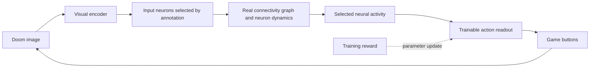

# Fly Doom research

Research date: September 26, 2026. This document distinguishes source findings from project decisions.

## Feasibility

The goal is to teach Doom control to a neural network constrained by the real fruit fly connectome. Connectivity alone does not determine neuronal electrical states, all receptors, synaptic strengths, or learning rules. The result will therefore be a computational model grounded in biological data; we will not claim it is a complete copy of a living brain.

The FlyWire adult female brain study includes 139,255 neurons and approximately 50 million chemical synapses. Directed neuron-pair counts and synapse counts are different: one pair can have many synaptic contacts. [Dorkenwald et al., Nature 2024](https://www.nature.com/articles/s41586-024-07558-y).

Shiu et al. built a brain-wide leaky integrate-and-fire (LIF) model using connectivity and neurotransmitter information, and studied feeding and grooming circuits. This provides a strong starting point for a dynamic model, but does not demonstrate Doom learning. [Paper](https://www.nature.com/articles/s41586-024-07763-9), [authors' code](https://github.com/philshiu/Drosophila_brain_model).

The 2026 FlyGM preprint trains a connectome-derived graph controller for simulated fly locomotion using reinforcement learning. It provides an example of a trainable controller constrained by connectivity. Its reported results concern a different environment and do not guarantee our Doom performance or biological validity. [FlyGM, arXiv v3](https://arxiv.org/abs/2602.17997v3).

## Dataset selection and access

We selected the **FAFB v783 publication archive** for the initial version: it offers a starting point close to the Shiu model and fixed source file versions. This does not mean it is the newest nervous system reconstruction. At the research date, Codex also lists datasets including BANC v888 and MCNS v1.0. We will not arbitrarily mix IDs and annotations across versions. Current Codex exports can differ from publication archives, and downloads can require an account or API token. [Codex FAQ](https://codex.flywire.ai/faq).

Selected inputs from [Zenodo 10676866](https://zenodo.org/records/10676866):

| File | Approximate size | Purpose |
|---|---:|---|
| `proofread_root_ids_783.npy` | 1.1 MB | Neuron IDs, including isolated neurons |
| `proofread_connections_783.feather` | 852 MB | Synapse counts per neuron pair and region |

The archive connection table includes `pre_pt_root_id`, `post_pt_root_id`, `syn_count`, regions, and neurotransmitter probabilities. The 9.5 GB individual-synapse file is not required for the initial graph. The current preparation code extracts directed connectivity counts without assigning neurotransmitter signs. Source MD5 values check download integrity; SHA-256 values are recorded in the local manifest. The source archive's existing quality filters still apply.

Preparation applies no additional synapse threshold, retains any self-connections, and sums regional rows for each directed pair. Matrix rows are targets and columns are sources. Regional and neurotransmitter information will be processed separately from the raw file when dynamics are added. Annotations and visual input and output populations must be matched to the same dataset version before simulation.

## Lessons from related Doom projects

[nftechie/doomfly](https://github.com/nftechie/doomfly) publishes a Doom experiment running on a real connectome. Its README reports that the current experiment failed visual, conditioning, and survival validation gates. Changing weights alone is not evidence of learning. We reviewed this report but did not independently run the upstream code.

[shreyash-sharma/doomFly](https://github.com/shreyash-sharma/doomFly/blob/main/docs/how-it-works.md) freezes connectivity and trains a small readout. It documents additional neural inputs derived from game state, including enemy direction. This differs from learning to play through pixels alone. Our primary experiment will not give the policy enemy coordinates or object labels.

## Proposed architecture

This diagram is the original training design. The experimental LIF kernel now runs inside a bounded pixel-to-game bridge, and a trainable engineered readout has been implemented, including offline Laya Vision distillation. The reward-driven parameter update shown here remains unimplemented; current teaching uses recorded target probabilities. See [the bridge assumptions and controls](BRIDGE.md) and [the Vision training procedure](VISION_WORKBENCH.md#offline-teaching-first-vision-student).

1. Start with a fixed graph and a small trainable readout. Inputs come only from images, and the output policy has no direct access to those images. This is a learned controller on top of a fixed connectivity model.
2. Then train the magnitudes of existing edges. The graph mask remains fixed, with no new connections. Record signs, weight bounds, and deviations from biological initialization. Choose between PPO/BPTT and local plasticity after initial performance measurements.
3. Use an LIF reference for the biological modeling path. A sparse rate model is a possible engineering comparison. If used, it will not be presented as LIF or as an exact reproduction of the paper.

The visual encoder is a central research challenge. Randomly assigning screen coordinates to neurons does not reconstruct natural fly vision. Visual-field mapping, annotation matching, and signal transmission to outputs will first be tested with small stimulation experiments. Inferring an effect's sign from neurotransmitter class is also a model assumption that depends on receptor context; unknown classes will not silently become excitatory.

## Game and experiment design

[ViZDoom](https://github.com/Farama-Foundation/ViZDoom) provides pixel observations, scenario control, and a Python interface. Windows is supported; maintainers recommend considering Linux/WSL for long experiments. The package can run using Freedoom assets. Initial setup is tested on Windows with the window hidden and sound disabled.

Curriculum: `basic` target shooting, then visual orientation and navigation, survival, and more complex maps. Success on `basic` does not mean completing a Doom level. Rewards are training signals; privileged state such as health or position must not leak into the policy. Neural state will reset at episode boundaries; persistent memory will be enabled only as a separate experiment.

Controls include a random policy, an untrained readout, a standard network with the same training budget, a retrained degree-preserving rewired graph, and a graph silenced during evaluation. Silencing demonstrates circuit dependence only; retrained comparisons are needed to establish an advantage from biological topology.

Use at least three independent training seeds and at least 20 evaluation seeds unseen during tuning. Keep training, validation, and test seeds separate. Measure success, return, accuracy, survival, and level completion as appropriate to the scenario. Report distributions and uncertainty; the best single video will not serve as the metric. Stronger learning claims require examining evaluation uncertainty alongside differences from controls.

## Resource budget and milestones

Local GPU: NVIDIA RTX 3060 Laptop with 6,144 MiB VRAM. System RAM information could not be read in the initial session. A dense 139,255-by-139,255 float32 matrix would occupy approximately 77.6 GB (72.2 GiB), making sparse storage necessary. That estimate covers weights only. A sparse graph fitting in memory does not guarantee that gradients across time and optimizer states will also fit.

- M0: literature review, data preparation tools, and ViZDoom integration check.
- M1: real source downloads, checksum verification, graph report, and matched annotations.
- M2: finite and stable model activity, stimulation responses, visual input-to-output transmission, step speed, and memory measurements.
- M3: training with a fixed graph and control experiments.
- M4: training existing synapses and comparing under the same evaluation protocol.
- M5: recordings, video, and more difficult Doom tasks.

September 26 follow-up: M1 is complete. The real graph was prepared and the publication-matched `flywire_annotations` v2.1.0 rows were aligned with all 139,255 neuron IDs. Measurements and limitations are in the [validation record](VALIDATION.md).

September 27 follow-up: an experimental LIF kernel and four bounded whole-graph stimulation conditions now run. M2 remains incomplete: photoreceptor stimulation affects downstream voltage but does not elicit descending spikes, and large voltage excursions require calibration. The positive control bypasses the retina. See [model assumptions, timing, and negative results](SIMULATION.md).

Long training runs will not begin before passing M2. If a subcircuit is needed instead of the whole brain, its scope will be recorded explicitly and will not be described as whole-brain simulation. Training time estimates will follow the first benchmark.

September 27 integration follow-up: a bounded engineering bridge now feeds coarse screen brightness directly into positive visual projection cells and maps descending spike rates to game buttons. This deliberately bypasses the unresolved retinal pathway, uses artificial assignments, and does not constitute passage of M2 or evidence of learning. Disconnected and zero-input controls are included; physiological calibration remains outstanding.

## Scope review after Vision teaching and recovery evaluation (October 6, 2026)

The engineering prototype now meets the immediate goal: real connectivity drives an added trainable student, Laya Vision supplies offline teaching targets, the trained student plays the basic shooting scenario without executing Vision, and recordings plus decision/weight inspection are available. The larger research roadmap remains incomplete.

| Milestone | Current status | Remaining work |
|---|---|---|
| M0–M1 | Completed for the selected dataset and initial setup | Revisit sources only when changing the scope or dataset |
| M2 | Calibrated engineering bridge runs; biological validation remains incomplete | Resolve the retinal pathway and physiological assumptions; the brightness-bin bridge is an artificial bypass |
| M3 | Fixed-graph training, Vision distillation, three recovery continuation seeds and their locked 20-opening gameplay comparison completed | Retrained matched network/topology controls, independent initializations and candidate-state recovery teaching. Continuations share one warm-start parent; paired intervals include zero, and older parent-training independence is unresolved |
| M4 | Not started | Train magnitudes of existing biological edges under explicit sign/mask/bound constraints if pursuing this later research stage |
| M5 | Interactive game recordings and numerical inspection available | Orientation, navigation, survival and harder maps; current success is limited to `basic` |

The first candidate scored 6/6 target kills against the parent's 5/6 on a small development comparison. Two evaluation openings repeat training images. The subsequent locked evaluation measured 19/20 candidate hits, 15/20 parent hits and 0/20 for the disconnected candidate, but 13 starts repeat a single training opening. The seven remaining openings give 6/7 versus 2/7 hits as a descriptive subgroup. See the [full protocol, uncertainty and scene-overlap audit](VALIDATION.md#locked-20-start-vision-student-validation-october-3-2026). These findings support fixed-policy circuit dependence and better performance in this scenario, not a biological-topology advantage or broad generalization.

The recovery teaching stage used 12 distinct training openings and 6 validation openings, with 20 further distinct openings reserved before teaching. All three continuations completed those 20 starts against their common parent: 15/20, 14/20 and 15/20 hits versus 13/20, with better measured mean returns. Every paired uncertainty interval includes zero. Each candidate recovered some failures and lost four parent successes; frequent LEFT/RIGHT changes remain a problem. All actual openings matched the locked scan, and complete RGB/input trajectory overlap was audited. No gameplay-based seed selection or checkpoint promotion occurred. See [the protocol, regressions and independent artifact checks](VALIDATION.md#reserved-recovery-gameplay-comparison-october-6-2026).

The next M3 work is retrained matched network/topology controls and independent initialization studies. Before further recovery tuning, reserve a fresh test set, collect observations reached by the new candidates, and evaluate rehearsal of earlier useful behavior. The previous parent-controlled collection does not fully cover the candidates' new closed-loop states. Both inspected evaluation sets are now development evidence. M4 is a separate extension rather than a prerequisite for the fixed-graph prototype. Automatic online learning is not implemented; current training remains offline.

## Live handoff and data expansion (October 9, 2026)

`flydoom.experiment` now connects completed training and benchmark identity to explicit live model selection. The browser presents the common parent and all three continuations without promoting a gameplay winner. It reloads the selected model's inspector and starts a fresh paused game; all weights remain fixed during play. The map starts with the entire anchor cloud enlarged and higher contrast. Full neuron morphology still requires additional anatomical data and is not supplied by this rendering change.

The next recovery reservation is `runs/vision-recovery-reservation-v2/plan.json`: 24 training starts, 8 validation starts and 20 future evaluation starts. An outcome-free scan examined 151 openings, excluding 529 known RGB identities from the discovered local records and retained teaching data. Evaluation openings were allocated first. No policy actions, Vision targets or rewards were collected in this reservation. Exact opening separation does not establish semantic independence or audit every historical trajectory PNG. The next collection/training protocol must still fix policy rotation, rehearsal proportions, training budget and validation selection before execution. The live application protects these future evaluation seeds from demonstrations.

External data review:

| Source | Observed format | Fit to this project |
|---|---|---|
| [Hugging Face DoomFrameDataset](https://huggingface.co/datasets/brahmandam/DoomFrameDataset) | Policy-generated RGB/action rollouts with episode/step metadata; approximately 2.4 million samples and 68 GB. Preview includes turning and combined actions. | A candidate for later visual/action studies, but not a drop-in four-action teacher dataset. Its card describes policy rollouts, not expert human demonstrations. |
| [GitHub Doom gameplay dataset](https://github.com/thavlik/doom-gameplay-dataset) | Preprocessed gameplay videos and frame/video indices | Useful for studying visual representations; the documented format does not provide our causal fly features or aligned four-action teacher targets. |
| [ViZDoom](https://github.com/Farama-Foundation/ViZDoom) | Controllable game environment | Preferred immediate expansion: generate ordered observations with our exact scenario, action timing, fly dynamics and causal memory, then ask the pinned Vision teacher for labels. |

No external training dataset was downloaded or merged in this step. External ingestion needs explicit episode boundaries, action semantics, source revision/licensing, teacher quality checks and train/validation/test separation. The stateful fly inputs must be regenerated from chronological observations under the project's simulator, rather than inferred from isolated screenshots. Anatomical morphology is a separate data need; [FlyWire's annotation repository](https://github.com/flyconnectome/flywire_annotations) links downloadable skeletons for its dataset.

## Anatomical surfaces and six-action pilot (October 9, 2026)

The map now adds 75 real FlyWire neuropil surfaces to the 139,255 reference positions and can download the selected neuron's actual v783 skeleton. Camera fitting includes the surfaces and selected branches. These additions supply anatomical shape without claiming that all full cell morphologies or synapses are rendered simultaneously. Surface color is not an activity measurement.

The separate six-action student adds forward and backward motor outputs, extends causal history, and transfers matching parent weights and normalization. A bounded offline Vision teaching pilot collected 165 training and 96 validation examples; validation teacher agreement increased from 10.42% to 47.92%. Biological connections and the Vision teacher remain fixed. The live mode executes the trained student without a Vision worker, and explicit manual motor checks demonstrate both directions in the engine without updating weights.

Backward is an available motor action, but the teacher supplied no backward top-choice labels in either split. This pilot therefore does not establish learned retreat. The next movement work needs a scenario and verified teaching examples in which retreat is useful, rehearsal of earlier behavior, and a new held-out evaluation protocol. The current basic shooting scenario, one training seed and small paired benchmark do not validate navigation. M2, matched topology controls under M3, and biological synaptic training under M4 remain unresolved. See the [validation record](VALIDATION.md) for the measured six-action comparison and its uncertainty.

## M4 started: constrained biological-edge learning (October 9, 2026)

M4 is now started at the engineering-pilot level. Two shared-gain searches made no accepted change; their reports are retained. A third experiment used direct local eligibility traces and a frozen decoder gradient to propose independent gains on selected existing synapses. Actual whole-graph replay, including hard spikes, accepted 13,867 changed CSR entries. Topology, signs, unselected edges and the decoder are unchanged. Training KL fell from 0.1429181 to 0.1425697; validation KL fell from 0.1743336 to 0.1733302. The source scenes were already seen by the decoder, and the two short development games show no gameplay gain.

This is an executable link from Laya teaching targets through the fixed decoder into biological-edge magnitude optimization. It is not full recurrent backpropagation or evidence that the brain's entire connectivity has been independently trained. The local derivative ignores indirect feedback and changes in spike timing; only exact forward rollout determines acceptance. M4 completion still requires longer trajectories, multiple seeds, stability analysis, separately reserved evaluation scenes and matched controls. M2 physiological validation remains unresolved. The new [research desk design and methods notebook](LAB_DESIGN_RESEARCH.md) documents source comparisons, exact scope, failed searches and next experiments.

### Automatic synaptic learning prototype (October 9, 2026)

The eight engineering follow-ups now have an implemented path: longer chronological training, reserved paired benchmarks, measured forward/backward curriculum feedback, an encoder ablation, full recurrent perturbation measurements, persistent population-state replay, named anatomy/path exploration, and an automatic candidate/promotion loop. See [Automatic learning](AUTOMATIC_LEARNING.md).

The first complete cycle trained real graph strengths but failed its promotion gate: training KL decreased, validation KL increased, and one task's native return regressed. The approved checkpoint is therefore unchanged. This completes the mechanism's integration, not the research objective of a reliably better Doom policy. Useful retreat, broader task generalization, statistically credible gains, biologically justified visual mapping and exact recurrent gradient training remain open research questions. Those limits are separated from implemented controls and preserved negative results in the [validation record](VALIDATION.md).

## Dataset audit and sparse follow-up (October 10, 2026)

The rejected October 9 cycle changed 292,748 gains relative to its parent using 48 training frames. Its largest training improvement came from one basic episode (mean KL delta -0.002906), while one distance episode regressed. Validation regression came from one basic episode (+0.005560); the other episode was unchanged. These saved-prediction diagnostics motivate a smaller, cross-episode update, but do not identify a proven causal failure mechanism. Reproduce the diagnosis with `python -m flydoom.cycle_diagnosis runs/learning/cycle-20261009-193333-715606`.

The new `flydoom.synaptic_consensus` experiment uses six fresh training trajectories, four validation trajectories, eight old training prefixes for rehearsal, and separate six-start gate/test sets. Per-episode local eligibility gradients must agree in sign in at least 75% of supporting episodes and be nonzero in at least three. Only the strongest 4,096 eligible edges may change. Training-only selection uses a 75% fresh / 25% rehearsal equal-episode objective and limits any training episode's KL regression to 0.005. Validation and native gameplay still independently veto promotion. This remains a small engineering experiment, not converged training or full recurrent backpropagation.

### Public data findings

| Source | Published contents | Integration assessment |
|---|---|---|
| [GameWAM ViZDoom](https://huggingface.co/datasets/Yunncheng/gamewam-vizdoom) | 50,000 policy-generated trajectories, 79,702,755 frames, four combat scenarios; 640x480 at 35 FPS; Apache-2.0; approximately 1.88 TB. | Strongest structured candidate for a future broader action policy. Nine action dimensions include rotation, speed and simultaneous buttons. Only a training split is supplied; reserve whole episodes for evaluation. |
| [DoomFrameDataset](https://huggingface.co/datasets/brahmandam/DoomFrameDataset) | About 2.4 million policy-generated image/action samples; roughly 68 GB; episode and step metadata. | Downloaded action map contains 18 categories. Only LEFT, RIGHT, FORWARD and ATTACK have exact local single-button equivalents; no WAIT/BACKWARD categories. No license was declared in the inspected card. |
| [p-doom Doom dataset](https://huggingface.co/datasets/p-doom/doom-dataset) | Ten million frames and actions; 60x80 images, ArrayRecord, train/validation/test, CC0-1.0. | Useful world-model/visual research source. Downloaded metadata says `env: coinrun` and `num_actions: 18`, despite the Doom card: resolve this inconsistency and action definitions before importing. |
| [GameNGen reproduction sample](https://huggingface.co/datasets/arnaudstiegler/vizdoom-50-episodes-skipframe-4) | 250,938 records, approximately 4.61 GB, episode IDs, JPEG frame bytes, action IDs and step IDs. | Inspected card lacks a license and action semantics; numerical IDs cannot safely be treated as our six actions. |
| [Doom gameplay videos](https://github.com/thavlik/doom-gameplay-dataset) | Approximately 170 hours of video; explicitly no ground-truth labels. | Visual representation research, not direct action imitation. Video availability alone does not provide aligned action targets. |
| [SauerkrautLM Doom MultiVec](https://huggingface.co/datasets/VAGOsolutions/SauerkrautLM-Doom-MultiVec-31k) | 31,645 human demonstration frames, Apache-2.0; ASCII views, depth bins and four soft action scores. | Frame skip matches four tics, but inputs are not RGB and turns are not strafes. Auxiliary depth would change our observation contract. Card review only; not downloaded. |
| [Doom actions Gemini](https://huggingface.co/datasets/chrisxx/doom-actions-gemini) | 172 short human deathmatch clips with 14-dimensional recorded actions and Gemini-assisted event annotations; MIT. | Potential separate perception evaluation source. Cropped clips lack episode prefixes and include weapons/rotation. Annotation claims require their own quality audit. Card review only; not downloaded. |

Four Hugging Face repository revisions and 11 small source files are retained in `runs/data-research-20261010/`. The source files total 250,004 bytes, excluding the repository API metadata. No full video archive was downloaded. `download-manifest.json` records pinned revision URLs, byte counts and SHA256 values. The two GameWAM Parquet samples are episode 0 from `battle1` and `defend_the_center`; this deterministic convenience sample is not a representative estimate of the full dataset.

The offline audit found 112/2,100 matching single-button rows in battle1 and 96/982 in defend-the-center: **208/3,082 in total**. Both episodes start with unsupported actions, so neither has a compatible causal prefix. Source timestamps match 35 Hz, while our policy holds each action for four tics. Removing incompatible rows would break recurrent history; matching action names alone cannot fix timing or dynamics. Sample videos were not downloaded, and **zero external rows were admitted to training**.

Reproduce the checks with `python -m flydoom.external_data_audit runs/data-research-20261010`. Immediate training expansion therefore uses native ViZDoom trajectories with the existing six-button timing and pinned Laya targets. Later external ingestion should either add a separately versioned multidimensional action head and matching timing, or use complete videos as visual pretraining/relabeling data; it must regenerate neural state chronologically and keep held-out episodes isolated.

## Model-neuron integration priority review (October 10, 2026)

The user now prioritizes biological integration over additional gameplay tuning. This section records a source/code review and a proposed protocol, not an implemented replacement or a new training result. No checkpoint, runtime implementation, dependency, or cache was changed for this review.

### What the current integration actually does

- `bridge.py` averages RGB into 64 brightness bins and cyclically assigns them to positive visual-projection neurons sorted by root ID. It bypasses photoreceptors and early visual processing. Neither root-ID order nor soma position establishes retinal receptive fields.
- `simulation.py` applies one LIF parameter set throughout the graph. Neurotransmitter signs are approximate presynaptic rules, without target receptor dynamics. Dopamine has no separate modulatory learning channel.
- `calibration.output_features` reads individual voltage/rate features from all 1,303 descending neurons. The current six-action `MovementReadout` combines these with action history; it does not use the legacy three cyclic output groups as its final action decoder. There is no direct RGB or Laya embedding input to this decoder.
- Laya Vision supplies offline action targets. The synaptic experiments adjust selected existing edges into descending cells, not all internal visual or memory circuits. Their local derivative omits indirect recurrent feedback and spike-time changes; complete forward replay evaluates proposals.
- Neural time advances 50 ms per observation, while an action can advance four game tics. A new physiological protocol must explicitly reconcile stimulus sampling and simulated time before comparing response latencies.

The local annotation audit found 139,255 cells, including 8,452 R1-6, 1,343 R7 and 1,324 R8 cells. No retinal-column or optical-direction field is present in this TSV. Alias-aware lookup finds two DNa02 cells in `hemibrain_type`, two DNg13 cells in `cell_type`, and four MDN cells whose `cell_type` is DNp50. Exact lookup in only one name column would miss relevant populations. These are anatomical identities, not measurements of their functional fidelity in our simulator.

### Primary evidence and usable resources

| Resource | Finding and project implication |
|---|---|
| [FlyVis, Nature 2024](https://www.nature.com/articles/s41586-024-07939-3), [official implementation](https://github.com/TuragaLab/flyvis) | A visual model uses connectivity constraints, graded neuronal dynamics and task optimization to predict responses compared with 26 experimental studies. Transfer its method: constrain cell-type dynamics and synaptic gains, then evaluate neural responses. Its averaged retinotopic network is not our exact whole-brain FAFB graph or a root-ID-compatible checkpoint. |
| [Eye structure and motion vision, Nature 2025](https://pmc.ncbi.nlm.nih.gov/articles/PMC12488493/), [author code/data](https://github.com/reiserlab/eyemap_T4) | Eye geometry shapes motion tuning. The repository contains `eyemap.RData`, medulla coordinates, optical directions and physiological response data. `proc_eyemap.R` maps Mi1 column indices to lens indices; these indices must not be treated as FlyWire root IDs. Matching coverage, coordinate systems and left/right conventions remain unverified locally. |
| [Visual-system parts list data](https://github.com/murthylab/visual-system-parts-list/tree/main/data), [FlyWire annotations](https://github.com/flyconnectome/flywire_annotations) | v783-compatible cell types, side information and synapse resources support anatomical reconciliation. Pin source releases and retain conflicting aliases instead of silently replacing current annotations. These tables alone do not supply a calibrated screen-to-retina mapping. |
| [Beiran and Litwin-Kumar, Nature Neuroscience 2025](https://www.nature.com/articles/s41593-025-02080-4) | The accessible abstract reports that connectivity alone can leave recurrent dynamics underdetermined; partial activity observations can constrain solutions. This motivates adding physiological targets. The study does not validate our model or provide a universal required number of recorded cells. |
| [Shiu et al., Nature 2024](https://www.nature.com/articles/s41586-024-07763-9) | Whole-brain LIF modeling supports specific sensorimotor predictions, while explicitly simplifying nonspiking cells, receptors and internal state. Use its experimental conditions as possible bounded controls, not as validation of our visual bypass or Doom behavior. |
| [Steering control, Cell 2024](https://doi.org/10.1016/j.cell.2024.08.033), [backward walking, Nature Communications 2020](https://www.nature.com/articles/s41467-020-19936-x) | Identified descending neurons offer functional hypotheses for steering and backward locomotion. Our MOVE_LEFT/RIGHT buttons strafe; they do not rotate. Any biological-to-game motor adapter must explicitly distinguish those axes. ATTACK remains an engineered output without a proposed biological shooting neuron. |
| [Dopamine-gated memory model, 2021](https://pmc.ncbi.nlm.nih.gov/articles/PMC8354444/) | Compartment-specific KC-to-MBON plasticity uses the relative timing of Kenyon-cell and dopamine activity. This is a later candidate for learning rules; assigning one global game reward to every dopamine neuron would be an additional engineering assumption. |
| [FlyGM, February 2026 preprint](https://arxiv.org/abs/2602.17997) | A useful engineering comparator for connectomic locomotion and topology controls. Its fixed graph operator and trainable latent features are not evidence of learning measured biological synaptic strengths or reproducing cellular physiology. Do not replace the current simulator on the strength of a preprint performance claim. |

### Proposed implementation order and acceptance evidence

1. **Establish visual identity and geometry.** Export a versioned mapping with root ID, cell type/alias, side, retinal column, optical direction, coordinate units, evidence source and uncertainty. Report unmatched cells explicitly. Audit the eye-map data against current morphology and connectivity before assigning pixels. A restricted validated visual field is acceptable; fabricated whole-eye coverage is not. A single Doom camera must have explicit field-of-view and outside-screen handling.
2. **Validate visual dynamics in isolation.** Evaluate a graded visual subcircuit using flashes, bright/dark moving edges, multiple directions, speeds and contrasts. Measure baseline, response polarity, latency and T4/T5 direction selectivity. Reserve stimulus conditions and cell populations before fitting. Match recording modalities with an observation model; raw calcium fluorescence is not membrane voltage. Resolve the failed retinal transmission pathway rather than merely increasing excitation until motor cells fire.
3. **Reconnect through the existing graph.** Adapt verified visual dynamics to the appropriate existing cells and boundary connections; do not append a duplicate optic lobe. Start with bounded cell-type time constants and positive gains shared by source/target type, keeping structural zeros fixed and sign assumptions documented. Expand to individual-edge residuals only if held-out evidence supports it. Recalibrate the graded/spiking interface and introduce a new checkpoint schema: existing calibration/source hashes intentionally prohibit silent reuse after dynamics change.
4. **Train with task and physiological constraints.** Keep Laya as an offline task teacher. Combine action imitation, measured visual-response agreement and penalties for excessive parameter drift or unstable activity. Fit coefficients on development data; keep physiological test observations separate. Teacher agreement alone cannot establish biological fidelity. A differentiable visual subcircuit is a tractable starting point before attempting recurrent gradients across the full graph.
5. **Ground and test the motor interface.** Compare the present decoder with a constrained population readout over identified descending circuits. Inspect signed population contributions and matched cell-silencing/stimulation effects from identical saved neural states. Record changes in action probabilities and downstream activity. Add rotation only in a separately versioned action protocol with new teacher targets; do not relabel existing strafe actions as turns.
6. **Measure whether the biological organization matters.** Retrain real-topology and degree/sign-constrained rewired controls under matched input/output capacity, compute budgets and several initializations. State which weight/strength statistics are preserved. Add direct-image, memory-only and input/time-shuffle baselines. Separate frozen-policy interventions from retrained controls: a disconnected model failing demonstrates dependence, not the superiority of the biological topology. Evaluate both held-out physiological responses and gameplay with uncertainty.
7. **Investigate local reward-modulated learning after those gates.** Audit KC/MBON/DAN identities and compartments, introduce an explicit modulatory channel, and test timing-dependent learning and retention on a small circuit before expanding. Keep the game-reward interpretation separate from claims about fly dopamine physiology.

The first deliverable should be an audited eye-to-cell map and a visual-stimulus response report. An integration dashboard can then show the actual chain from sampled visual location through identified cells to output changes, including measured intervention effects. No biological integration success percentage is currently justified; the earlier short-game kill percentage measures a different outcome.
