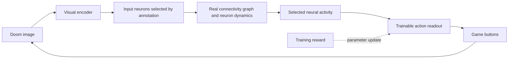

# Fly Doom research

Research date: September 26, 2026. This document distinguishes source findings from project decisions.

## Feasibility

The goal is to teach Doom control to a neural network constrained by the real fruit fly connectome. Connectivity alone does not determine neuronal electrical states, all receptors, synaptic strengths, or learning rules. The result will therefore be a computational model grounded in biological data; we will not claim it is a complete copy of a living brain.

The FlyWire adult female brain study includes 139,255 neurons and approximately 50 million chemical synapses. Directed neuron-pair counts and synapse counts are different: one pair can have many synaptic contacts. [Dorkenwald et al., Nature 2024](https://www.nature.com/articles/s41586-024-07558-y).

Shiu et al. built a brain-wide leaky integrate-and-fire (LIF) model using connectivity and neurotransmitter information, and studied feeding and grooming circuits. This provides a strong starting point for a dynamic model, but does not demonstrate Doom learning. [Paper](https://www.nature.com/articles/s41586-024-07763-9), [authors' code](https://github.com/philshiu/Drosophila_brain_model).

The 2026 FlyGM preprint trains a connectome-derived graph controller for simulated fly locomotion using reinforcement learning. It provides an example of a trainable controller constrained by connectivity. Its reported results concern a different environment and do not guarantee our Doom performance or biological validity. [FlyGM, arXiv v3](https://arxiv.org/abs/2602.17997v3).

## Dataset selection and access

We selected the **FAFB v783 publication archive** for the initial version: it offers a starting point close to the Shiu model and fixed source file versions. This does not mean it is the newest nervous system reconstruction. At the research date, Codex also lists datasets including BANC v888 and MCNS v1.0. We will not arbitrarily mix IDs and annotations across versions. Current Codex exports can differ from publication archives, and downloads can require an account or API token. [Codex FAQ](https://codex.flywire.ai/faq).

Selected inputs from [Zenodo 10676866](https://zenodo.org/records/10676866):

| File | Approximate size | Purpose |
|---|---:|---|
| `proofread_root_ids_783.npy` | 1.1 MB | Neuron IDs, including isolated neurons |
| `proofread_connections_783.feather` | 852 MB | Synapse counts per neuron pair and region |

The archive connection table includes `pre_pt_root_id`, `post_pt_root_id`, `syn_count`, regions, and neurotransmitter probabilities. The 9.5 GB individual-synapse file is not required for the initial graph. The current preparation code extracts directed connectivity counts without assigning neurotransmitter signs. Source MD5 values check download integrity; SHA-256 values are recorded in the local manifest. The source archive's existing quality filters still apply.

Preparation applies no additional synapse threshold, retains any self-connections, and sums regional rows for each directed pair. Matrix rows are targets and columns are sources. Regional and neurotransmitter information will be processed separately from the raw file when dynamics are added. Annotations and visual input and output populations must be matched to the same dataset version before simulation.

## Lessons from related Doom projects

[nftechie/doomfly](https://github.com/nftechie/doomfly) publishes a Doom experiment running on a real connectome. Its README reports that the current experiment failed visual, conditioning, and survival validation gates. Changing weights alone is not evidence of learning. We reviewed this report but did not independently run the upstream code.

[shreyash-sharma/doomFly](https://github.com/shreyash-sharma/doomFly/blob/main/docs/how-it-works.md) freezes connectivity and trains a small readout. It documents additional neural inputs derived from game state, including enemy direction. This differs from learning to play through pixels alone. Our primary experiment will not give the policy enemy coordinates or object labels.

## Proposed architecture

This diagram is a training design. The experimental LIF kernel now also runs inside a bounded pixel-to-game bridge with a fixed, artificial readout. The trainable readout and reward update shown here have not been implemented. See [the bridge assumptions and controls](BRIDGE.md).

1. Start with a fixed graph and a small trainable readout. Inputs come only from images, and the output policy has no direct access to those images. This is a learned controller on top of a fixed connectivity model.
2. Then train the magnitudes of existing edges. The graph mask remains fixed, with no new connections. Record signs, weight bounds, and deviations from biological initialization. Choose between PPO/BPTT and local plasticity after initial performance measurements.
3. Use an LIF reference for the biological modeling path. A sparse rate model is a possible engineering comparison. If used, it will not be presented as LIF or as an exact reproduction of the paper.

The visual encoder is a central research challenge. Randomly assigning screen coordinates to neurons does not reconstruct natural fly vision. Visual-field mapping, annotation matching, and signal transmission to outputs will first be tested with small stimulation experiments. Inferring an effect's sign from neurotransmitter class is also a model assumption that depends on receptor context; unknown classes will not silently become excitatory.

## Game and experiment design

[ViZDoom](https://github.com/Farama-Foundation/ViZDoom) provides pixel observations, scenario control, and a Python interface. Windows is supported; maintainers recommend considering Linux/WSL for long experiments. The package can run using Freedoom assets. Initial setup is tested on Windows with the window hidden and sound disabled.

Curriculum: `basic` target shooting, then visual orientation and navigation, survival, and more complex maps. Success on `basic` does not mean completing a Doom level. Rewards are training signals; privileged state such as health or position must not leak into the policy. Neural state will reset at episode boundaries; persistent memory will be enabled only as a separate experiment.

Controls include a random policy, an untrained readout, a standard network with the same training budget, a retrained degree-preserving rewired graph, and a graph silenced during evaluation. Silencing demonstrates circuit dependence only; retrained comparisons are needed to establish an advantage from biological topology.

Use at least three independent training seeds and at least 20 evaluation seeds unseen during tuning. Keep training, validation, and test seeds separate. Measure success, return, accuracy, survival, and level completion as appropriate to the scenario. Report distributions and uncertainty; the best single video will not serve as the metric. Stronger learning claims require examining evaluation uncertainty alongside differences from controls.

## Resource budget and milestones

Local GPU: NVIDIA RTX 3060 Laptop with 6,144 MiB VRAM. System RAM information could not be read in the initial session. A dense 139,255-by-139,255 float32 matrix would occupy approximately 77.6 GB (72.2 GiB), making sparse storage necessary. That estimate covers weights only. A sparse graph fitting in memory does not guarantee that gradients across time and optimizer states will also fit.

- M0: literature review, data preparation tools, and ViZDoom integration check.
- M1: real source downloads, checksum verification, graph report, and matched annotations.
- M2: finite and stable model activity, stimulation responses, visual input-to-output transmission, step speed, and memory measurements.
- M3: training with a fixed graph and control experiments.
- M4: training existing synapses and comparing under the same evaluation protocol.
- M5: recordings, video, and more difficult Doom tasks.

September 26 follow-up: M1 is complete. The real graph was prepared and the publication-matched `flywire_annotations` v2.1.0 rows were aligned with all 139,255 neuron IDs. Measurements and limitations are in the [validation record](VALIDATION.md).

September 27 follow-up: an experimental LIF kernel and four bounded whole-graph stimulation conditions now run. M2 remains incomplete: photoreceptor stimulation affects downstream voltage but does not elicit descending spikes, and large voltage excursions require calibration. The positive control bypasses the retina. See [model assumptions, timing, and negative results](SIMULATION.md).

Long training runs will not begin before passing M2. If a subcircuit is needed instead of the whole brain, its scope will be recorded explicitly and will not be described as whole-brain simulation. Training time estimates will follow the first benchmark.

September 27 integration follow-up: a bounded engineering bridge now feeds coarse screen brightness directly into positive visual projection cells and maps descending spike rates to game buttons. This deliberately bypasses the unresolved retinal pathway, uses artificial assignments, and does not constitute passage of M2 or evidence of learning. Disconnected and zero-input controls are included; physiological calibration remains outstanding.
