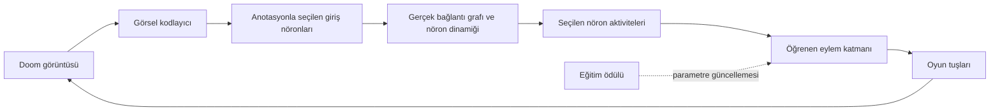

# Fly Doom araştırması

Araştırma tarihi: 26 Eylül 2026. Bu belge kaynak bulgularını proje kararlarından ayırır.

## Yapılabilirlik

Amaç, gerçek meyve sineği bağlantı haritasının kısıtladığı bir sinir ağına Doom kontrolünü öğretmek. Bağlantı haritası nöronların elektriksel durumunu, bütün reseptörlerini, sinaptik güçlerini veya öğrenme kurallarını tek başına belirlemez. Dolayısıyla sonuç, biyolojik veriye dayalı hesaplamalı bir model olacaktır; canlı beynin eksiksiz kopyası olduğu iddia edilmeyecek.

FlyWire'ın yetişkin dişi beyin çalışması 139.255 nöron ve yaklaşık 50 milyon kimyasal sinaps içeriyor. Nöronlar arasındaki yönlü kenar sayısı ile sinaps sayısı farklıdır: bir çift arasında çok sayıda sinaps olabilir. [Dorkenwald ve diğerleri, Nature 2024](https://www.nature.com/articles/s41586-024-07558-y).

Shiu ve diğerleri bağlantı ve nörotransmiter bilgisiyle beyin ölçeğinde leaky integrate-and-fire (LIF) modeli kurup beslenme ve temizlenme devrelerini incelemiş. Bu, dinamik model kurmak için güçlü bir başlangıç; Doom öğrenildiğinin kanıtı değil. [Makale](https://www.nature.com/articles/s41586-024-07763-9), [yazarların kodu](https://github.com/philshiu/Drosophila_brain_model).

2026 tarihli FlyGM ön baskısı, bağlantı haritasından türetilmiş graf denetleyicisini pekiştirmeli öğrenmeyle sanal sineğin hareketlerine eğitiyor. Bu, eğitilebilir bağlantı kısıtlı ağ yaklaşımını destekleyen bir örnek. Çalışmanın bildirdiği sonuçlar farklı bir ortamda; bizim Doom başarımızı veya biyolojik doğruluğumuzu garanti etmiyor. [FlyGM, arXiv v3](https://arxiv.org/abs/2602.17997v3).

## Veri seçimi ve erişim

İlk sürüm için **FAFB v783 yayın arşivi** seçildi: Shiu modeline yakın bir başlangıç ve sabit dosya sürümleri sağlıyor. Bu en yeni sinir sistemi haritası olduğu anlamına gelmiyor. Codex şu anda BANC v888 ve MCNS v1.0 dahil başka veri setleri de listeliyor. Sürümler arasında kimlik ve anotasyonları gelişigüzel birleştirmeyeceğiz. Codex'in güncel dosyaları yayın arşivinden farklılaşabiliyor; indirmeler hesap/API belirteci gerektirebiliyor. [Codex FAQ](https://codex.flywire.ai/faq).

[Zenodo 10676866](https://zenodo.org/records/10676866) üzerinde seçilen girdiler:

| Dosya | Yaklaşık boyut | Kullanım |
|---|---:|---|
| `proofread_root_ids_783.npy` | 1,1 MB | İzole nöronlar dahil kimlikler |
| `proofread_connections_783.feather` | 852 MB | Nöron çifti ve bölge başına sinaps sayıları |

Arşiv bağlantı tablosu `pre_pt_root_id`, `post_pt_root_id`, `syn_count`, bölge ve nörotransmiter olasılıkları içeriyor. Tekil sinapsların 9,5 GB dosyası ilk graf için gerekmiyor. Mevcut hazırlayıcı yalnızca yönlü bağlantı sayısını çıkarır; nörotransmiter işareti henüz atamaz. Kaynak MD5 değerleri indirme bütünlüğünü kontrol eder; SHA-256 değerleri yerel manifestte kaydedilir. Kaynak arşivin önceden uyguladığı kalite filtreleri geçerlidir.

Hazırlayıcı ek sinaps eşiği uygulamaz, öz bağlantıları tutar, bölge satırlarını aynı yönlü çift için toplar. Matriste satır hedef, sütun kaynak nörondur. Dinamik model eklenirken bölgesel ve nörotransmiter bilgileri ham dosyadan ayrıca işlenecek. Anotasyonlar, görsel giriş hücreleri ve çıkış hücreleri aynı sürümle eşleştirilmeden simülasyona geçilmeyecek.

## Benzer Doom projelerinden dersler

[nftechie/doomfly](https://github.com/nftechie/doomfly) gerçek bağlantı haritasıyla çalışan bir Doom deneyi yayımlıyor. README, mevcut deneyin görsel işleme, koşullama ve hayatta kalma doğrulamalarını geçmediğini söylüyor. Ağırlıkların değişmesi tek başına öğrenme kanıtı değildir. Bu raporu okuduk; kodu çalıştırarak bağımsız doğrulama yapmadık.

[shreyash-sharma/doomFly](https://github.com/shreyash-sharma/doomFly/blob/main/docs/how-it-works.md) bağlantıları sabit tutup küçük bir çıkış katmanını eğitiyor. Düşman yönü gibi oyun durumundan gelen ek nöral girdileri açıkça belgeliyor. Bu, yalnızca piksellerle görerek oynama iddiasından farklıdır. Bizim ana deneyimizde düşman koordinatları veya nesne etiketleri politika girdisi olmayacak.

## Önerilen mimari

Bu şema tasarımdır; ilk altyapıda henüz sinir ağı ve eğitim uygulanmadı.

1. Önce sabit graf + öğrenen küçük çıkış katmanı. Girdi yalnızca görüntüden gelir; çıktı politikası doğrudan görüntüye erişmez. Bunun adı, sabit bağlantı modeli üzerinde öğrenen denetleyicidir.
2. Sonra yalnızca mevcut kenarların büyüklüklerini eğiten model. Graf maskesi sabit kalır; bağlantı eklenmez. İşaret, ağırlık sınırı ve biyolojik başlangıçtan sapma kaydedilir. PPO/BPTT veya yerel plastisite seçimi ilk performans ölçümünden sonra yapılır.
3. LIF referansı biyolojik modelleme hattında; seyrek hız modeli olası mühendislik karşılaştırmasıdır. Hız modeli kullanılırsa LIF veya makalenin birebir tekrarı olarak sunulmaz.

Görsel kodlayıcı kritik araştırma noktasıdır. Ekran koordinatlarını rastgele nöronlara dağıtmak doğal sinek görmesini yeniden kurmaz. Görsel alan/anotasyon eşlemesi ve çıkışa sinyal ulaşması önce küçük uyarı deneyleriyle sınanacak. Nörotransmiter sınıfından etki işareti çıkarmak da reseptör bağlamına bağlı bir model varsayımıdır; bilinmeyen sınıflar sessizce uyarıcı yapılmayacak.

## Oyun ve deney tasarımı

[ViZDoom](https://github.com/Farama-Foundation/ViZDoom), piksel girdisi, senaryo kontrolü ve Python arayüzü sağlıyor. Windows desteği var; bakımcılar uzun deneylerde Linux/WSL değerlendirilmesini öneriyor. Paket Freedoom varlıklarıyla çalışabilir. İlk kurulum Windows üzerinde, görünmez pencere ve ses kapalı şekilde denenir.

Müfredat: `basic` hedef vurma → görsel yönelim ve gezinme → hayatta kalma → daha karmaşık haritalar. `basic` başarısı Doom bölümünü bitirmek anlamına gelmez. Ödül yalnızca eğitim sinyalidir; sağlık/konum gibi ayrıcalıklı durumun politikaya sızması önlenecek. Bölüm bitişlerinde nöral durum sıfırlanacak; bellek aktarımı ancak ayrı deney olarak açılacak.

Kontroller: rastgele politika, eğitilmemiş çıkış katmanı, eşit eğitim bütçeli standart ağ, yeniden eğitilmiş dereceyi koruyan karıştırılmış graf ve değerlendirme sırasında susturulmuş graf. Susturma yalnızca devre bağımlılığını gösterir; biyolojik topolojinin avantajını kanıtlamak için yeniden eğitilmiş karşılaştırmalar gerekir.

En az üç bağımsız eğitim tohumu; ayarlama sırasında görülmeyen en az 20 değerlendirme tohumu. Eğitim, doğrulama ve test tohumları ayrı tutulacak. Başarı, toplam ödül, isabet, hayatta kalma ve bölüm tamamlama senaryoya göre ölçülecek. Sonuçlar dağılım ve belirsizlikle raporlanacak; en iyi tek video ölçüt olmayacak. Daha güçlü bir öğrenme iddiası için test aralığı ve kontrol farkları birlikte incelenecek.

## Kaynak bütçesi ve kilometre taşları

Yerel GPU: NVIDIA RTX 3060 Laptop, 6144 MiB VRAM. Sistem RAM bilgisi bu oturumda okunamadı. 139.255 kare float32 yoğun matris yaklaşık 77,6 GB (72,2 GiB) tutar; bu nedenle seyrek temsil gerekli. Bu hesap yalnızca ağırlıklardır. Seyrek grafın belleğe sığması, zaman boyunca gradyanların ve optimizer durumunun sığacağını garanti etmez.

- M0: kaynak incelemesi, veri hazırlayıcı ve ViZDoom bağlantı testi.
- M1: gerçek dosya indirme, checksum kontrolü, graf raporu, eşleşen anotasyonlar.
- M2: dinamik modelde sonlu/kararlı aktivite, uyarıya tepki, görsel girişten çıkışa sinyal, adım hızı ve bellek ölçümü.
- M3: sabit graf üzerinde eğitim ve kontrol deneyleri.
- M4: mevcut sinapslarda eğitim, aynı değerlendirme protokolüyle karşılaştırma.
- M5: kayıt/video ve daha zor Doom görevleri.

26 Eylül takip durumu: M1 tamamlandı. Gerçek graf hazırlandı ve yayınla eşleşen `flywire_annotations` v2.1.0 açıklamaları tüm 139.255 kimliğe eşlendi. Ölçülen sayılar ve veri sınırlamaları [doğrulama kaydında](VALIDATION.tr.md). Sıradaki çalışma M2; henüz çalışır nöron dinamiği yok.

M2 geçmeden uzun eğitime başlanmayacak. Bütün beyin yerine alt devre kullanılması gerekirse kapsam açıkça kaydedilecek; tüm beyin olarak adlandırılmayacak. Tahmini eğitim süresi ilk benchmark sonrasında belirlenecek.
