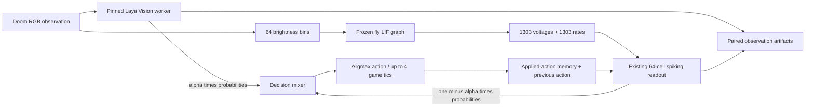

# Laya Vision research workbench

The current entry point is an instrumented, paired inference system. It evaluates the pinned Laya Vision model and the existing fly-driven student on the same native Doom observation, then applies an explicit mixture of their action distributions. The old text-Laya experiments and their rejected teacher results remain historical artifacts. The new visual teacher is a different checkpoint and implementation.

The initial three-start local comparison measured 3/3 target kills and mean return 83 for both Vision and the 0.8 mixture, versus 2/3 and -111 for the student. All 156 recorded decisions passed artifact, fusion, causal-memory and probability-replay audits. See [validation evidence and limits](VALIDATION.md#laya-vision-integration-and-research-workbench-october-3-2026).

## Launch and inspect

```powershell
.\.venv\Scripts\python.exe -m flydoom.research
```

Open **http://127.0.0.1:8770**. The observatory has one shared workspace: Doom on the left and the anatomical connectome plus engineered readout on the right. **Recorded runs** and **Live experiment** select the source for both panels together. The source chip and map caption distinguish archived output features from live simulated spikes.

### Recorded runs

The selector prefers a student-only recording that matches the loaded checkpoint. With the trained Vision student loaded, the prepared 49-decision candidate evaluation opens by default. Use **Play run**, pause, arrows, the slider, or numbered decisions. Both panels move to the same episode/decision. Game tics animate inside a decision while neural values remain fixed until the next inference boundary. A kill is labeled from engine counters; the last available image is held when the engine supplies no terminal frame.

The map preserves the real anatomical neuron anchors. For archives, orange biological highlights encode the absolute stored descending voltage feature; other neurons have no archived activity and remain unmeasured. Student-cell brightness reflects measured spikes, and color shows the largest positive output-logit contribution (WAIT gray, LEFT blue, RIGHT green, ATTACK copper). Biological spike counts for all neurons are available only in live mode. Node positions, weights and activity are not interchangeable quantities.

**Action selection** shows applied probabilities, the recorded action and the Vision/student relationship. Click an action to rank the **Active readout cells** table by contribution to that action. The table lists the six strongest active contributors, their measured spikes, largest positive action contribution and signed logit product. Cells contribute to a shared action score; they do not independently choose buttons. The applied action node is ringed on the map.

Click a cell in the table or directly in the 3D map. Its recorded input/output links are highlighted and the inspector opens with the sum of fly, memory and previous-action input products plus bias. It lists the four strongest input products and all four output-weight products. Selecting a descending root ID shows its recorded voltage/rate features and available retained links. An unrecorded anatomical cell explicitly reports that its activity is unavailable. The inspector closes independently of playback.

The detailed checkpoint hashes, training metrics and scope notes are under **Experiment details**. The previous long signal pipeline, separate live-map section, repeated activity grids and local counterfactual sandbox were removed from the frontend. Their place is taken by the shared map and selection-based inspector. There is one replay timer and one source selection, so the game and map cannot silently refer to two sessions.

### Live experiment

The initial engine run is paused. **Single step** advances one paired decision; **Run** continues; **Pause** takes effect at the next decision boundary; **End run** prevents further actions after that boundary. Both the image and full biological spike map use the same live sequence. The image is the observation before the selected action, while reward and termination are measured afterward. Selecting nodes uses the exact sequence's existing neuron inspector.

**New run settings** creates a paused run after the previous one ends. Seed, 1 to 6 episodes, 1 to 75 decisions and Vision coefficient are fixed per run. A coefficient of zero leaves action selection entirely to the student, while Vision is still evaluated as an observer in this paired live instrument. Fully teacher-free evaluation recordings mark Vision as not executed. Switching UI sources does not stop or advance the live game; use the live controls to pause it when required.

After completing or ending a live run, switch to **Recorded runs** and press the refresh button. Post-tic frames and student features are saved automatically. Loading detailed archive data reevaluates only the small fixed student on its saved inputs to verify its arithmetic. It does not execute Vision or rerun the biological graph.

### Archive integrity and developer contract

`GET /api/replay-signals?id=ID` verifies source-trace identity, the archived checkpoint, NPZ/image hashes, replay/trace alignment, student activity/probability reproduction and input-drive arithmetic. It returns exact output root IDs, every recorded descending voltage/rate feature, memory and previous-action fields, measured student activity, strongest input products, output weights and biases. Missing or modified artifacts disable the archive map detail explicitly. `replay_signals.py` supplies this data; the research `app.js` controls both source modes and extends the existing anatomical WebGL renderer without changing the legacy observer.

Existing completed paired runs can be reconstructed with a fresh output directory:

```powershell
.\.venv\Scripts\python.exe -m flydoom.replay --run runs/vision-workbench-v1/run-20261003-030435-554880 --output runs/replays/my-reconstruction
```

Reconstruction replays recorded actions in ViZDoom and checks every original RGB hash and return. It does not recompute teacher predictions. Run artifacts are local and not shipped as source. The `basic` scenario supports strafing and shooting; success is not navigation or completion of a Doom level.

## Architecture and contracts



Canonical action order is `WAIT, MOVE_LEFT, MOVE_RIGHT, ATTACK`. The upstream Doom prompt offers three actual game buttons, so Vision is mapped to `[0, p_left, p_right, p_attack]`. The student still has four actions. The default engineering mixture is:

```text
p_applied = alpha * p_vision + (1 - alpha) * p_student
action = argmax(p_applied)
default alpha = 0.8
```

`alpha=1` selects pure Vision control; `alpha=0` selects pure student control. Both branches still execute for paired measurement, so the run includes the fly simulation's latency even in pure Vision mode. The coefficient is not learned, is not a biological weight, and has not been optimized. There is no direct Vision-to-fly synaptic matrix. The default parent retains its previous training; the separate `runs/fly-student-vision-v1` candidate has now been distilled from Vision as described below. No optimizer runs during gameplay.

The graph retains state between decisions and resets between episodes. Student internal state resets each decision. The 17 memory features and previous-action one-hot are updated from the **applied mixed action**, rather than either branch's unused proposal. Both policies receive only their declared visual/history inputs; no engine labels, target boxes, future actions, or reward enter inference.

## Module boundaries

| Module | Responsibility |
|---|---|
| `flydoom/vision_setup.py` | Resolve the Hub revision, download artifacts, hash model and fork source files |
| `flydoom/vision.py` | Verify artifacts; start an isolated import process; RGB request/response protocol; exact scorer telemetry |
| `flydoom/research.py` | Paired inference, mixture, causal memory updates, immutable decision files, run lifecycle, HTTP API |
| `flydoom/replay.py` | Native capture indexing, verified reconstruction of older traces, hash-checked replay library |
| `flydoom/vision_distill.py` | Verified paired-record ingestion, episode-separated soft-target training, teacher-free gameplay comparison |
| `flydoom/vision_validation.py` | Locked 20-start protocol, paired disconnected control, scene-overlap audit and grouped uncertainty estimates |
| `flydoom/live_brain.py` | Existing checkpoint validation and observer primitives; static-root parameter supports the new frontend |
| `flydoom/live_activity.py`, `live_map.py` | Existing exact-ID connection catalog, forward hooks, anatomical map and activity serialization |
| `flydoom/web/research/` | Shared game/map workspace, archive/live source controls, active-cell contributions and selected-connection inspector |

The text and visual forks both import as `laya`. Replacing the installed package would change the old trainer's dependency. Instead, a subprocess prepends only the pinned visual source directory to its own import path. The parent process retains `laya==0.3.21`. Requests carry uint8 320 × 240 RGB bytes; replies carry a frame hash, calibrated probabilities computed from unrounded logits, telemetry, timing, and prompt provenance. A serialized request channel has timeouts and fails explicitly if the worker exits. Worker diagnostics go to `runs/vision-worker.log`.

Inference sets `HF_HUB_OFFLINE=1` and `TRANSFORMERS_OFFLINE=1`. It verifies the full model and fork source hashes before loading, uses FP32, and reports the actual device. The selected model's `processor/`, `backbone/` config and full safetensors file are local; no live model download is needed.

## Pinned dependencies and provenance

| Component | Pinned value |
|---|---|
| Model | `thaitea/laya-vision` |
| Model revision | `f2fe3c12cb6d04c59d8a190250bf3fb40fc828dc` |
| Fork source | `r33drichards/laya-vision` |
| Source commit | `9e1e2419d855ad3e1a2af4d4bd1ef6be5418842c` |
| Parameters | 201,161,347 |
| Additional installed libraries | Pillow 12.3.0; torchvision 0.29.1+cu130 |
| Existing compute runtime | PyTorch 2.14.0+cu130; Transformers 5.17.0 |
| Default student | `runs/fly-student-memory-v1` |

On a separately prepared checkout, retain the existing training environment, install `requirements-vision.lock.txt`, clone the fork into `models/laya-vision-source`, and check out the source commit above. Then run `python -m flydoom.vision_setup`. The Windows CUDA lock is platform-specific; other platforms need compatible PyTorch/torchvision wheels. The setup command defaults to the exact model revision above; an explicit `--revision` can select another revision, which is resolved and recorded before downloading.

Primary references: [model card](https://huggingface.co/thaitea/laya-vision), [fork repository](https://github.com/r33drichards/laya-vision), [upstream game adapter](https://github.com/r33drichards/laya-vision/blob/9e1e2419d855ad3e1a2af4d4bd1ef6be5418842c/laya/games.py). The model card publishes its own game benchmark and license. Local results must be measured separately under this project's scenario, assets, limits and action protocol.

## HTTP API and artifacts

| Endpoint | Contract |
|---|---|
| `GET /api/meta` | Model/source revisions, student hash, graph dimensions, run configuration |
| `GET /api/state` | Latest paired observation and current run status; bounded timeline |
| `GET /api/snapshot?sequence=N` | A retained observation, with current lifecycle status |
| `GET /api/neuron?id=ID&sequence=N` | Exact selected snapshot's cell/edge values and contributions |
| `GET /api/map`, `/api/map-activity?sequence=N` | Existing anatomical coordinates and aligned neural counts |
| `GET /api/weights?full=1` | Complete student tensors, final Vision scorer weights, explicit mixture coefficients |
| `GET /api/report` | Current run provenance and completed episode outcomes |
| `GET /api/replays` | Available saved run IDs and outcome summaries |
| `GET /api/replay?id=ID` | Recorded decisions, branch distributions, effects, and frame URLs |
| `GET /api/replay-signals?id=ID` | Verified archived descending features, student activity, input products and checkpoint readout weights |
| `GET /api/replay-frame?id=ID&frame=N` | Bounds-checked PNG with checksum validation |
| `POST /api/control` | `{ "command": "run" / "pause" / "step" / "stop" }` |
| `POST /api/new-run` | `{ "seed": 72000, "episodes": 1, "max_decisions": 75, "alpha": 0.8 }` |

The server binds only to `127.0.0.1`, retains the existing same-origin write checks, and serves only named static routes. New-run requests are bounded and reject unknown settings. The legacy human feedback API is disabled for this mixed-policy collection so it cannot silently pretend that the student's proposal was the applied action.

Each workbench owns a directory under `runs/research-*`; each new run has its own child directory. `report.json` describes the experiment. `decisions.jsonl` contains aligned observation indices, seed, proposals, applied action, return and Vision telemetry. Each `observations/NNNNN.png` has a paired `NNNNN.npz` containing student input features, teacher/student/applied probabilities, student activity and drive. The JSONL records the NPZ checksum and RGB frame hash. These are suitable inputs to a separately validated future distillation stage; collecting them is not itself training.

Original checkpoints, connectome weights and the hash-locked simulator, student, and memory implementations are preserved. The upstream checkpoint emits a configuration warning about an out-of-range `pad_token_id`; actual single-frame predictions and contribution reconstruction passed locally. This integration does not edit the upstream config or claim a resolution of that upstream warning.

New JSONL rows also contain `playback_frames` and `effect` (reward delta, kill delta/count, actual game tics and episode termination). `observations/NNNNN-ticK.png` stores available post-action images. `replay.json` indexes saved decisions and SHA256 hashes for every frame after completion or a stopped prefix. Artifact discovery covers `runs/replays/*/replay.json` and `runs/*/run-*/replay.json`; custom output locations outside these patterns are not automatically listed. A replay indexing error is recorded as `replay_error` without masking the original run status.

## Offline teaching: first Vision student

The first distillation pilot is recorded by `runs/vision-distillation-v1/plan.json`. Before collecting the new episodes, it reserved training seeds 72000–72002 and 73000–73005, validation seeds 73020–73025, and gameplay comparison seeds 73040–73045. It combines the earlier hybrid and student trajectories with six new pure-Vision episodes. Teacher labels on the student's recovery trajectories help cover observations that successful teacher-only play does not visit. Six other Vision episodes supply validation. Episode seeds do not guarantee unique screenshots; four validation observations were removed for exact RGB or student-input overlap with training, leaving 147 training and 26 validation samples after within-split deduplication.

Training minimizes `KL(p_vision || p_student)` with AdamW at learning rate 0.0001 for 100 epochs and batches of 32. It starts from the intact memory student, preserves its normalization, and updates only the engineered input projection, 64-cell recurrent matrix, output projection and biases through the existing surrogate spike gradient. The fly connectivity, simulator, Vision weights, and original student checkpoint are unchanged. There is no LoRA, RAG, reward optimization or online weight update in this stage.

The checkpoint with the lowest validation KL is selected, including epoch zero as an eligible fallback. No gameplay comparison result influences that selection. Epoch 100 was selected in this pilot. The train agreement with Vision rises from 14.97% to 97.28%; validation agreement rises from 50.00% to 61.54%, and validation KL falls from 1.14097 to 0.69757. This training/validation gap and small sample size limit the claim. Agreement with the teacher is not game success or evidence that the biological graph is necessary.

Prepared-artifact commands (use fresh output names when rerunning):

```powershell
.\.venv\Scripts\python.exe -m flydoom.vision_distill train --plan runs/vision-distillation-v1/plan.json --output runs/fly-student-vision-repeat
.\.venv\Scripts\python.exe -m flydoom.vision_distill compare --plan runs/vision-distillation-v1/plan.json --candidate runs/fly-student-vision-v1 --output runs/vision-distillation-eval-repeat
.\.venv\Scripts\python.exe -m flydoom.research --checkpoint runs/fly-student-vision-v1 --alpha 0
```

The `compare` command loads the native game and the frozen graph once and runs the parent and selected candidate on the same six reserved starts, up to 75 decisions each. It **never creates or executes a Vision model**. Applied-action memory evolves from each student's own actions. It captures images, probabilities, activity, reward deltas and terminal counters for both policies. The resulting `run-parent` and `run-candidate` recordings are available in the workbench through the recording refresh button. Their Vision columns show “Not executed” rather than invented teacher probabilities. The predeclared comparison ranks total kills first and mean return second; an exact tie retains the parent. The comparison does not silently change the default checkpoint.

The workbench command loads the candidate and shows the before/after training metrics under **Experiment details**. At `alpha=0`, the student chooses all actions while Vision still runs as an observer for the paired inspector. This differs from the fully teacher-free comparison above. If port 8770 is already occupied, use another port or stop the existing server first.

The completed pilot comparison measured 6/6 kills and mean return 68.33 for the candidate, versus 5/6 and -20.33 for the parent, in 49 versus 153 decisions. Two evaluation openings repeat a training image, so this remains a small development comparison. The complete per-seed table and limitations are in [validation evidence](VALIDATION.md#first-offline-laya-vision-distillation-october-3-2026). To inspect the actual student-controlled game, select **vision-distillation-eval-v1 / run-candidate / Student only / 49 decisions** from the recording selector, then press **Play run**. Select the matching `run-parent` record to compare the original behavior.

Dataset ingestion verifies parent identity, Vision revision/source identity, NPZ checksums, the exact RGB image supplied to Vision, probability distributions, applied-action fusion, and causal memory/previous-action features. `train.npz` and `validation.npz` in the candidate directory preserve exactly the retained training inputs and teacher targets. Its report records their hashes, source trace/report hashes, split-plan hash, epoch history, selected epoch and actual parameter changes. The original parent's human/text-teacher history remains in its separate report and is not presented as a Vision teacher acceptance result.

## Locked gameplay validation and graph-dependence control

The larger evaluation uses one already selected candidate and 20 starts shared by three conditions: the memory parent, the Vision-distilled candidate, and that same candidate with graph transmission disabled. Each episode permits 75 decisions of up to four game tics. Vision is never instantiated, no optimizer runs, and no checkpoint is promoted using these outcomes.

```powershell
.\.venv\Scripts\python.exe -m flydoom.vision_validation plan --output runs/vision-validation-plan-repeat
.\.venv\Scripts\python.exe -m flydoom.vision_validation run --plan runs/vision-validation-plan-repeat/plan.json --output runs/vision-validation-repeat
```

The planning command audits existing report, plan and decision-trace seeds, chooses 20 unused values using a fixed RNG, and records checkpoint, dataset, calibration, Python-source and native-scenario hashes before gameplay. `plan.sha256` detects accidental protocol edits; it is a local reproducibility check, not a public preregistration. Both commands require fresh output directories. The runner validates all locked artifacts before and after evaluation and refuses a changed protocol or checkpoint. Failed runs retain partial reports and are not silently resumed or declared complete.

The disconnected condition uses the existing simulator's `connected=False` transmission path. Visual drive to input cells remains, but synaptic propagation is disabled. Student weights, normalization, action-memory encoding and action selection stay fixed. Each condition evolves its own causal action history, and neural state resets at episode boundaries. Its recording is labeled **Disconnected graph control**. Poorer results show dependence on available graph signals under this intervention; they do not prove that biological topology is better than a retrained random or conventional network. A large input-distribution shift can also damage a fixed policy.

The report retains every planned seed, verifies identical opening RGB hashes across conditions, and audits both opening and subsequent decision images/inputs against the retained Vision training and validation splits. Neither repeats nor failures are removed to improve the primary score. Different seeds can still produce the same image, so paired hit-rate and return differences include a 10,000-draw bootstrap grouped by exact opening image, using RNG seed 401. These are descriptive uncertainty estimates for one fixed checkpoint; distinct image hashes do not establish independent scenes, unseen earlier parent training, or robustness across training seeds.

Use the recording refresh button to find `vision-validation-v1 / run-parent`, `run-candidate`, and `run-candidate-disconnected` on the prepared machine. The same numerical archive inspector verifies all three checkpoints' decisions. The original six-start pilot remains available. At least three independent training runs and retrained matched controls remain separate M3 work.

## Diverse recovery collection and three teaching repetitions

`flydoom.vision_recovery` scans opening RGB images before observing policy actions, labels or rewards. It selects 12 training, 6 validation and 20 reserved evaluation openings with distinct pixel hashes. Openings matching the preceding Vision training/validation images or the larger evaluation openings are excluded. This removes exact opening repeats, not all possible similarities or subsequent trajectory overlap.

```powershell
.\.venv\Scripts\python.exe -m flydoom.vision_recovery plan --output runs/vision-recovery-repeat
.\.venv\Scripts\python.exe -m flydoom.vision_recovery run --study runs/vision-recovery-repeat --checkpoint-prefix runs/fly-student-recovery-repeat
```

Use fresh output names. The plan locks source, parent, datasets, game assets, opening scan and split assignments before teaching. The current Vision student controls each collection episode for up to 24 decisions at alpha zero. Vision labels the exact same observations as an offline teacher; it does not choose the applied actions. The collector verifies that actual initial RGB hashes match the locked scan, records causal memory and neural inputs through the existing research session, and exposes both collection runs in the replay library. It uses an isolated Vision worker and does not interrupt the browser's live session.

The three offline repetitions use seeds 101, 202 and 303 with the same warm-start checkpoint, frozen normalization, 100 AdamW epochs and learning rate 0.0001. They differ in minibatch ordering; these are continuation repetitions, not three independent network initializations. Each repetition selects its own lowest-validation-KL epoch, with the unchanged starting model eligible. The existing distillation validator checks recording identities and removes exact RGB/input overlap from validation before training. All three outcomes are reported.

No gameplay outcome from the 20 reserved openings enters collection or checkpoint selection. This command trains and validates imitation only; a subsequent locked gameplay comparison must evaluate the repetitions before any checkpoint is promoted. The active workbench stays on its existing tested checkpoint. New-data continuation may forget earlier behavior because it does not rehearse the complete earlier dataset; the later gameplay comparison must measure that risk. Biological synapses and Vision weights remain fixed.

The prepared `runs/vision-recovery-v1` study completed with 220 training and 110 retained validation examples. Validation teacher agreement increased from 28.18% to 61.82%, 60.91% and 59.09% for seeds 101, 202 and 303. These values concern the new recovery dataset and must not be compared as if it were the first pilot's smaller validation set. The candidates are stored under `runs/fly-student-recovery-v1-seed-*`. [Full teaching evidence and limitations](VALIDATION.md#diverse-recovery-teaching-three-continuation-seeds-october-3-2026) distinguish this offline stage from the separate reserved gameplay comparison, now also completed below.

To inspect the data that taught them, refresh **Recorded runs** and select `vision-recovery-v1 / run-train / alpha 0.0 / 220 decisions` or its 111-decision validation recording. Those recordings show the unchanged parent collecting observations with Vision as an observer; they are not gameplay recordings of the new candidate weights.

## Complete brain view

The research map fits all 139,255 anatomical anchors to the available area after rotation and resizing. **Enlarge brain** gives the entire map area to the anatomical cloud while keeping Doom beside it on desktop. **Show circuit** restores the engineered student, memory and action nodes. Selecting a student from the active-cell table also restores the circuit view. **Reset map view** clears zoom, pan and activity filtering without closing the enlarged view.

**3D view**, **XY plane**, **XZ plane** and **YZ plane** set the projection of the retained source coordinates. These names do not assert an anatomical left/right or front/back orientation. Drag rotates and changes the selector to 3D; Shift-drag pans while preserving the selected plane. The wheel zooms. Manual zoom and pan may move points outside the frame until reset. The fitting calculation uses the same yaw, pitch and perspective equations as the WebGL renderer. Projected bounds are cached by orientation and adjusted to each viewport.

The cloud contains one reference position per neuron, not complete cell morphology or a reconstructed brain surface. Archive colors represent stored descending voltage features; other biological activity was not retained. Live colors show the current simulated spike counts. Fitting the complete cloud does not infer missing activity. Edge checks cover five viewport widths, four projections and both display modes, with actual point bounds, selection, reset and WebGL error checks. Evidence: `runs/brain-fit-check.json` and `runs/brain-fit-*.png`.

## Reserved gameplay comparison of recovery repetitions

`flydoom.vision_recovery_eval` compares the common Vision parent and all three recovery continuations on the 20 opening images reserved by the teaching study. Each candidate was already selected using validation KL. Gameplay results do not choose a preferred seed or replace the active checkpoint.

```powershell
.\.venv\Scripts\python.exe -m flydoom.vision_recovery_eval plan --study runs/vision-recovery-v1 --output runs/vision-recovery-gameplan-repeat
.\.venv\Scripts\python.exe -m flydoom.vision_recovery_eval run --plan runs/vision-recovery-gameplan-repeat/plan.json --output runs/vision-recovery-gameplay-repeat
```

Use fresh output names. Planning verifies the completed teaching study, checkpoint lineage, training-plan hashes and identical candidate datasets, then locks the four checkpoints, datasets, calibration and current Python sources. Execution checks this lock before and after gameplay. It loads the frozen graph once, swaps only the fixed student tensors between conditions and preserves each condition's causal history. Every actual opening must match its reserved RGB hash. Each episode permits 75 decisions; the recorder retains failures and successes alike. No Vision model or optimizer is created.

The report contains all four hit rates, mean returns, decision and action counts, per-opening outcomes, exact trajectory RGB/input overlap with both recovery and earlier Vision datasets, and a paired 10,000-draw opening bootstrap for each continuation against its parent. Three candidates share the same 20 starts: the resulting 60 candidate episodes are not 60 independent scenes. The repetition summary describes minibatch-order variability from one shared warm start, not independent initializations. An independent artifact audit also rechecks the original teaching lock, including native game assets.

The prepared evaluation lives under `runs/vision-recovery-gameplay-v1`; its four `run-*` archives use their own verified checkpoint weights in the numerical inspector. Refresh **Recorded runs** after completion to load them. These recordings contain autonomous candidate play, unlike the preceding parent-controlled teaching collection. [Validation evidence](VALIDATION.md#reserved-recovery-gameplay-comparison-october-6-2026) records the measured results and their limits.

The prepared parent scored 13/20 target-hit episodes, mean return -135.15. Continuations 101/202/303 scored 15/20, 14/20 and 15/20, with mean returns -72.30, -78.15 and -74.70. Independent auditing reproduced all 2811 decisions and checked 13864 frame hashes. Edge loaded the four archives and inspected 15 decisions per condition using each recording's own weights. All paired intervals include zero, and four parent-successful starts fail under every continuation. The active workbench therefore remains on its tested parent; the experiment does not automatically promote any candidate.

Repeating these commands on the same study repeats the same 20 openings. After their first gameplay evaluation they are inspected development data, not a new untouched test set. Further tuning requires a separately reserved evaluation set before observing its outcomes.
